# Connectors: Architecture and Design Plan

_Research and design document, 2026-08-24. Branch context: `connector_auth`._

## Purpose and scope

A **connector** is anything that can act as a data source for ingestion:
Notion, Gmail, Slack, Google Drive, Linear, a customer's own webhook feed. The
`connector_auth` branch has a first slice of this (Notion authorization via
Composio, one table, four routes). This document works out the architecture the
rest of it should be built on, before more provider code exists to be undone.

It answers four questions:

1. What contract does every connector implement, such that adding the tenth one
   is mechanical rather than architectural?
2. How is authorization handled when every provider authenticates differently?
3. How does content actually flow in: cron, webhook, bulk backfill, or all
   three, and what makes that durable?
4. How do multi-tenancy, spaces, and authorship work when the external system
   has its own idea of workspaces, accounts, and permissions?

Question 4 turned out to be the load-bearing one and most of the design falls
out of it, so it comes first.

**In scope:** the connector contract, credential handling, the sync engine,
data model, tenancy and authorship, failure and observability, phasing.

**Not in scope:** provider-by-provider API minutiae, the console UI, pricing.
Where a provider detail is stated it is there to stress-test the contract, not
to specify the client.

**Design targets** (decided 2026-08-24): Composio stays as the credential
broker, behind a port that a first-party OAuth backend can replace per provider.
The three providers the contract is designed against are **Notion, Gmail, and
Slack**, chosen because they disagree with each other on every axis that
matters.

## How to view the diagrams

All diagrams are Mermaid. GitHub renders them; in VS Code or Cursor use Markdown
Preview (`Ctrl/Cmd + Shift + V`). A diagram review pass, including the design
changes the diagrams forced, is recorded in
[What the diagrams exposed](#what-the-diagrams-exposed). Read that section
before implementing anything from the earlier sections.

## Contents

- [Where the design starts: three scopes that do not line up](#where-the-design-starts-three-scopes-that-do-not-line-up)
- [The tenancy model](#the-tenancy-model)
- [Invariants](#invariants)
- [What exists today on `connector_auth`](#what-exists-today-on-connector_auth)
- [The connector contract](#the-connector-contract)
- [Provider stress test](#provider-stress-test)
- [Authorization](#authorization)
- [The sync engine](#the-sync-engine)
- [Data model](#data-model)
- [Authorship, visibility, and identity](#authorship-visibility-and-identity)
- [Quota, cost, and backpressure](#quota-cost-and-backpressure)
- [Failure modes and observability](#failure-modes-and-observability)
- [What the diagrams exposed](#what-the-diagrams-exposed)
- [Phasing](#phasing)
- [Open decisions](#open-decisions)

## Where the design starts: three scopes that do not line up

The question "which space does a connector attach to" has no clean answer until
you separate three different things that all get called scope.

**1. Grant scope.** What one authorization actually covers.

- **Notion.** One workspace per grant. The integration sees only the pages and
  databases a human explicitly shared with it. Two workspaces means two grants.
  The grant is workspace-shaped but the visible set is a hand-picked subset.
- **Slack.** One workspace (team) per install. A bot token sees public channels
  it can join plus private channels it is invited to. A user token sees what
  that one user sees. Two very different grants from the same OAuth screen.
- **Gmail.** One mailbox per grant, always exactly one human. There is no
  workspace-wide grant short of domain-wide delegation with a service account,
  which is a different credential kind and an enterprise sale.

**2. Permission scope.** Who inside the external system may see a given item.
Notion has per-page permissions, Slack has per-channel membership, Gmail is
trivially single-viewer. This is not the same as grant scope: a Notion grant can
hand us a page that only three of the customer's forty employees can open.

**3. Crosmos scope.** `organization` > `memory_space` > row-level
`owner_user_id` plus `visibility` (`private` or `org`), with optional visibility
groups and grants layered on top.

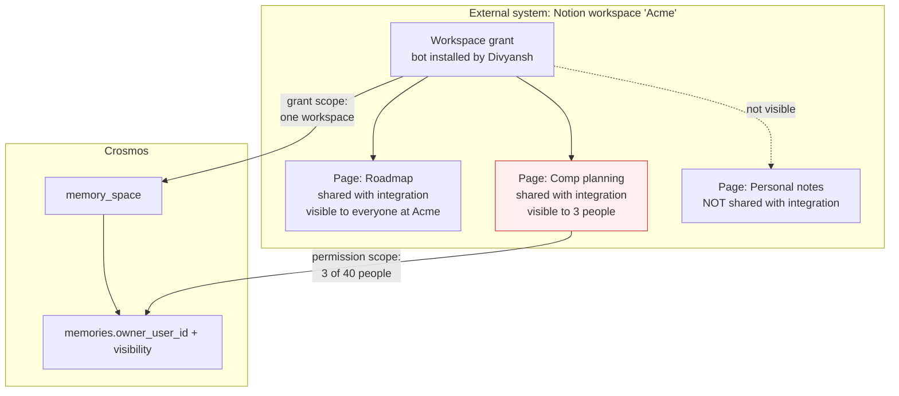

The trap is treating a connection as "this account is now attached to this
space" and writing everything in owned by whoever clicked Connect. Do that with
an admin-installed Notion or Slack connection and the Comp planning page lands
in a shared space at `visibility='org'`, readable by all forty people. Crosmos
sells permission-aware retrieval; leaking on the very first connector would be
the worst possible place to be sloppy.

There is a second, quieter trap. Our visibility model is **ownership-based**:
`resolveReadVisibility` returns a set of user ids and reads are filtered to
`visibility='org' OR owner_user_id IN (...)`. It can express "you may see
Alice's memories". It cannot express "you may see this row because you are in
`#leadership`". Mirroring an external per-item ACL therefore needs row-level ACL
support that does not exist yet. That is a real piece of work, and it is the
reason the phasing below looks the way it does.

## The tenancy model

**A connection binds a viewer, not an account.**

```
connection = external grant  x  crosmos space  x  viewer principal  x  selected scope
```

- **Viewer principal.** The single Crosmos identity whose external view this
  connection reproduces. Every source the connection produces is owned by the
  viewer (`sources.owner_user_id = viewer_user_id`), so all existing visibility
  machinery applies with no changes.
- **Selected scope.** An explicit subset of the grant: chosen Notion
  pages/databases, chosen Slack channels, Gmail labels plus a date window.
  Never "everything the grant allows" by default. This is a correctness control
  as much as a cost control.
- **Author.** Who wrote the content inside the external system. Recorded
  separately from ownership, mapped to a Crosmos user only when identity can be
  proven. Authorship feeds attribution and ranking. It never grants access.

Two deployment shapes fall out, and they are not equally ready:

| Shape | Example | Viewer principal | Space | Default visibility | Status |
|---|---|---|---|---|---|
| **Personal** | a user connects their own Notion, Gmail, or Slack user token | the connecting user | that user's space | `private` | Buildable now |
| **Workspace** | an admin connects the company Slack once for everyone | a service principal representing the install | a shared space | needs per-item ACL | Blocked on row-level ACL |

The personal shape is exactly the case where ownership-based visibility is
already correct: everything the connection can see is what one principal can
see, owned by that principal, private by default. Nothing leaks, because the set
of things we ingested is by construction the set of things that one human could
already read.

The workspace shape is where it breaks, and no amount of care in the connector
fixes it, because the gap is in the visibility model rather than in the
connector. **Recommendation: ship personal-shape connections first and treat
workspace connections as a phase that starts with row-level ACL on
sources/memories, not with more provider adapters.**

### Answering the Notion case directly

"How do you connect a Notion account that is already scoped to a Notion
organisation?" You do not connect the organisation. You connect one person's
view of it:

- Divyansh connects Notion. Composio brokers a grant against workspace `Acme`.
  We record `external_account_id = <Acme workspace id>` and
  `viewer_user_id = Divyansh`.
- He picks which databases and page trees to sync. We ingest only those.
- Everything produced is owned by Divyansh, `visibility='private'`, in his
  space. His agent can retrieve it, nobody else can, and the Comp planning page
  stays exactly as private as it was in Notion.
- Rachit connects the same Acme workspace from his own account. That is a
  **second connection**, second grant, second viewer, second space. He sees what
  Notion lets him see.

The cost of that honesty is duplication: the Roadmap page gets fetched and
extracted twice, once per viewer, and stored twice. That is a real bill, and it
is the price of not having row-level ACL yet. Two mitigations, in order of
cheapness:

1. **Dedupe the fetch, not the extraction.** An org-level cache keyed by
   `(provider, external_account_id, external_id, external_version)` stores the
   fetched body once. Second viewer skips the API call, still extracts. Saves
   provider quota and latency, not LLM cost. Cheap to build, no correctness risk.
2. **Dedupe the extraction, behind row-level ACL.** Extract once into an
   org-shared memory carrying the external ACL, and filter at read time. Saves
   the real money, needs the ACL work, and is the same prerequisite as workspace
   connections. This is the phase-4 destination.

Do not build 2 before the ACL exists, and do not fake it by widening visibility.

### Which space, concretely

For personal connections there are two defensible policies:

- **Bind to a caller-specified space** (what the branch does today). Flexible,
  matches the space-scoped API key model already shipped, and lets a B2B2C
  customer put each end user's connector output in that end user's space.
- **Auto-provision a per-connection space** (for example `notion:acme`). Cleaner
  blast radius and trivial "delete everything from this connector", at the cost
  of fragmenting a user's memory across spaces, which hurts retrieval because
  search is per-space.

Recommendation: keep caller-specified, because search is per-space and
fragmenting a user's memory across connector-specific spaces would make the
product worse at the thing it exists to do. Add a `DELETE ?purge=true` to get
the blast-radius benefit without the fragmentation.

## Invariants

These are the rules the rest of the design is checked against. If an
implementation makes one of these false, the implementation is wrong.

1. **A connector never bypasses the ingestion pipeline.** It produces `sources`
   rows and dispatches ingestion jobs through the same path `POST /sources`
   uses. No connector gets its own extraction, embedding, or vector write.
2. **A connector never ingests what its viewer principal cannot see.** Grant
   scope is not permission. If we cannot establish that the viewer can read an
   item, we do not ingest it.
3. **Webhooks are hints, never content of record.** A webhook says "item X may
   have changed". The engine then fetches X through the normal path. Webhooks
   are lossy, replayable, and spoofable; a periodic reconciliation sweep is what
   makes the system eventually correct.
4. **Every external item has a stable identity, and re-sync updates in place.**
   An edited Notion page updates the same `sources` row and re-extracts through
   `purgeSourceArtifacts`. It does not create a second source, because
   cross-source dedup is best-effort and would leave both copies.
5. **The adapter is pure and tenancy-blind.** It gets an authenticated HTTP
   caller, a deadline, and a logger. It never sees `org_id`, the database, or
   the queue. This keeps what a new connector author must learn small, and makes
   adapters testable against recorded fixtures.
6. **Sync is checkpointed and resumable.** Nothing may assume it finishes in one
   invocation. Same reason as ingestion: the Workers subrequest cap and
   invocation cancellation, which already caused one production stall.
7. **Connector work is admission-controlled and metered exactly like user
   ingestion,** and yields to it under pressure. A backfill is not allowed to
   spend an org's whole monthly quota or starve interactive ingests.
8. **Credentials never enter our data plane in a form we could leak.** Today
   that means an opaque broker reference. If a first-party backend lands, it
   means envelope-encrypted at rest and never logged.

## What exists today on `connector_auth`

Commit `bc9575b` adds one table, four routes, a Composio client, and tests. It
is a reasonable first slice and the seam it picked (`auth_backend` plus
`auth_connection_id` as an opaque credential reference) is the right one. What
follows is what the rest of the design has to fix or finish, not a criticism of
scope.

**Schema (`connector_connections`).**

| Finding | Why it matters |
|---|---|
| `uq_connector_space_provider_live` on `(space_id, provider)` allows only one live connection per provider per space | A user with a personal and a work Notion workspace cannot connect both. The `(space_id, viewer_user_id, provider, external_account_id)` partial unique is the correct constraint; this one should go. |
| `external_account_id` is never populated | `createNotionConnection` does not set it and `refreshConnectorConnection` does not persist it, so the constraint that should be doing the work can never fire and we cannot tell which workspace a connection points at. |
| `display_name` is never populated | The console cannot show the user which workspace they connected. |
| No cursor, scope selection, schedule, or sync state | There is nowhere to put sync state, so sync cannot be built without a migration anyway. |
| Status set lacks `needs_reauth` and the sync states | `expired` and "user revoked in Notion" both need a reauth prompt; `disabled` currently absorbs revocation. |
| `owner_user_id` is `ON DELETE SET NULL` | A connection whose viewer is gone must be disabled, not left syncing into a space with a null owner. |

**Behavior.**

| Finding | Why it matters |
|---|---|
| `GET /connectors/{id}` calls Composio on every read (`refreshConnectorConnection`) | A dashboard listing connectors fails or hangs when Composio is slow. Status should be cached and refreshed by webhook or by the sweep, with an explicit refresh action. |
| `mapComposioStatus` maps `INACTIVE` and `REVOKED` to `disabled` | Conflates "the user turned it off here" with "the provider revoked our access". The first is terminal, the second needs a reauth prompt. |
| Disconnect deletes the Composio account and marks the row `disabled`, and does nothing about ingested data | Retention on disconnect is a product and compliance decision that has not been made. Needs an explicit default plus a purge option. |
| No org-level cap on connections | Connector count per plan is an entitlement, and unbounded connections are unbounded scheduled cost. |
| `AUTH_BACKEND` is a hardcoded `'composio'` constant | The column is the right seam but there is no port behind it yet. |

None of these block the branch from merging as an authorization slice. All of
them are inputs to the checklist.

## The connector contract

Four layers, and the boundaries between them are the whole point.

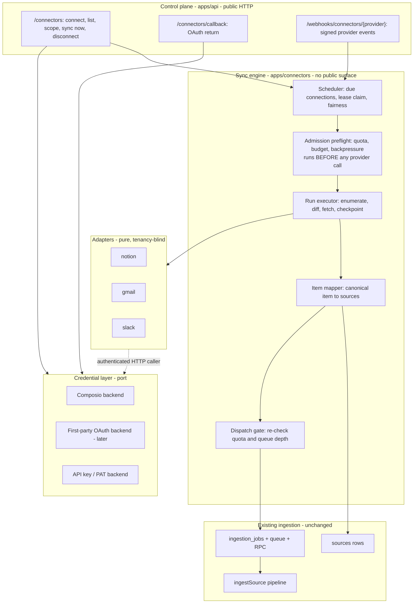

The adapter surface, as a port:

```ts
type ProviderId = 'notion' | 'gmail' | 'slack';
type ItemShape = 'document' | 'conversation';

interface ConnectorCapabilities {
  /** How the provider expresses "what changed since last time". */
  delta: 'cursor' | 'watermark' | 'history' | 'none';
  /** Does the enumeration page carry a version, so we can skip a fetch? */
  versionInEnumeration: boolean;
  /** How deletions become knowable. `none` means only reconciliation finds them. */
  deletes: 'events' | 'enumeration' | 'none';
  webhooks: boolean;
  /** Granularity of the provider's own ACL, for the phase-4 ACL work. */
  acl: 'none' | 'container' | 'item';
  binary: boolean;
  shape: ItemShape;
  rateLimit: { requestsPerSecond: number; burst: number };
}

interface ConnectorAdapter {
  readonly provider: ProviderId;
  readonly capabilities: ConnectorCapabilities;

  /** Selectable units for the scope picker: databases, channels, labels. */
  listScopes(ctx: ConnectorContext): Promise<ScopeOption[]>;

  /** One bounded page of "these items exist / changed". Never fetches bodies. */
  enumerate(
    ctx: ConnectorContext,
    scope: SelectedScope,
    cursor: SyncCursor | null,
  ): Promise<EnumeratePage>;

  /** Fetch and normalize one item. Returns a tombstone if it is gone. */
  fetch(ctx: ConnectorContext, ref: ItemRef): Promise<CanonicalItem | Tombstone>;

  /** Verify signature and translate a delivery into hints. Never returns content. */
  parseWebhook(req: Request, secrets: WebhookSecrets): Promise<WebhookHint[]>;

  /** Resolve an external actor id to a name and, if available, an email. */
  describeActor(ctx: ConnectorContext, actorId: string): Promise<ExternalActor>;
}
```

`ConnectorContext` carries an authenticated `fetch`-shaped caller, a deadline
(reuse `packages/runtime/deadline.ts`), and a logger. It carries no tenancy.

The canonical item is the contract's real payload:

```ts
interface CanonicalItem {
  externalId: string;              // stable for the item's lifetime
  externalVersion: string;         // etag, last_edited_time, historyId, or hash
  externalUrl: string | null;
  container: { id: string; kind: string; name: string; path: string[] };
  title: string | null;
  shape: ItemShape;
  body:
    | { kind: 'document'; contentType: 'text' | 'markdown'; text: string }
    | { kind: 'conversation'; turns: Turn[] };
  actors: ExternalActor[];
  eventTime: string | null;        // when it happened, not when we saw it
  createdAt: string | null;
  updatedAt: string | null;
  acl: { kind: 'private' | 'container'; containerId: string } | null;
  contentHash: string;
  attachments: AttachmentRef[];    // enumerated in phase 1, fetched later
}
```

Two things about this envelope earn their place:

- **`shape` is explicit.** Notion is a document. Slack threads and Gmail threads
  are conversations, and conversations already have a pipeline: 4-turn
  segmentation with a lookback window, which is what makes speaker attribution
  and pronoun resolution work. A connector that flattens a Slack thread into a
  text blob throws that away and measurably degrades extraction.
- **`externalVersion` plus `contentHash` are separate.** The version is what the
  provider tells us cheaply, often during enumeration. The hash is what we
  compute after fetching. Version comparison saves the fetch; hash comparison
  saves the extraction when a provider bumps a timestamp without changing
  anything, which all three of these providers do.

Everything tenancy-shaped happens in the mapper, not the adapter:

| Canonical field | Lands as |
|---|---|
| `body` (document) | one `sources` row, `content_type` `text` or `markdown` |
| `body` (conversation) | N `sources` rows via the existing segmentation path |
| `externalId`, `externalVersion`, `contentHash` | `connector_documents` |
| `container`, `externalUrl`, `actors`, provider | `sources.meta.connector` |
| `eventTime` | `sources.meta.date`, which the extractor already reads |
| viewer | `sources.owner_user_id`, `sources.visibility` |

## Provider stress test

The contract is only worth something if it survives providers that disagree.

| | **Notion** | **Gmail** | **Slack** |
|---|---|---|---|
| Grant unit | workspace | one mailbox | workspace (team) |
| Viewer semantics | what the installer shared with the integration | the mailbox owner | bot: channels it joined; user token: that user |
| Selectable scope | databases, page trees | labels, date window, query | channels |
| Delta | `watermark` on `last_edited_time` via search | `history` via `historyId` | `cursor` per channel via `oldest` ts |
| Version in enumeration | yes (`last_edited_time`) | partial (thread ids, needs a get for the body) | yes (message ts) |
| Deletes | `none`; only reconciliation finds them | `events` via history | `events` via Events API |
| Webhooks | limited; treat as absent for phase 1 | Pub/Sub push, needs a topic | yes, Events API, strong |
| ACL granularity | `item` | `none`, single viewer | `container` (channel) |
| Shape | document | conversation | conversation |
| Binary | yes (files on pages) | yes (attachments) | yes (uploads) |
| Volume shape | hundreds to thousands of pages, slow churn | tens of thousands of messages, fast churn | very high, bursty |
| The thing that will hurt | pagination plus per-block fetch makes one page expensive | volume, and that most mail is worthless to a memory system | volume, and that channel membership is the ACL |

Three consequences for the contract:

1. **Notion has no usable webhook and no delete signal.** So reconciliation is
   not an optimization, it is the only way a deleted page ever leaves memory.
   The engine must have it from day one.
2. **Gmail and Slack will drown us if we ingest everything.** Scope selection
   with a conservative default is a correctness feature, not a nicety. Default
   Gmail to a single label plus a 30-day window; default Slack to explicitly
   chosen channels.
3. **Slack's ACL is per-channel, which is exactly the `container` case that
   ownership-based visibility cannot express** for a shared install. Personal
   Slack (user token, viewer-scoped) is fine. Shared Slack waits for ACL.

## Authorization

Composio stays the broker for now. The seam already in the schema is the right
one and it should get an actual port behind it.

```ts
interface CredentialBackend {
  readonly id: 'composio' | 'crosmos_oauth' | 'api_key';
  /** Begin authorization. Returns a redirect for OAuth, or completes for a PAT. */
  begin(input: BeginInput): Promise<{ ref: string; authorizationUrl?: string }>;
  /** Finish after callback. Must return the external account identity. */
  complete(ref: string): Promise<{ externalAccountId: string; displayName: string }>;
  /** An authenticated caller for the adapter. Refresh is the backend's problem. */
  caller(ref: string): Promise<AuthenticatedFetch>;
  status(ref: string): Promise<CredentialStatus>;
  revoke(ref: string): Promise<void>;
}
```

`connector_connections.auth_backend` plus `auth_connection_id` stay exactly as
they are. The point of the port is that swapping Notion to first-party OAuth
later is a backend registration plus a per-connection migration of the
reference, and touches no connector, sync, or tenancy code.

Three credential kinds exist and the model must not assume OAuth:

- **Brokered OAuth** (`composio`): we hold a reference, the broker holds tokens.
- **First-party OAuth** (`crosmos_oauth`): we hold tokens. Requires envelope
  encryption at rest, a refresh loop with jitter, and a rule that tokens never
  appear in logs, errors, or Analytics Engine blobs.
- **Static secret** (`api_key`): PATs, bot tokens, webhook shared secrets. No
  refresh, so expiry is only discovered on a 401, which means the failure path
  matters more than the happy path.

Connect flow:

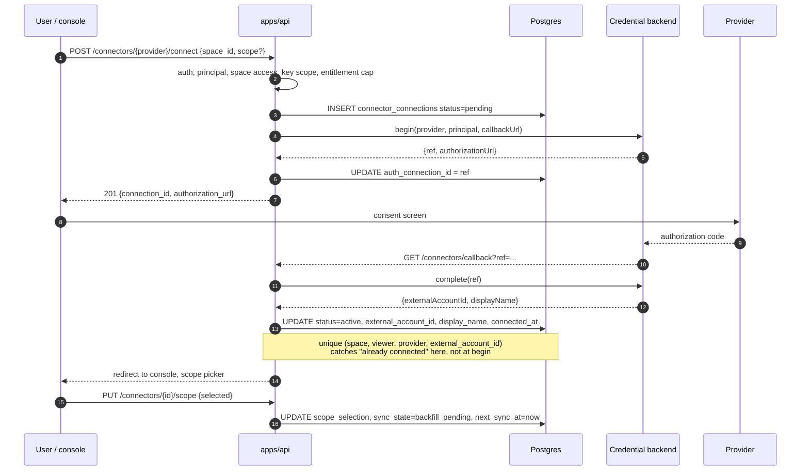

Two details worth being deliberate about:

- **The duplicate check moves to the callback.** We do not know which workspace
  the user picked until they have picked it, so `begin` cannot tell whether it
  is a duplicate. Insert `pending` with a null `external_account_id`, and let
  the partial unique index reject the duplicate at `complete`, cleaning up the
  loser. The identity key includes `viewer_user_id` because two viewers may
  connect the same external account without sharing visibility. The current
  code's pre-check at `begin` is checking the wrong thing.
- **Scope selection is a separate step after connect,** and until it happens the
  connection syncs nothing. This is what prevents a connect click from turning
  into a 40,000-message backfill.

Lifecycle:

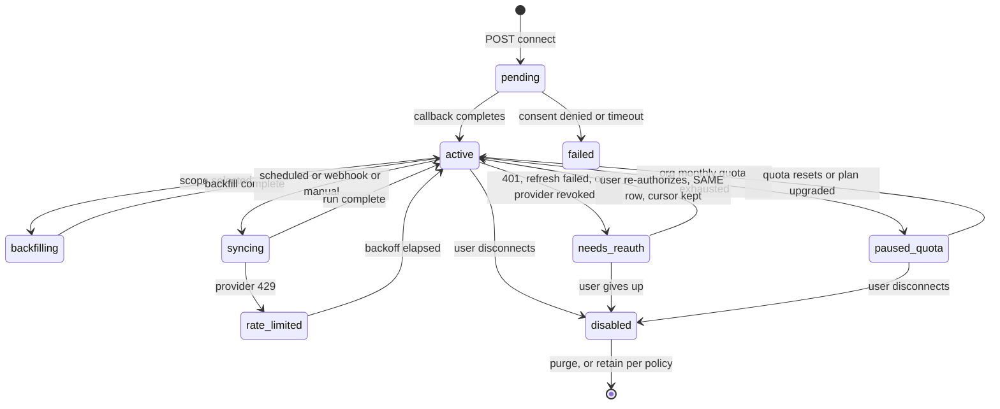

`needs_reauth` returning to `active` on the **same row** is load-bearing. Minting
a new connection on reauth would fight the unique index and, worse, drop the
sync cursor, which turns a reauth into a full re-backfill and a duplicate storm.

## The sync engine

Four triggers, one execution path. That is the main structural decision here:
backfill, cron delta, webhook, and manual sync all become a `connector_sync_runs`
row and a message on one queue, so there is one piece of code to make correct.

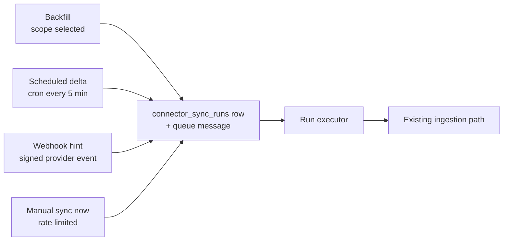

### Worker topology

Connector sync gets **its own worker and its own queue**, `apps/connectors`
consuming `connector-sync`, rather than living in `apps/ingestion`.

The reason is blast radius. Connector sync is IO against third parties with
their own rate limits, outages, and long-tail latency. Sharing the ingestion
consumer means a Notion incident eats ingestion concurrency and spends the
shared DLQ budget, and interactive ingestion, which is the thing a customer is
watching, degrades because of a background job. Separate worker, separate queue,
separate DLQ, separate metrics, and its own placement.

What stays shared, deliberately, is the **ingestion** queue: connector-produced
sources go through exactly the same dispatch path as `POST /sources`, because
invariant 1 says they must. Isolation there comes from admission control rather
than from a separate queue, and the doc should be honest that this is the weaker
of the two mechanisms.

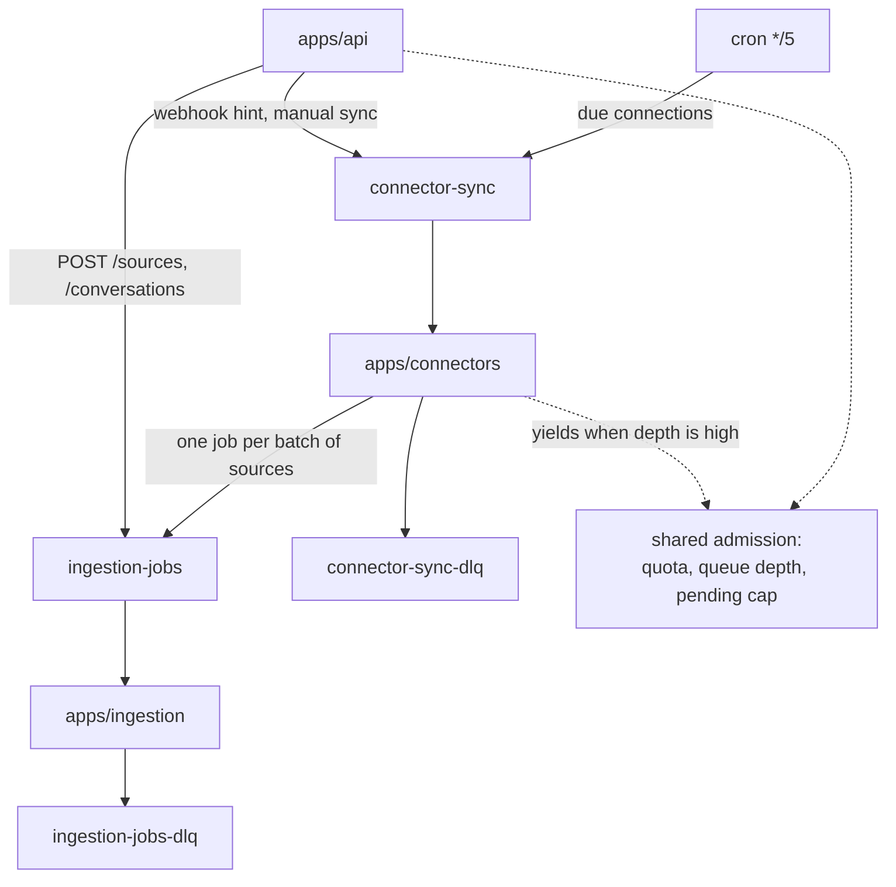

### Scheduler

A cron sweep (every 5 minutes, alongside the existing 15-minute re-drive)
selects due connections and fans them onto the queue:

```sql
SELECT ... FROM connector_connections
WHERE status = 'active'
  AND sync_state NOT IN ('backfilling','syncing','paused_quota')
  AND next_sync_at <= now()
ORDER BY next_sync_at
LIMIT :sweep_cap
```

with a **per-org fan-out cap** inside the sweep, so one org with 500 connections
cannot starve every other org's schedule. Claiming reuses the pattern that
already works for ingestion jobs: a compare-and-swap into `syncing` with a
lease, so the cron, a webhook, and a manual click cannot triple-run one
connection. `claimJob` in `apps/ingestion/src/job-store.ts` is the reference
implementation and the connector version should be a deliberate copy of it, not
a new invention.

Cadence is per provider and per plan: Gmail 5 minutes, Slack webhook-driven with
a 1-hour reconcile, Notion 15 minutes, and a full reconciliation for every
provider daily.

### Run execution

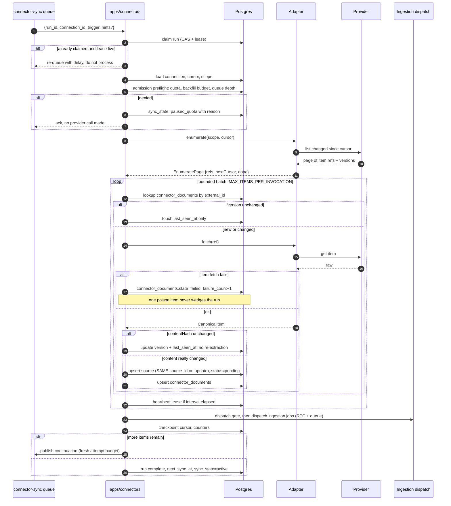

The batching, checkpointing, continuation-instead-of-retry, and lease heartbeat
are all lifted from the ingestion worker on purpose. That design exists because
of a real production stall (large sources blowing the 1000-subrequest cap and
looping silently), and connector sync has the identical failure shape: an
unbounded external collection processed in a bounded invocation.

### Per-item decision flow

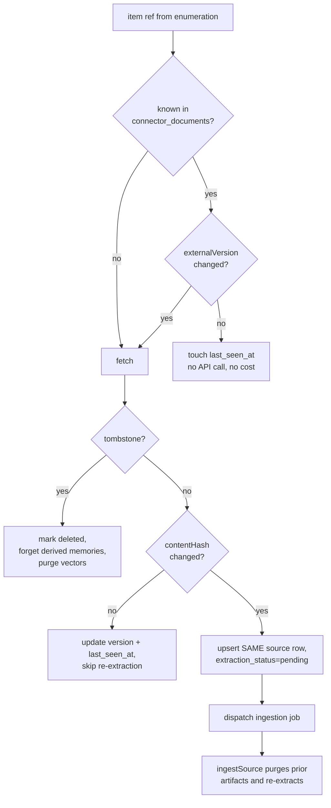

Two savings compound here and they are the difference between a viable and an
unviable connector: version comparison avoids the fetch, hash comparison avoids
the LLM. On a Notion workspace where 1% of pages change per day, a correct
implementation does roughly 1% of the work of a naive one.

### Updates and deletes

- **Update** reuses the same `sources.id`, sets `extraction_status='pending'`,
  and dispatches. `purgeSourceArtifacts` removes the previous attempt's memories,
  chunks, and vectors before re-extraction, so this is idempotent by
  construction. Creating a second source instead would leave both versions
  retrievable and rely on soft dedup, which loses races.
- **Hard delete at the provider** tombstones the `connector_documents` row and
  soft-forgets derived memories (`forgotten_at`), consistent with the rest of the
  system never physically deleting during ingestion.
- **Deletes we were never told about** are caught by reconciliation: a full
  enumeration pass stamps `last_seen_at` on everything present, then documents
  in a fully enumerated scope whose `last_seen_at` predates the run start are
  treated as deleted. Guard this hard: only run it on a **complete** enumeration,
  never on a partial or errored one, or a provider hiccup silently forgets a
  customer's memory.

### Webhooks

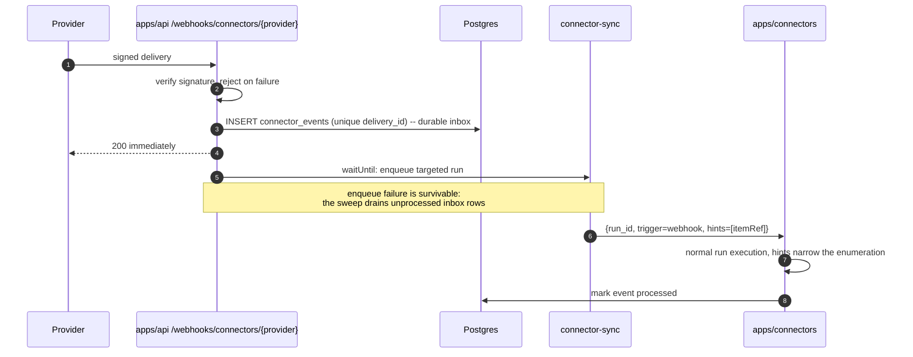

Persisting the delivery **before** acking is what makes a lost enqueue
recoverable. Acking first and enqueuing best-effort would mean a queue blip
silently drops a change, and with providers that have no delete signal we would
never notice. The unique `delivery_id` also gives us replay protection for free,
which matters because all three providers redeliver.

## Data model

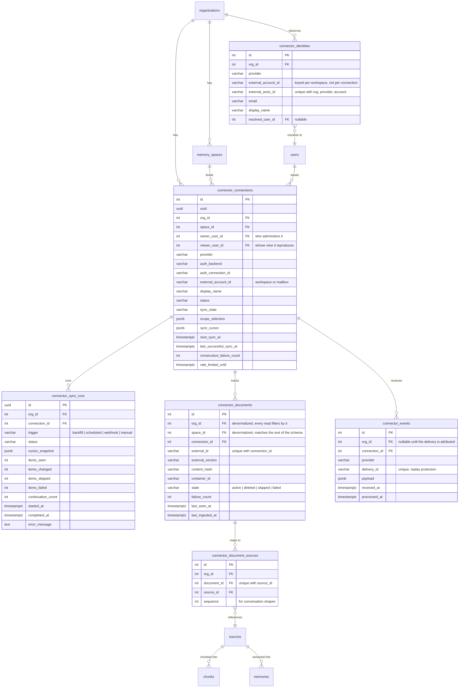

Notes on choices that were not obvious:

- **`connector_document_sources` is a join table, not a `source_id` column.**
  A document-shaped item maps to one source, but a conversation-shaped item
  (Slack thread, Gmail thread) segments into many. A single `source_id` column
  would have quietly worked for Notion and broken on Slack, and the "update in
  place" rule needs to update the whole set.
- **No new column on `sources`.** `sources` is the hottest write table in the
  system; the connector link lives on the connector side and provider metadata
  rides in the existing `meta` jsonb under a `connector` key.
- **`viewer_user_id` is separate from `owner_user_id`.** They are the same for
  personal connections. Keeping them distinct is what lets a workspace
  connection, later, have a service principal as viewer and a real admin as
  owner without overloading one column with two meanings. Roll it out with an
  expand/backfill/contract sequence: add it nullable while new writes populate
  it, backfill existing rows, then generate a second migration making it
  `NOT NULL`.
- **`connector_events` is a table, not just a queue message,** for the durable
  inbox and replay protection described above.
- **Every connector table carries `org_id`,** and `connector_documents` also
  carries `space_id`, denormalized from the connection. This matches what every
  other table in the schema does and what the tenancy invariant in
  `.codex/AGENTS.md` requires (filter by both `org_id` and `space_id`). Reaching
  through `connection_id` for tenancy would be the one place in the codebase
  that does it differently, and it would make per-tenant cleanup a join.
- **`connector_identities` is keyed per org and external workspace, not per
  connection.** The same Slack user seen through two different connections is
  one person. Keying per connection would resolve them twice, inconsistently.

## Authorship, visibility, and identity

Who is the author, in the four cases that actually occur:

| Case | Owner (access) | Author (attribution) |
|---|---|---|
| Gmail, personal | the viewer | the message sender, via `connector_identities` |
| Notion page, personal connection | the viewer | Notion's `created_by` / `last_edited_by` |
| Slack thread, personal (user token) | the viewer | each turn's speaker |
| Slack channel, shared install (phase 4) | service principal + row ACL | each turn's speaker |

The separation is the point. **Ownership decides who can retrieve. Authorship
decides what the memory says and how it is attributed.** Conflating them is
either a leak (author gets ownership) or a loss of signal (everything attributed
to the connecting user).

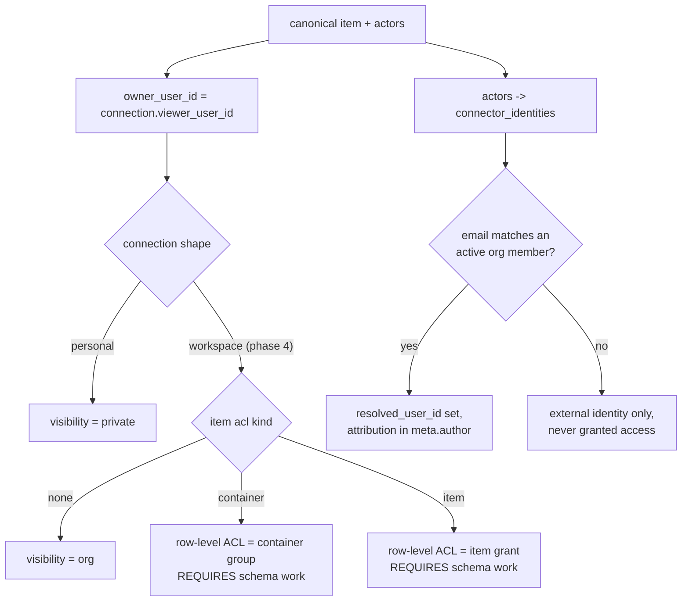

Identity resolution rules, stated so nobody has to guess later:

1. An external actor is matched to a Crosmos user **only** by verified email
   against an active member of the same org. Name matching is not identity.
2. A resolved identity grants **attribution only**. It never changes
   `owner_user_id` and never widens visibility.
3. Unresolved actors are kept as external identities with a display name, so a
   memory can still say who said something without inventing a principal.
4. Do not create placeholder `users` rows for external actors. They would show
   up in member lists, seat counts, and visibility-group pickers, and the
   cleanup would be worse than the problem.

## Quota, cost, and backpressure

A connector turns a one-off request into a standing bill, so the metering has to
be decided up front rather than discovered on an invoice.

- **Metering.** Connector-ingested content counts against
  `monthly_tokens_ingested` exactly like user-submitted content, using the same
  submitted-input-token unit. There is no separate meter and no free lane.
- **Backfill estimation and budget.** Before a backfill starts, enumerate and
  estimate. Show the user the estimate, and hold the run to a
  `backfill_budget_tokens` on the connection. Exceeding it moves the connection
  to `paused_quota` with a specific reason rather than silently consuming the
  org's month.
- **Yielding to interactive work.** Connector fan-out into the ingestion queue
  stops at a **lower** threshold than user ingestion (proposal: 50% of
  `maxQueueDepth`). Background sync should degrade before a customer's live
  ingest does.
- **Per-connection concurrency is 1,** enforced by the run lease. Per-org
  connector concurrency is capped by the sweep's per-org fan-out cap.
- **Provider rate limits** are declared in `capabilities.rateLimit`, respected
  through `Retry-After`, and persisted as `rate_limited_until` so a backoff
  survives the invocation that learned about it.
- **Plan entitlements**: connections per org, providers allowed, sync frequency,
  and backfill ceiling all belong in the existing entitlements mechanism.

## Failure modes and observability

| Failure | Detection | Response |
|---|---|---|
| Token expired or revoked | 401 from provider, or backend status | `needs_reauth`, stop syncing, notify owner |
| Provider outage | 5xx streak | exponential backoff on `next_sync_at`, `consecutive_failure_count`, alert past a threshold |
| Provider rate limit | 429 | honor `Retry-After`, persist `rate_limited_until` |
| Poison item | per-item failure count | mark the document `failed`, keep syncing the rest, surface a count. One bad page must never wedge a workspace |
| Run wedged | lease expiry | reclaim, same as ingestion jobs |
| Webhook flood | events per minute per connection | drop to scheduled sync, coalesce hints |
| Silent no-progress loop | run advances zero items yet asks to continue | refuse the continuation, DLQ. Directly copied from the ingestion continuation guard |
| Quota exhausted | admission check | `paused_quota`, resume on reset |
| Deleted-at-source | reconciliation | tombstone plus forget, only on complete enumeration |

Metrics, per provider and per connection, on the existing Analytics Engine path:

- `connector_sync_run` with trigger, outcome, duration, items seen/changed/
  skipped/failed
- `connector_item_lag_seconds`: `now - item.updatedAt` at ingest, which is the
  number that actually answers "is the customer's memory current"
- `connector_api_call` with provider, endpoint class, status, duration
- `connector_webhook_received` and webhook-to-ingested latency
- `connector_reauth_required`, `connector_rate_limited`, `connector_quota_paused`
- Existing ingestion metrics tagged with source origin so connector-driven
  ingestion is separable from user-driven

Alert on: reauth rate, connections with `consecutive_failure_count` past a
threshold, item lag p95 per provider, and connector DLQ depth.

## What the diagrams exposed

The diagrams were reviewed against the invariants after being drawn, and then
rendered and read back as images, which caught four things that reading the
source did not. Twelve things were wrong or missing in total. The sections above
already reflect the fixes; they are recorded here because the reasoning is the
useful part.

R1 to R8 came from reading the diagrams against the invariants. R9 to R12 came
from looking at the rendered images, where layout makes ordering and omissions
obvious in a way that source text does not.

**R1. Two producers, one admission gate.** The first topology diagram had the
sync engine writing sources and dispatching ingestion jobs directly, in parallel
with `POST /sources`. Drawn side by side it was obvious that only one of the two
producers passes through `preflight`. A connector backfill would have blown the
org's monthly quota and starved interactive ingestion while doing it. Fix:
admission (quota, queue depth, pending cap) becomes a shared module both
producers call, and the connector path uses a stricter threshold. This is
invariant 7 and it exists because of the diagram.

**R2. One document is not one source.** The first ER diagram had
`connector_documents.source_id` as a 1:1 column. It survives Notion and breaks
on Slack and Gmail, where a thread segments into many sources, and it breaks the
"update the same row" rule for exactly the providers with the most churn. Fix:
`connector_document_sources` join table.

**R3. Reauth had no path home.** The first state machine treated `disabled` as
the sink for every credential failure, which meant reauthorizing produced a new
connection row. That collides with the unique index and, worse, discards the
sync cursor, converting a reauth into a full re-backfill with duplicate
extraction cost. Fix: `needs_reauth` is a distinct state that returns to
`active` on the same row, keeping the cursor.

**R4. The webhook ack was ordered wrong.** The first sequence verified, enqueued,
then returned 200. If the enqueue failed we would 500, the provider would retry
a few times and then give up, and for Notion, which has no delete signal, that
change would never be discovered by any other route. Fix: durable inbox first,
ack second, enqueue best-effort, sweep drains the residue. Same shape as the
existing durable-enqueue-plus-fast-kick pattern in ingestion dispatch.

**R5. The scopes diagram killed a product assumption.** Drawing grant scope and
permission scope as separate boxes made two things undeniable: one live
connection per `(space, provider)` is wrong (a user has personal and work
Notion), and a shared workspace connection cannot be expressed at all with
ownership-based visibility. That is what produced the personal-first phasing
rather than a "we will be careful" note.

**R6. Queue isolation is partial, and pretending otherwise would be dishonest.**
The topology diagram shows connector sync on its own queue but feeding the
shared ingestion queue, because invariant 1 requires the shared pipeline. So
isolation protects the sync path from ingestion and vice versa, but a huge
backfill still competes for ingestion capacity. The only lever there is
admission, not topology. Stated explicitly rather than hidden by a tidy diagram.

**R7. Cheap change detection was missing a step.** The first item flow fetched
first and compared hashes second. For Notion and Slack the enumeration page
already carries a version, so the fetch is avoidable entirely. Fix: a
`versionInEnumeration` capability and a version check before the fetch, with the
hash check kept as a second gate to avoid re-extracting on cosmetic bumps.

**R8. Nothing deleted anything.** Across every flow, no arrow removed data. All
three providers can lose an item without telling us, and Notion has no delete
signal at all, so memories would accumulate forever and answer with content the
customer deleted, which for a memory product is the worst class of bug. Fix:
reconciliation with `last_seen_at`, hard-guarded to complete enumerations only.

**R9. Admission was in the wrong place, and the picture said so.** In the
rendered run sequence, the admission check sat at step 18, after the loop had
already called the provider, fetched bodies, and written source rows. So a
connection whose org is out of quota would burn provider rate limit and DB
writes before being told no. The component diagram had the same ordering.
Fix: an admission preflight before any provider call, which parks the connection
in `paused_quota` without spending anything, plus a second lighter gate at
dispatch, since a long run can exhaust quota while it is running.

**R10. The lease heartbeat was outside the loop.** It only fired after the whole
batch, but a batch is a series of third-party calls with unbounded latency, so a
healthy run against a slow provider could lose its lease and get double-claimed.
This is the exact bug the ingestion worker already fixed with
`CHUNK_HEARTBEAT_INTERVAL_MS`, and it was reintroduced by drawing the heartbeat
where it was convenient rather than where it is needed. Fix: heartbeat inside
the item loop on an interval.

**R11. Nothing in the picture survived a single bad item.** The failure table
said poison items must not wedge a run, but the sequence had no failure branch
at all, so the implementable reading of the diagram was "one 500 from Notion
kills the batch". Fix: an explicit per-item failure branch with a `failure_count`
on the document, which also gives the metric that tells us a scope is
systematically broken rather than briefly unlucky.

**R12. The new tables were not tenant-scoped.** Seeing all the entities laid out
next to `sources` and `memories` made it obvious that every existing table
carries `org_id` (and usually `space_id`) while none of the new ones did. That
violates the tenancy invariant, makes every query a join through
`connector_connections`, and would make per-tenant deletion slow and easy to get
wrong. The same look showed `connector_identities` keyed per connection when
identity is really an org-level fact. Both fixed in the data model above.

A note on what the review could not check: these diagrams are logical. They do
not prove subrequest counts fit an invocation, they do not prove the Notion
enumeration API is cheap enough at the page level, and they do not prove the
sweep's per-org fairness is sufficient. Those need measurement during phase 1,
and the checklist carries them as explicit measurement tasks rather than
assumptions.

## Phasing

**Phase 0, foundations.** Fix and finish the auth slice on the branch: persist
`external_account_id` and `display_name`, drop the wrong unique index, split the
status model, stop calling Composio on every read, put a real port behind
`auth_backend`. Define the adapter and canonical item contracts with no
provider behind them. No sync yet.

**Phase 1, Notion, personal, viewer-scoped.** Scope picker, backfill with
checkpointing, watermark delta, reconciliation, `connector_documents`, the sync
engine and its worker, admission and metering, the metric set. Notion first
because it is document-shaped (no conversation segmentation to get right), has
no webhook to build, and has the slowest churn.

**Phase 2, Gmail.** Conversation shape through the existing segmentation path,
`historyId` delta, Pub/Sub push, aggressive default scoping, attachments
enumerated but not fetched.

**Phase 3, Slack.** Events API webhooks end to end, per-channel scope, high
burst volume, coalescing. Personal (user token) only.

**Phase 4, shared workspace connections.** Row-level ACL on sources and
memories, retrieval filter changes, external identity mapping, service
principals, and only then org-shared extraction to remove the per-viewer
duplication cost.

Each phase is shippable and each one is useful without the next.

## Open decisions

1. **Retention on disconnect.** Default to retaining ingested memories with a
   `?purge=true` option, or default to purging? Compliance-adjacent, and it
   should be one answer across all connectors. Recommendation: retain by
   default, purge on request, state it in the API docs.
2. **Space policy.** Caller-specified space (recommended, and what the branch
   does) versus auto-provisioned per-connection spaces. Interacts with how the
   console wants to present connectors.
3. **Sync cadence per plan.** Is near-real-time sync a paid feature? It is the
   single biggest driver of connector cost.
4. **Backfill depth defaults.** Gmail 30 days or all mail; Slack 90 days or all
   history. Affects the first-run bill more than anything else on this list.
5. **First-party OAuth timing.** At what connection count or cost does Composio
   stop being the cheaper option? Worth a threshold now so it is a trigger
   rather than a debate.
6. **Whether phase 4 is real.** Row-level ACL is a significant change to the
   retrieval filter. If shared workspace connectors are not near-term revenue,
   the honest move is to say personal-only out loud rather than leave phase 4
   implied.
