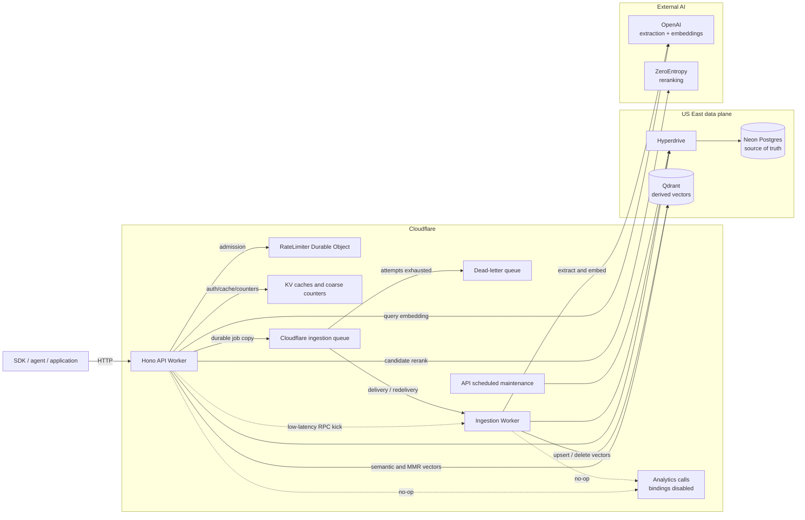
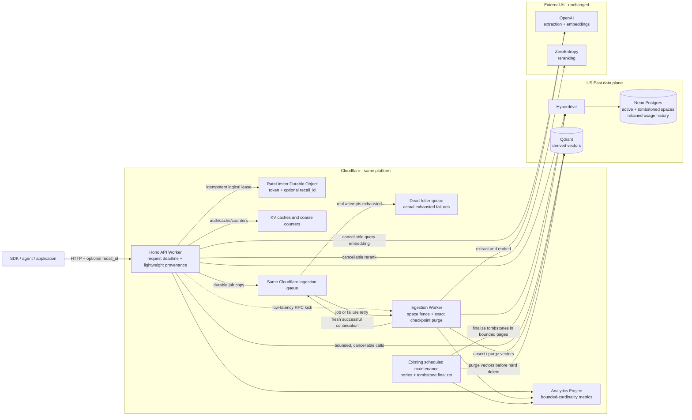
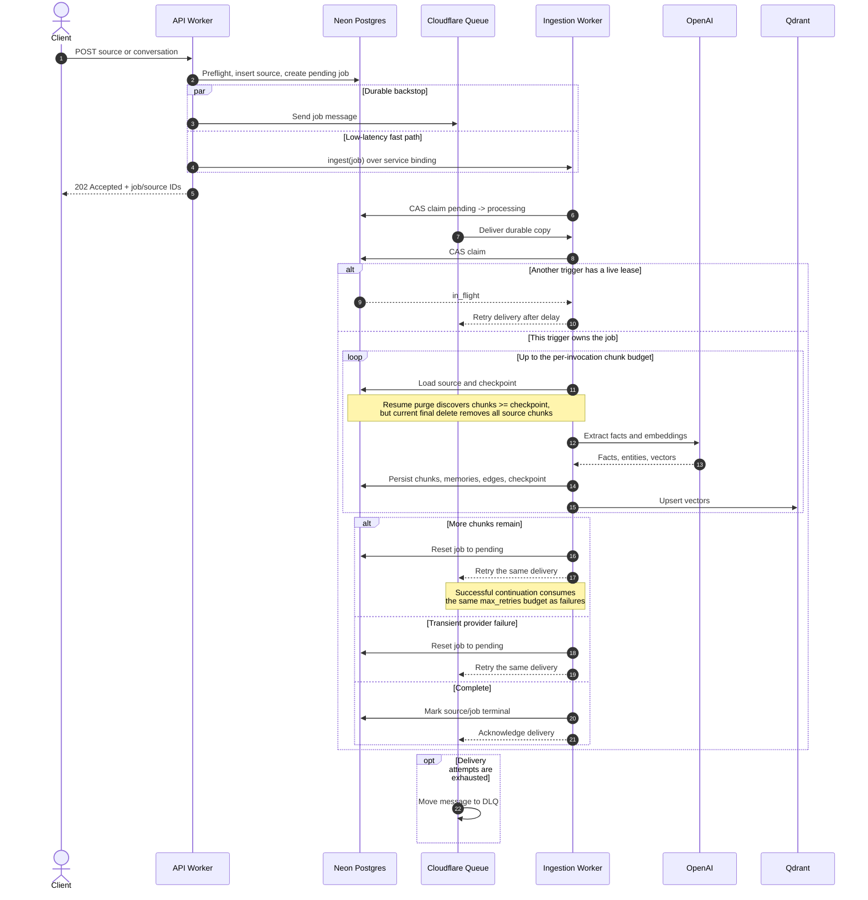
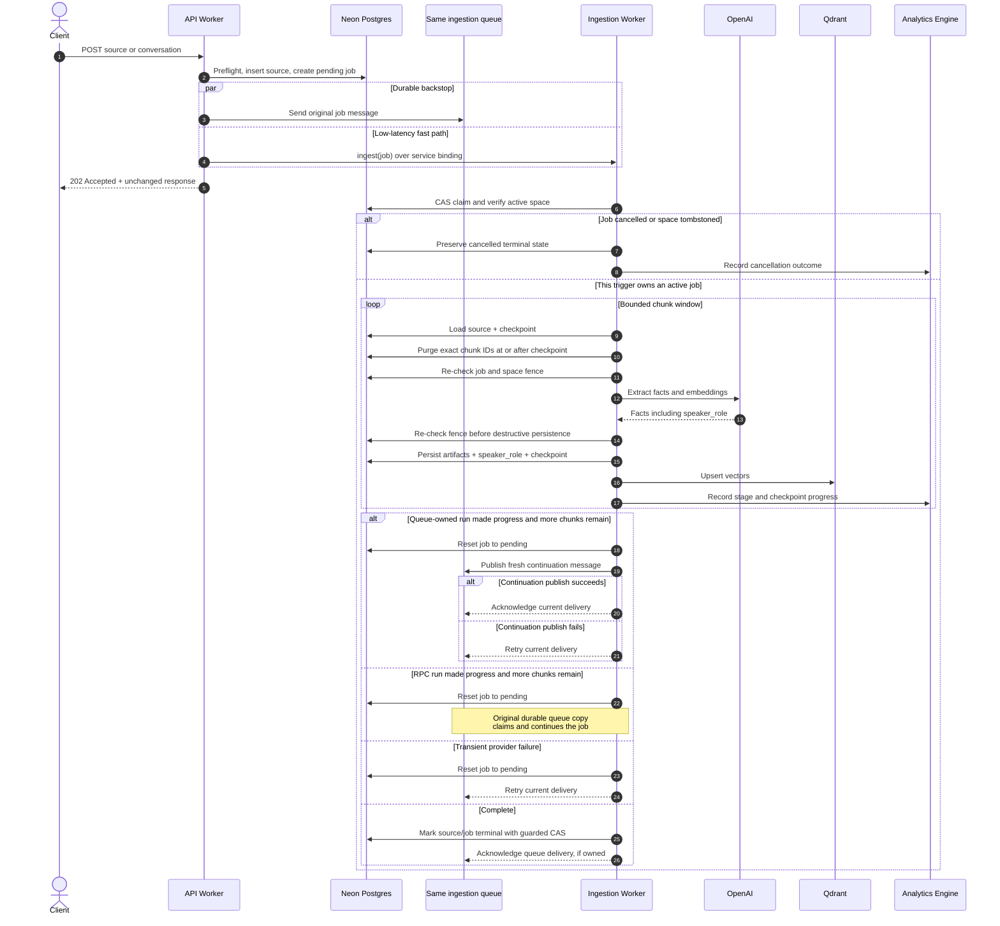
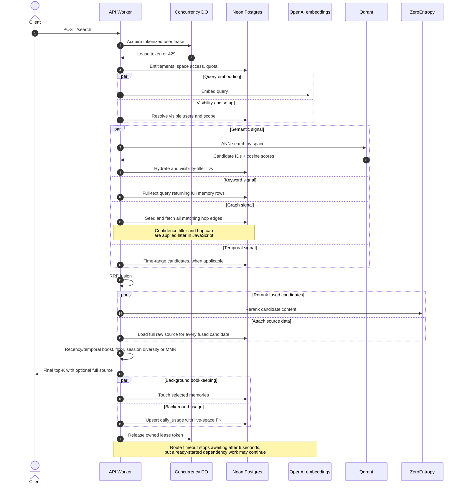
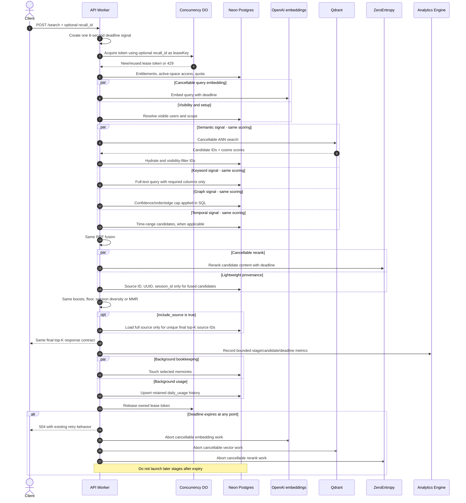
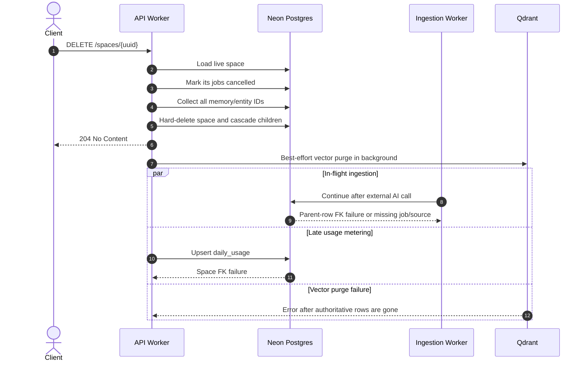
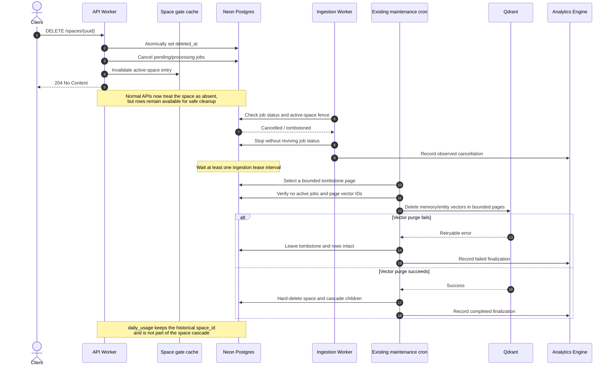
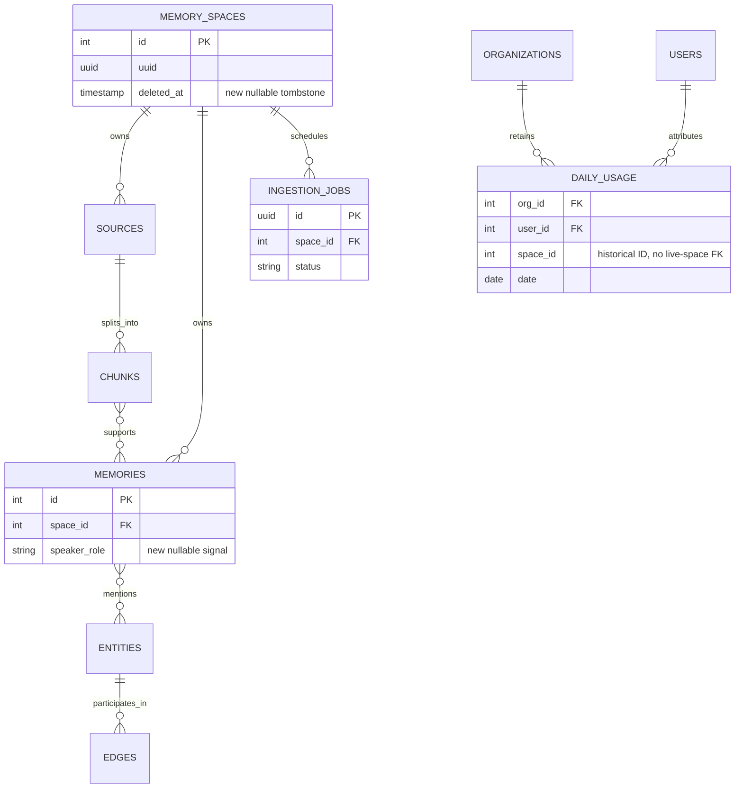
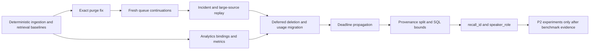

# Ingestion and Retrieval: Now vs. After

_System-design and sequence diagrams for the approved no-regression changes,
2026-08-10._

## Scope

This document explains how the ingestion and retrieval system works today and
how it will work after the P0/P1 items in the
[engineering priority checklist](./ingestion-retrieval-priority-checklist-2026-08-10.md)
are implemented.

The “after” design is not a re-platforming proposal. It keeps the same Workers,
queue, database, vector store, and AI providers. The changes repair lifecycle
boundaries, prevent wasted work, bound existing queries, and activate existing
observability without removing any retrieval signal.

> **Implementation status:** the “after” diagrams are a proposed target. The
> unchecked P0/P1 checklist work has not started; these diagrams must not be
> read as the currently deployed production architecture.

> **Live-production context:** the “now” diagrams describe the customer-facing
> Hono system serving `api.crosmos.dev` today, including its live Neon data. Any
> database difference shown in an “after” diagram requires a staged,
> backward-compatible production migration; it is not a pre-production schema
> setup or a historical Python migration.

P2 experiments such as fact supersession, ANN overfetch, and ingestion request
idempotency are intentionally not shown as active behavior. They require
benchmark evidence before they can change the pipeline.

For a deeper code-backed description of the current system, see the
[ingestion and retrieval system design](./ingestion-retrieval-system-design.md).

## How to view the diagrams

All diagrams in this file are Mermaid diagrams.

- GitHub and many Git hosting tools render them automatically.
- In VS Code or Cursor, open Markdown Preview with `Ctrl/Cmd + Shift + V`.
- If a preview does not render Mermaid, use a Mermaid Markdown extension or
  paste only the contents of a `mermaid` block into
  [Mermaid Live Editor](https://mermaid.live/).

The diagrams describe logical requests. Arrows do not imply that every call is
synchronous; labels identify background, queue, and best-effort work where it
matters.

## Executive summary

The easiest way to understand the change is:

| Area | Now | After |
|---|---|---|
| Infrastructure | API Worker, Ingestion Worker, Queue, Neon, Qdrant, OpenAI, ZeroEntropy | The same components; no new broker or database |
| Large ingestion | A successful continuation retries the current queue delivery and consumes its failure-attempt budget | A successful continuation publishes a fresh message to the same queue; failure attempts remain for actual failures |
| Resume cleanup | The purge discovers checkpoint-scoped chunks but then deletes all chunks for the source | The purge deletes only the exact discovered chunk IDs |
| Space deletion | Parent row is hard-deleted immediately while workers or usage writes may still be running | Space is hidden immediately, workers are fenced, and physical cleanup happens after a grace period |
| Usage history | `daily_usage` is cascaded with the space and late writes can hit an FK error | Usage keeps the historical integer space ID without a live-space FK |
| Retrieval timeout | The API stops waiting after six seconds, but dependency work can continue | One deadline is propagated to cancellable work and prevents later stages from starting |
| Source attachment | Full raw source content is loaded for every fused candidate | Lightweight provenance is loaded for ranking; full content is loaded only for final top-K |
| Graph/keyword reads | Some bounds and field reductions happen after rows reach the Worker | Equivalent filters, limits, and projections happen in SQL |
| Logical recall retries | A DO supports `leaseKey`, but the API cannot supply one | Optional `recall_id` reaches the DO so one logical recall reuses one live lease |
| Speaker attribution | Extracted and normalized, then discarded before persistence | Stored additively; ranking remains unchanged |
| Metrics | Metrics calls exist but Analytics bindings are disabled | The same calls write to Analytics Engine with bounded-cardinality tags |

The retrieval result is deliberately unchanged: the same signals participate,
the same scoring and selection rules run, and `include_source=true` still
returns the complete original source.

## 1. Component architecture now

### What this means

There are two entry paths into ingestion, but only one ingestion job:

- The service-binding RPC makes a new job start quickly.
- The queue message is the durable copy that recovers the job if the RPC run
  never starts or its Worker isolate disappears.
- A Postgres compare-and-set claim prevents a healthy RPC run and its queue copy
  from processing the job at the same time.

Retrieval runs inline in the API Worker because the client needs an immediate
answer. Postgres remains the authorization authority; Qdrant supplies candidate
IDs and scores but cannot independently decide which private memories the
caller may see.

The main problem is not the component selection. It is that several lifecycle
states share one mechanism: queue retries represent failures, healthy polling,
and successful continuation; immediate space deletion races background work;
and the route timeout is not the dependency deadline.

## 2. Component architecture after the approved changes

### What changed

The Ingestion Worker gains a producer binding to the same queue. This does not
create another queue or another processing system. It lets a completed chunk
window publish a fresh continuation without pretending that successful progress
was a failed delivery.

The database gains small lifecycle fields and constraints:

- `memory_spaces.deleted_at` marks a space as immediately unavailable.
- The active-space name index ignores tombstones so a name can be reused.
- `daily_usage.space_id` stays as a historical integer, but no longer references
  a currently existing space row.
- Memories store nullable speaker attribution that extraction already emits.

The API Worker gains a request-scoped deadline and the ability to pass an
optional logical recall ID to the existing concurrency Durable Object. Retrieval
queries transfer less data, but the ranking pipeline itself is unchanged.

Analytics Engine is not a new business dependency in the request path. Metrics
remain best-effort: a metrics failure cannot fail ingestion or retrieval.

### What did not change

- No Kafka, new queue technology, graph database, or multi-region database.
- No removal of the RPC fast path or durable queue backstop.
- No replacement of Neon or Qdrant.
- No removal or reweighting of semantic, keyword, graph, or temporal signals.
- No changes to RRF, reranker thresholds, recency weights, temporal boosts,
  session diversity, or MMR.
- No change to the public `source` field: it remains the original full source
  when requested.

## 3. Ingestion sequence now

### Where the current sequence is fragile

1. **A healthy large source can look like a failing message.** Every continuation
   increments the same delivery-attempt counter used for provider or database
   failures.
2. **Resume cleanup is broader than its discovery query.** Earlier completed
   chunks can be removed even though their associated memories remain.
3. **Deletion is only noticed between some units of work.** The parent space can
   disappear while an external call or persistence stage is still active.
4. **Metrics do not reach a sink.** Logs show individual failures, but there is
   no low-cardinality time series for continuation depth, checkpoint progress,
   or DLQ rate.

The queue/RPC design itself is still valuable. The error is treating progress
as retry failure, not having two triggers.

## 4. Ingestion sequence after the approved changes

### Why this sequence is safer

- **Progress and failure are different states.** A fresh continuation starts
  with a fresh delivery-attempt counter. A genuinely failing dependency still
  consumes the bounded failure budget and can reach the DLQ.
- **Checkpoint work is monotonic.** A resumed invocation removes only artifacts
  it is allowed to recreate. Completed earlier chunks remain valid evidence.
- **Deletion becomes a write fence.** The worker checks both the job and the
  parent space before expensive or destructive stages. A cancelled job cannot
  be revived by a heartbeat.
- **The original queue safety property remains.** The RPC path does not publish
  duplicate continuations; its original queue copy remains the recovery path.
- **No extraction signal is removed.** Facts, temporal values, entities, edges,
  visibility, and citations remain. Speaker attribution is additionally stored.

## 5. Retrieval sequence now

### What the retrieval sequence already does well

- Semantic, keyword, graph, and temporal signals run in parallel.
- RRF combines rank evidence without requiring incomparable raw scores to share
  a scale.
- Semantic retrieval is essential; auxiliary signal failures degrade visibly
  instead of turning every search into a 500.
- Qdrant candidates are hydrated through Postgres visibility rules.
- Rerank fallback, recency/temporal adjustment, relevance floor, and diversity
  are explicit stages.
- Concurrency leases are token-owned and released in `finally`.

The proposed work does not replace any of this. It shortens the amount of data
and work surrounding the ranking stages.

## 6. Retrieval sequence after the approved changes

### Why retrieval accuracy stays the same

The changes happen around the ranking math, not inside it:

1. **SQL bounds reproduce existing JavaScript behavior.** Graph edges use the
   same confidence rule, effective-time ordering, ID tie-breaker, and hop limit.
2. **Projection changes fields, not rows.** Keyword search returns the same
   matching rows and ranks, but does not transfer unused columns.
3. **Session metadata still arrives before selection.** Lightweight provenance
   includes `session_id`, so session diversity makes the same choices.
4. **Full source loading moves after selection.** This changes how many source
   bytes are loaded, not the source chosen or the value returned.
5. **Cancellation changes only work that has exceeded the existing deadline.**
   A request that completes within six seconds must produce an identical result.
6. **`recall_id` affects admission, not ranking.** It prevents copies of one
   logical request from occupying several live slots.

Every ranking-neutral change is gated by exact differential fixtures. If
candidate IDs, ordering, scores, source text, or top-K differ, the optimization
does not ship until the difference is explained and explicitly approved.

## 7. Space deletion sequence now

### Why immediate hard deletion is difficult to recover

Cancelling a job changes database state, but it cannot instantly cancel an
already-running external request. The Worker may resume after the parent space
has been deleted. Similarly, search usage is intentionally written in the
background and may execute after the response and delete race.

Deleting Postgres rows before Qdrant vectors also removes the easiest inventory
of vector IDs. A failed best-effort purge can therefore leave derived vectors
without an authoritative row to drive a retry.

## 8. Space deletion sequence after the approved changes

### What the user experiences

Deletion still feels immediate. As soon as `deleted_at` is committed and the
cache is invalidated, normal read, search, source, and ingestion APIs treat the
space as missing. The delay applies only to physical cleanup.

The grace period solves the race without making the DELETE request wait for AI
calls, queue leases, or a large vector purge. Anything an old Worker committed
before observing the fence remains under the tombstoned parent and is included
in final cleanup.

Vector deletion happens before the final database cascade. If it fails, the
next cron can derive the IDs again and repeat the idempotent deletion. Usage
history is independent of this lifecycle and remains available for billing and
audit.

## 9. Failure behavior now vs. after

| Failure | Now | After |
|---|---|---|
| RPC isolate disappears | Queue copy recovers after lease expiry | Same behavior |
| Queue sees healthy RPC run | Retries current delivery | Same, because durable copy must survive until the RPC run settles |
| Large source needs another window | Retries current delivery and burns an attempt | Publishes fresh continuation after checkpoint progress |
| Continuation publish fails | Not a separate operation today | Current delivery is retried; durable work is not acknowledged away |
| Transient LLM/embed/vector error | Bounded local retry, then queue redelivery | Same; actual failure still consumes failure budget |
| Resumed partial batch | May delete earlier source chunks | Deletes exact checkpoint-scoped chunk IDs only |
| Search auxiliary signal fails | Empty signal contribution with log | Same, plus metric |
| Semantic signal fails | Search fails loudly | Same; no misleading keyword-only answer |
| Search exceeds six seconds | Client gets timeout; work may continue | Client gets timeout; cancellable work aborts and later stages do not start |
| Source lookup is expensive | Full source loaded for all fused candidates | Full source loaded only for selected results |
| Space deleted during ingestion | Worker can hit missing-parent failures | Tombstone fences writes; delayed cascade cleans everything |
| Vector cleanup fails | Parent rows may already be gone | Tombstone remains, so cleanup is retryable |
| Late usage write after deletion | FK failure | Historical usage upsert succeeds |
| Metrics sink unavailable | Metrics are already no-op | Remain best-effort; pipeline behavior is unaffected |

## 10. Data and interface changes

The public changes are additive or behavior-compatible:

- Search accepts an optional UUID `recall_id`. Requests without it behave as
  they do now.
- Search response fields and scoring remain unchanged.
- Ingestion acceptance responses remain unchanged.
- Space deletion still returns `204`; deleted spaces immediately read as
  absent.
- `speaker_role` is internal in this phase and does not alter the memory API or
  ranking.
- Queue messages may carry an internal `continuation_count` for safety and
  observability.

## 11. Safe delivery sequence

This ordering is important:

1. Baselines make “nothing broke” measurable.
2. Purge and continuation correctness are fixed before performance work.
3. Metrics are enabled before lifecycle changes need production monitoring.
4. Deferred deletion ships through an additive migration and staged finalizer.
5. Retrieval changes ship one at a time and must match the baseline exactly.
6. Anything capable of changing recall remains a later, benchmark-gated
   experiment rather than being bundled into the simplification work.

## Final design takeaway

The after-design is intentionally boring in the best sense: it keeps the
current components and makes each one own a clearer responsibility.

- The queue represents durable work and real retries; a fresh message represents
  successful continuation.
- The checkpoint defines exactly which ingestion artifacts may be recreated.
- A tombstone separates “unavailable to users” from “safe to physically purge.”
- The route deadline becomes the deadline of downstream retrieval work.
- Provenance needed for ranking stays early; large source content moves late.
- SQL bounds data before it reaches the Worker without changing ranking rules.
- Metrics describe behavior without becoming a correctness dependency.

That gives the system more predictable failure handling and better scaling
without trading away ingestion fidelity or retrieval accuracy.
