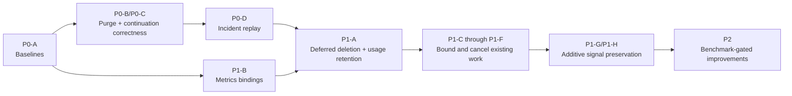

# Ingestion and Retrieval Engineering Priority Checklist

_Repository-scoped consolidation, 2026-08-10._

## Purpose

This is the canonical execution checklist for reliability, correctness, and
safe scaling work in the TypeScript/Hono ingestion and retrieval pipelines. It
combines the current architecture review with the three Cloudflare incident
documents:

- [Cloudflare observability incident](./cloudflare-observability-incident-2026-07-25.md)
- [Cloudflare incident remediation plan](./cloudflare-incident-remediation-plan-2026-07-25.md)
- [Cloudflare incident remediation status](./cloudflare-incident-remediation-status-2026-08-05.md)

The detailed component and sequence diagrams remain in the
[ingestion and retrieval system design](./ingestion-retrieval-system-design.md).
Where that document discusses a
longer-horizon target architecture, this checklist is the nearer-term source of
truth: fix correctness, lifecycle boundaries, bounded work, and observability
before considering any re-platforming.

This checklist is intentionally scoped to this repository. SDK changes,
Cloudflare account configuration, provider dashboards, and other external work
are recorded as dependencies, not as repository-owned completion checkboxes.

> **Implementation status:** the unchecked actions in this checklist are
> proposals and have not started. Items marked `[x]` are pre-existing incident
> remediations found in the repository; they are not evidence that the new
> checklist work has been implemented.

> **Production warning:** `api.crosmos.dev` and its Hono/Workers data path are
> serving production users now. The Neon database contains live production
> data; this is not a pre-cutover or disposable migration environment. None of
> the new schema changes proposed by this checklist have been applied. Every
> migration below must therefore use a staging-first, backup, compatibility,
> lock-budget, verification, and rollback procedure appropriate for a live
> production database.

## Decisions and non-regression rules

The existing architectural shape remains in place:

- Hono API Worker for synchronous API and retrieval work.
- Ingestion Worker for asynchronous extraction.
- Cloudflare Queue as the durable ingestion backstop.
- Direct service-binding RPC as the low-latency ingestion trigger.
- Neon Postgres as the authoritative data and authorization store.
- Qdrant as a derived vector index.
- OpenAI extraction and embeddings, and ZeroEntropy reranking.

The following are release-blocking invariants:

| Invariant | Required behavior |
|---|---|
| Public API compatibility | Existing request fields, response fields, status codes, and `source` semantics remain compatible. New fields are optional and additive. |
| Retrieval signals | Semantic, keyword, graph, temporal, reranking, recency, relevance-floor, and session-diversity behavior remain present. |
| Ranking-neutral changes | Candidate IDs, per-signal ordering, fused ordering, final scores, and final top-K must be identical on deterministic fixtures. |
| Ingestion efficacy | Canonical facts, entities, edges, citations, visibility, temporal values, and source association must not be lost. |
| Authorization | Postgres visibility filtering remains authoritative even when ANN results originate in Qdrant. |
| Durability | The queue remains the durable backstop; the RPC fast path must never become the only copy of a job. |
| Billing | Daily usage survives deletion of a space and remains retained under the existing retention policy. |
| Failure behavior | A performance optimization must fail soft or roll back without silently returning lower-quality recall. |

Two policy decisions that previously blocked incident work are now resolved:

- **Space deletion:** use immediate logical deletion with deferred physical
  cleanup.
- **Usage retention:** retain `daily_usage` after its source space is physically
  deleted.

## Status legend

- `[x]` — present in this repository and documented as deployed.
- `[~]` — partially implemented or implemented but not adequately verified.
- `[ ]` — not implemented.
- `[-]` — deliberately dropped or deferred; do not implement without new
  evidence.
- `[external]` — required outside this repository.

“Documented as deployed” is not the same as independently verified. The later
remediation-plan update says version `34adf955` was deployed on 2026-08-05; the
older status snapshot says the same fixes were not yet deployed. The later
document takes precedence for historical status, but the live behavior still
needs the verification step below.

## Incident progress reconciliation

| Status | Incident item | Repository truth as of 2026-08-10 | Remaining work |
|---|---|---|---|
| `[x]` | P0-1 retry suppression | Retry hints are emitted through `Retry-After` and `x-should-retry`. | Verify under an overload replay. SDK replacement must preserve the header contract. |
| `[~]` | P0-2 recall singleflight | `RateLimiterDO` understands an optional `leaseKey`, but the search schema, concurrency interface, adapter, and route do not pass it. | Add optional `recall_id` server support. SDK singleflight and stale-request cancellation are external. |
| `[-]` | P0-3 Worker CPU allowance | The original CPU-limit premise was refuted. | Do not change the CPU allowance; measure CPU only during replay. |
| `[~]` | P0-4 Neon exhaustion protection | Capacity errors are classified as dependency 503s with retry suppression. | Capacity alerts are external. Defer a shared circuit breaker until metrics show meaningful work is still wasted after classification. |
| `[x]` | P0-5 early overload shedding | Per-user concurrency is checked before database-backed gates. | Verify rejection latency and absence of 500s under load. |
| `[x]` | P0-6 dependency classification | Known capacity and transient dependency errors receive machine-readable behavior. | Extend only when a real unclassified provider failure is observed. |
| `[x]` | P1-1 tokenized leases | Concurrency releases are token-owned rather than removing another request's slot. | Logical-request reuse remains part of P0-2. |
| `[x]` | P1-2 limiter consolidation | Redundant Durable Object admission calls were consolidated. | Keep the call-count assertion in load tests. |
| `[x]` | P1-3 query bounds/fail-soft signals | `tsquery` input is bounded and auxiliary signals use fail-soft fan-out. | Preserve semantic as essential and test pathological query shapes. |
| `[ ]` | P1-4 deletion vs ingestion | The API still cancels jobs and immediately hard-deletes the parent space. | Implement the deferred-deletion design below. |
| `[x]` | P1-5 retrieval timeout contract | Retrieval timeout is six seconds and concurrency TTL is derived from it. | Propagate cancellation so timed-out work does not continue. |
| `[ ]` | P1-6 scheduled DB retries | Cron sweeps are isolated but each receives only one attempt per invocation. | Add small, classified transient retries. |
| `[~]` | P1-7 AI/vector degradation | Search degrades auxiliary signals; ingestion now has source retries, durable checkpoints, retryable requeue, and Qdrant write retries. | Enable metrics. Defer provider-wide circuit breakers/concurrency controls until measurements justify them. |
| `[ ]` | P1-8 `daily_usage` FK race | Usage writes still reference the live `memory_spaces` row with cascade deletion. | Remove that one FK while retaining the historical integer dimension. |
| `[~]` | P2-1 lifecycle correlation | Request, job, and correlation IDs reach queue messages and many worker logs. | Make correlation consistent at all ingestion acceptance and terminal events. Triage/outbox systems are external. |
| `[~]` | P2-2 event separation | Structured HTTP and stage events exist in code. | Analytics is disabled; dashboard construction is external. |
| `[ ]` | P2-3 metrics/log tuning | Metrics calls exist but Analytics Engine bindings are commented out in both Workers. | Enable the bindings after the account/datasets exist, then measure before reducing logs. |
| `[ ]` | P2-4 SLO alerts/runbooks | No repository runbook closes the incident loop. | Add repository runbook after metrics are live. Alert configuration is external. |
| `[~]` | P2-5 regression/load/failure tests | `scripts/verify-incident-fixes.ts` exists. There is no automated API admission, deletion-race, or retrieval-equivalence suite. | Build the no-regression harness and run staged failure injection. |

## P0 — Correctness and proof before optimization

### [ ] P0-A. Establish deterministic no-regression baselines

**Why**

The current retrieval implementation has multiple quality-sensitive stages but
no automated corpus that proves a refactor preserved each signal and the final
ranking. Ingestion unit tests cover chunk planning and parsing, but not the
persisted fact/entity/edge result of a resumed or failed run.

**Repository change**

- Add deterministic provider fakes and a seeded Postgres fixture.
- Record canonical ingestion output excluding generated IDs and timestamps:
  facts, memory types, speaker roles, event times, entity links, edges,
  visibility, source/chunk association, and checkpoint progression.
- Record retrieval output at each boundary: semantic, keyword, graph, temporal,
  RRF, reranker/fallback, recency/temporal adjustment, relevance floor,
  session-diversity/MMR selection, and public response mapping.
- Separate exact-equivalence fixtures from a later gold-question quality set.

**Acceptance gate**

- Behavior-preserving work must produce identical candidate IDs, ordering,
  scores, signal attribution, and public response content.
- Ingestion changes must produce identical canonical artifacts; newly persisted
  metadata may only add information.
- The harness fails on a missing signal rather than silently accepting a
  smaller candidate set.

### [x] P0-B. Fix resumed-batch purge boundaries

**Why**

`purgeSourceArtifacts` selects chunks at or after the durable checkpoint, but
its final chunk deletion currently removes every chunk belonging to the source.
A resumed batch can therefore erase earlier evidence rows while leaving their
memories in place, breaking citation provenance.

**Repository change**

- Delete chunks using the exact `chunkIds` collected by the scoped query.
- Keep vector deletion before memory-row deletion so a failed vector operation
  remains recoverable.
- Preserve entity rows, which are shared and resolved idempotently by name.

**Acceptance gate**

- Given completed sequences `0..7` and checkpoint `8`, a failed retry may purge
  sequence `8+` artifacts but must leave sequences `0..7`, their junctions,
  memories, edges, and citations intact.
- Repeating the purge is idempotent.
- A full redrive with checkpoint zero still purges all source-owned artifacts.

**Rollback**

This is a local predicate correction. Revert the change only if the scoped
artifact test fails; do not compensate by rebuilding unrelated source data.

**Implemented 2026-08-11**

- `purgeSourceArtifacts` now deletes chunks with `inArray(chunks.id, chunkIds)`
  instead of `eq(chunks.sourceId, sourceId)`
  (`apps/ingestion/src/ingestion/pipeline.ts`).
- `apps/ingestion/tests/purge-scope.test.ts` covers checkpoint scoping,
  cross-source isolation, the `SET NULL` edge path, full redrive, repeat
  purges, an above-range checkpoint, and vector-failure recoverability. The
  first case fails against the pre-fix predicate, so it is a real gate.
- `apps/ingestion/tests/helpers/fake-db.ts` is a new in-memory `Database`
  double that evaluates real Drizzle predicates (via `PgDialect`) against seeded
  rows and models the FK cascades, so scope bugs are caught by surviving-row
  assertions rather than by call-sequence snapshots.
- The existing-data audit in “Existing-data audit required before rollout”
  is still outstanding: this fix prevents future damage but cannot recreate
  citation links already removed.

### [x] P0-C. Separate progress continuations from failure attempts

**Why**

`max_retries = 15` currently covers three different conditions: healthy RPC
backstop polling, transient failure retries, and successful large-source
continuations. A valid source can require more than 15 bounded invocations and
reach the DLQ without a processing failure.

**Repository change**

- Give the ingestion Worker a producer binding to the same existing ingestion
  queue; no new queue or broker is introduced.
- When a queue-owned run returns `requeue_incomplete` after advancing its
  checkpoint, send a fresh continuation carrying the same job/correlation IDs,
  update its enqueue timestamp, and acknowledge the current delivery.
- If continuation enqueue fails, retry the current delivery so the durable copy
  is not lost.
- Keep `retry_transient`, unhandled failures, and `skipped_in_flight` on the
  existing delivery retry budget.
- Add a bounded `continuation_count` for logs/metrics and reject a continuation
  loop that makes no checkpoint progress.
- Do not enqueue another continuation from the RPC fast path: its original
  durable queue message remains the backstop and will claim the pending job.

**Acceptance gate**

- A source requiring more than 15 processing windows completes without DLQ.
- Every sequence is processed once with no gap or duplicated derived artifact.
- A transient provider failure still consumes the configured delivery retry
  budget and eventually reaches visible DLQ handling if it never recovers.
- Failure to publish a continuation leaves the current message retryable.

**Implemented 2026-08-11**

- `INGESTION_QUEUE` producer binding added to the ingestion Worker for dev,
  staging, and production — same queue it consumes, no new queue or broker.
  Verified with `wrangler deploy --dry-run --env production`.
- `IngestionJobMessage.continuation_count` is new, optional, defaulted to zero,
  so in-flight messages produced before this change stay valid.
- `processIngestion` now returns `IngestionRunResult { outcome, chunksProcessed }`.
  `chunksProcessed` is the progress evidence the consumer needs; every chunk it
  counts corresponds to a completed source or an advanced
  `ingest_next_sequence` checkpoint.
- `handleIngestionDelivery` splits the outcomes: `requeue_incomplete` publishes
  a fresh continuation (same job/correlation IDs, refreshed `enqueued_at_ms`,
  incremented counter) and then acks; `retry_transient`, `skipped_in_flight`,
  and unhandled errors stay on the delivery retry budget.
- Publish happens strictly before ack, and a publish failure re-queues the
  current delivery, so there is never a window without a durable copy. A
  duplicate copy is harmless — the atomic job claim collapses it.
- Continuations are refused (and demoted to the retry budget, so the DLQ makes
  them visible) when the run advanced nothing, when `MAX_JOB_CONTINUATIONS`
  (800) is reached, or when the producer binding is absent.
- The RPC fast path deliberately publishes nothing; its original durable queue
  message still claims the pending job.
- `apps/ingestion/tests/continuation.test.ts` — 16 cases including a 25-window
  run (well past the 15-delivery failure budget), publish failure, no-progress
  refusal, ceiling enforcement, and missing-binding fallback.
- Also widened the `@crosmos/observability` field allowlist from 61 to 102
  entries. `chunks_processed`, `remaining_chunk_count`, `from_sequence`,
  `transient_source_count` and ~35 others were already being logged at call
  sites and silently stripped before emission, which would have made these
  continuation events unreadable in production. All added fields are
  identifiers, counts, or bounded enums.

**Not yet done**

- Continuation metrics (`P1-B`) still require the Analytics Engine bindings.
- Staging/production replay of a >15-window source is pending deployment.

### [ ] P0-D. Verify the deployed incident fixes

**Why**

The incident plan documents deployment, but most acceptance criteria remain
unmeasured. Mechanism reasoning is not a substitute for replaying the failure
shape.

**Repository work**

- Run `scripts/verify-incident-fixes.ts` against staging first and an approved
  production test space second.
- Extend automated coverage for admission ordering, token-owned release,
  `Retry-After`, `x-should-retry`, pathological `tsquery` shapes, classified
  dependency errors, and timeout behavior.
- Store a dated result summary in this document or a linked test artifact; do
  not commit credentials or raw customer content.

**Acceptance gate**

- Burst results contain only expected success/429 responses, not 500s.
- Every shed request includes the expected retry hints.
- Rejection p50 remains under the existing 400 ms script threshold.
- Pathological query shapes do not fail the entire search.
- No claimed completion status is based only on an unexecuted script.

## P1 — Reliability and quality-neutral simplification

### [ ] P1-A. Implement deferred space deletion and retain usage history

**Why**

Immediate parent deletion races in-flight workers and best-effort usage writes.
It also makes a failed external-vector purge difficult to retry because the
authoritative IDs have already disappeared.

**Repository change**

1. Add nullable `memory_spaces.deleted_at` and an index for pending deletion.
2. Replace the active-space name constraint with a partial unique index on
   `(org_id, name) WHERE deleted_at IS NULL`, allowing a deleted name to be
   recreated while cleanup is pending.
3. Make normal space reads, lists, quota counts, cached access gates, source
   preflight, and admin operations exclude deleted spaces.
4. Keep an internal include-deleted lookup for the deletion/finalization path.
5. On `DELETE`, atomically set `deleted_at` first, cancel pending/processing
   jobs, invalidate the cache, and return the existing `204` response.
6. Prevent a job heartbeat from changing a cancelled job back to `processing`;
   terminal transitions must be compare-and-set guarded.
7. Let the ingestion worker check both job cancellation and active-space state
   before each source, before every chunk-concurrency window, and before
   persistence/graph stages.
8. Extend the existing scheduled maintenance path to finalize a bounded number
   of tombstoned spaces after at least one ingestion lease interval and after no
   active jobs remain.
9. Delete memory/entity vectors in bounded, keyset-paginated pages before the
   final parent-row delete. A vector error leaves the tombstone for the next
   idempotent sweep.
10. Drop `daily_usage_space_id_memory_spaces_id_fk` but keep `space_id` non-null,
    keep its uniqueness key, and keep org/user foreign keys unchanged.

**Preserved behavior**

- The public delete response remains `204`.
- Deleted spaces immediately behave as absent to all normal APIs.
- Existing source, memory, entity, and edge cascades remain the physical cleanup
  mechanism.
- Billing retains the historical integer space ID for 400 days.

**Acceptance gate**

- No new work can enter a tombstoned space.
- In-flight ingestion observes cancellation without overwriting job status.
- Anything committed before cancellation is included in the later purge.
- A vector purge failure does not hard-delete the parent and succeeds on retry.
- A late retrieval or ingestion usage write succeeds after physical space
  deletion.
- Repeated delete while the tombstone exists is idempotent.

**Rollout**

- Apply the additive column/FK/index migration first.
- Deploy read filtering, write fencing, and finalizer code with finalization
  disabled.
- Exercise deletion races in staging.
- Enable deferred deletion, then enable finalization.
- Keep the hard-delete implementation available only as a short rollback path
  until all tombstones have been finalized successfully.

### [ ] P1-B. Activate existing metrics before reducing logs

**Why**

Both Workers already emit useful metrics, but their Analytics Engine bindings
are commented out. As a result, throttle, signal degradation, ingestion
outcome, and DLQ metrics are production no-ops.

**Repository change**

- After the external account/dataset prerequisite is satisfied, enable the
  development, staging, and production bindings in both Wrangler configs.
- Add bounded-cardinality measurements for checkpoint advancement,
  continuations, delivery retry reason, DLQ, deletion age/finalization,
  cancellation, per-signal candidate count/failure, retrieval deadline, cron
  attempts, and source-content bytes loaded.
- Keep request, user, organization, space, source, and job IDs in structured
  logs only; never use them as Analytics tags.
- Add a repository runbook describing which metrics establish overload,
  dependency failure, stuck ingestion, deletion backlog, and recall degradation.

**Acceptance gate**

- A staging request and ingestion job produce queryable data points.
- Metric emission failure remains a no-op for request correctness.
- Log sampling is not reduced until metric coverage is verified.

**External dependencies**

- `[external]` Enable Analytics Engine and create/authorize the datasets.
- `[external]` Build provider/Cloudflare dashboards and alerts from the emitted
  metrics.

### [ ] P1-C. Cancel retrieval work after the request deadline

**Why**

The six-second route timeout currently stops awaiting the result but does not
cancel OpenAI, Qdrant, ZeroEntropy, or later database work. During overload this
creates invisible work that continues consuming dependency and connection
capacity after the client has already received a timeout.

**Repository change**

- Create one request deadline/`AbortSignal` and pass it through retrieval ports
  and adapters that support cancellation.
- Combine the request deadline with existing adapter-level safety timeouts.
- Check the deadline between stages and avoid launching downstream work after
  expiry.
- Preserve fail-soft behavior for auxiliary signals; cancellation of the whole
  request is not reported as a random signal failure.

**Acceptance gate**

- Searches completing before the deadline return exactly the same result.
- A timed-out request initiates no new downstream stage and aborts cancellable
  fetches.
- Concurrency release still occurs in `finally` and never frees another lease.

### [ ] P1-D. Split candidate provenance from full source content

**Why**

The current provenance join runs for every fused candidate and selects the full
raw `sources.content`, even though only final top-K candidates are returned.
However, source metadata cannot simply move after selection because
`session_id` drives session-diverse selection.

**Repository change**

- Replace the pre-selection attachment with a lightweight provenance query that
  loads only source integer ID, source UUID, and session ID for every candidate.
- Preserve the deterministic first-source rule: lowest source ID, then chunk
  sequence.
- After selection, batch-load full source content for only the unique source IDs
  in final top-K and only when `include_source=true`.
- Keep the public `source` value as the complete original source; do not replace
  it with chunk content in this compatibility phase.
- Rename misleading internal `sourceChunk` terminology only if it can be done
  mechanically with no wire change.

**Acceptance gate**

- Session-diverse top-K and all scores are identical to baseline.
- `include_source=true` returns byte-identical source strings.
- `include_source=false` performs no full-content query and omits the key as it
  does today.
- Candidate/source visibility scoping remains unchanged.
- Staging p95 must not regress by more than 5%; otherwise keep the old one-query
  path until the second round-trip can be overlapped safely.

### [ ] P1-E. Push exact retrieval bounds and projections into SQL

**Why**

Graph edges are fetched without a SQL limit, then confidence-filtered and sliced
in JavaScript. Keyword search selects the full memory row even though ranking
needs a known subset of fields. These are avoidable data-transfer and Worker
memory costs.

**Repository change**

- Move the existing graph confidence rule into SQL using the same null-as-1.0
  semantics.
- Preserve effective-time descending and edge-ID descending ordering, then
  apply `GRAPH_MAX_EDGES_PER_HOP` in SQL.
- Remove the JavaScript cap only after differential tests prove equality.
- Select only fields required by `toRankedCandidate` plus the rank expression in
  keyword search.
- Instrument seed-entity-to-memory fanout, but do not cap it yet; a new cap would
  change graph recall without proof of equivalence.

**Acceptance gate**

- Old and new graph edge IDs/order match for null confidence, threshold
  boundary, temporal `asOf`, visibility, and high-degree fixtures.
- Keyword candidate IDs, rank positions, normalized scores, and hydrated values
  are identical.

### [ ] P1-F. Retry transient scheduled-job DB failures safely

**Why**

The reaper, redrive, billing reconciliation, and cleanup sweeps are isolated and
idempotent, but a brief connection error defers all work until the next cron.

**Repository change**

- Add one shared helper with at most three total attempts.
- Retry only classified transient database/connection errors.
- Use short exponential backoff with jitter; do not retry deterministic budget
  exhaustion, constraint failures, invalid input, or unknown logic errors.
- Keep each sweep independent so one exhausted retry budget does not block the
  others.

**Acceptance gate**

- A transient-first/success-second fixture completes once without duplicate
  effects.
- Deterministic errors receive one attempt.
- Logs and metrics include sweep name, attempt count, and final outcome.

### [ ] P1-G. Finish repository-side stable recall identity

**Why**

The Durable Object can reuse a live logical lease, but no request can currently
supply the key through the API stack. Retried copies of one logical recall can
therefore still consume multiple concurrency slots.

**Repository change**

- Add optional UUID `recall_id` to the search request schema.
- Extend `ConcurrencyLimiter.acquire` with an optional logical lease key.
- Pass it only to the Durable Object adapter; keep KV/no-op behavior compatible.
- Include `recall_id` in structured retrieval logs but not metric tags.

**Acceptance gate**

- Repeated acquisition of the same live `recall_id` reuses one slot.
- Different recall IDs consume independent slots.
- Omitting the field preserves current behavior and generated clients remain
  compatible.

**External dependency**

- `[external]` SDKs generate a stable ID per logical recall, reuse it for
  retries, coalesce identical in-flight searches, and cancel stale calls.

### [ ] P1-H. Persist extracted speaker attribution

**Why**

The extraction prompt and normalization layer produce `speaker_role`, and the
dedup key uses it, but persistence drops it. This loses a real signal before any
future ranking or attribution policy can evaluate its value.

**Repository change**

- Add a nullable, internally validated speaker-role field to memories.
- Persist the normalized value during memory insertion.
- Include it in canonical ingestion fixtures and internal hydration types.
- Do not expose it publicly or change ranking in this phase.

**Acceptance gate**

- User, assistant, system, tool, and null values round-trip correctly.
- Existing rows remain valid with null.
- Retrieval results and scores remain identical.

## P2 — Benchmark-gated follow-up

These items are worthwhile but should not run ahead of the P0/P1 proof and
observability work.

### [ ] P2-A. Add optional ingestion request idempotency

Use an optional `Idempotency-Key` on source and conversation ingestion. Back it
with a small request record keyed by organization, user, endpoint, and key,
including a request-body hash and the accepted response. A repeated identical
request replays the original job/source IDs; reuse with a different body is a
conflict. Do not use content-only deduplication because identical facts may be
intentionally recorded in different sessions.

**Why:** queue delivery is idempotent per job, but repeated API calls currently
create different jobs and sources before the queue can coordinate them.

### [ ] P2-B. Evaluate visibility-aware ANN overfetch

Qdrant filters by space, while Postgres removes memories the caller cannot see.
Measure how often this returns fewer visible candidates than requested. If the
rate is meaningful, try bounded adaptive overfetch behind a flag and require
non-inferior Recall@K, MRR, and nDCG on the gold set before enabling it.

Do not reindex Qdrant with owner/visibility payloads until overfetch measurements
show that the extra payload/index lifecycle is justified.

### [ ] P2-C. Persist fact fingerprints in observation mode

Persist the existing normalized fact key or a versioned fingerprint for
diagnostics and replay comparison, without a unique constraint. Measure true
duplicates versus intentional repeated facts before considering enforcement.

### [ ] P2-D. Reconcile orphaned entities and vectors

Build a dry-run report first. Any cleanup must use tenant scoping, a grace
period, bounded pages, and idempotent deletion. Enable physical removal only
after a staging report is reviewed and vector/row counts reconcile.

### [ ] P2-E. Evaluate fact supersession in shadow mode

Detect possible old/new fact relationships and report their effect on retrieval
without filtering either fact. No `valid_to`, supersession filter, or ranking
change ships until a reviewed gold set proves that historical and current facts
remain retrievable for the questions that require them.

### [ ] P2-F. Correct unsupported content-type behavior deliberately

The public schema accepts HTML, JSON, PDF, image, audio, and video while the
worker rejects them. Do not silently narrow the accepted contract in a patch.
Choose either a parser implementation or a versioned/scheduled contract change,
then update OpenAPI and SDKs together.

## Explicitly deferred: do not add now

- Kafka or another message broker.
- A new graph database.
- Multi-region database or active-active ingestion.
- Transactional event sourcing or a general outbox framework.
- Chunk-per-message queue fanout.
- Removal or reweighting of semantic, keyword, graph, or temporal retrieval.
- Changes to RRF, reranker relevance floor, recency weights, graph decay, or
  existing score thresholds without a gold-set evaluation.
- A shared Neon Durable Object circuit breaker while classified 503s and retry
  suppression already prevent the incident's retry amplification.
- Provider-wide circuit breakers for every AI/vector adapter without measured
  repeated waste.
- Qdrant visibility-payload reindexing before overfetch measurements.
- Unique fact fingerprints or automatic fact supersession before shadow-mode
  evaluation.
- Replacing the public `source` field with evidence-chunk content.
- Search-result caching without a reliable per-space data-version key.

The direct RPC plus durable queue design is also retained. Removing RPC would
reintroduce cold-queue ingestion latency; removing the queue would sacrifice
durability. Their coordination should be tested and simplified locally, not
replaced with another platform.

## Production migration and existing-data gotchas

The proposed API changes are additive, but the complete checklist is not
migration-free. Do not deploy all “after” changes in one release. The safe plan
requires small schema migrations, mixed-version compatibility, and an audit for
damage that the current purge bug may already have caused.

These migrations target the database currently used by the customer-facing
Hono production API. They are not cleanup for an inactive Python deployment and
must not be applied under the assumption that no users or jobs are active.

### Migration and backfill matrix

| Change | Production migration | Backfill | Compatibility gotcha |
|---|---|---|---|
| Checkpoint-scoped purge fix | None | Audit and targeted repair only | The fix prevents future damage but cannot recreate citation links already removed. |
| Fresh queue continuations | Ingestion Worker producer binding; no DB change | None | Existing queue messages have no `continuation_count`; treat it as optional and default it to zero. |
| `memory_spaces.deleted_at` | Add nullable column and deletion lookup index | None; existing null rows are active | Deploy tombstone-aware readers and the worker fence before enabling soft deletion. |
| Active-space name uniqueness | Replace the current constraint with a partial unique index | None | Create the partial index concurrently before dropping the old constraint; until then, a deleted name cannot be reused. |
| Retained `daily_usage` | Drop only `daily_usage_space_id_memory_spaces_id_fk` | None | Historical org usage will intentionally stop decreasing when a space is deleted. Document this billing semantic. |
| Persisted `speaker_role` | Add nullable memory column | None | Historical rows stay null; do not re-run extraction merely to populate it. |
| Optional `recall_id` | None | None | Requests that omit it must follow the current lease behavior. |
| Deadline propagation | None | None | Abort handling must not turn a request that completes inside six seconds into a premature failure. |
| Provenance/full-source split | None | None | `source` must remain byte-identical and `session_id` must still load before diverse selection. |
| Graph/keyword SQL bounds | None unless measurement justifies a new index | None | Preserve null-confidence semantics, ordering, tie-breaks, and candidate scores exactly. |
| Analytics Engine | Wrangler/account configuration | No historical metrics backfill | Enable and verify the sink before reducing log volume. |

Production schema changes follow `packages/db/migrations/README.md`: update the
Drizzle schema, generate and commit the numbered migration/snapshot, but apply
production SQL deliberately through `psql`; never run the squashed baseline
against production.

Before each production SQL statement:

- validate the exact statement and expected lock on a production-like staging
  copy;
- take or verify a restorable production backup/restore point;
- set conservative `lock_timeout` and `statement_timeout` values so traffic is
  rejected by the migration rather than silently blocked behind it;
- inspect active ingestion jobs, long-running transactions, and database
  capacity;
- apply one migration unit at a time and verify the live API before continuing;
  and
- record the forward-fix/rollback procedure, noting that the retained-usage FK
  change is not directly reversible after usage rows outlive deleted spaces.

Where Postgres supports it, create new indexes with `CREATE INDEX CONCURRENTLY`
instead of taking a long write-blocking table lock. Constraint changes still
require a deliberately scheduled lock window even when the underlying index was
built concurrently.

### Existing-data audit required before rollout

The current resumed-batch purge can discover only chunks at or after a
checkpoint and then delete every chunk for the source. If that path has already
run after a partially persisted failure, older memories may have lost their
`chunk_memories` citation links.

Run a read-only audit for:

- memories with no `chunk_memories` relationship;
- completed sources with missing or inconsistent chunk coverage;
- source/checkpoint states that do not match persisted chunk sequences;
- Qdrant points whose Postgres memory/entity row no longer exists; and
- Postgres memory/entity rows that should have, but lack, a Qdrant point.

Do not turn the audit into an automatic global cleanup. A memory without a
source link cannot always be attributed safely after the relationship is gone.
For confirmed affected data:

1. snapshot the affected space and source;
2. identify and review genuinely orphaned derived rows/vectors;
3. remove confirmed orphaned vectors before their Postgres rows;
4. re-ingest only the affected source; and
5. compare the repaired canonical facts before accepting the result.

A blanket re-ingestion can duplicate orphaned memories because the deleted
junction no longer tells the purge which source owned them.

### Backfills deliberately not required

- Do not re-extract all historical memories for `speaker_role`; null is the
  backward-compatible historical value.
- Do not regenerate embeddings or rebuild Qdrant for the P0/P1 rollout.
- Do not rewrite queued messages; the consumer must accept the old shape.
- Do not rewrite existing `daily_usage`; dropping the FK preserves rows as-is.
- Do not backfill fingerprints, visibility payloads, or supersession state as
  part of this checklist.

### Mixed-deployment and rollback rules

- Apply additive columns before deploying code whose Drizzle schema selects
  them. Old code safely ignores the new nullable columns.
- Deploy the Ingestion Worker’s tombstone checks and guarded heartbeats before
  the API is allowed to set `deleted_at`.
- Deploy active-space filtering to every API read/write path before enabling
  soft deletion; invalidate existing cached space gates on delete.
- Drop the usage FK before enabling the hard-delete finalizer. After historical
  usage rows outlive their spaces, restoring that FK requires a separate data
  policy and is not a simple rollback.
- Enable logical deletion first. Keep the vector/hard-delete finalizer disabled
  until staging proves cancellation and the ingestion lease grace period.
- Enable the finalizer last and retain tombstones when vector purge fails.
- Release deadline propagation, provenance loading, and SQL query changes one
  at a time behind reversible configuration/deployments.

The current production service is the Hono Worker at `api.crosmos.dev`. The old
Python repository is not a live reader that needs dual-runtime migration
support. Any other internal service that directly reads these tables must still
be checked for tombstone compatibility before soft deletion is enabled.

## Delivery order



Deploy only one quality-sensitive retrieval change at a time. Record the
baseline, staged result, production metric, and rollback condition on the
corresponding checklist item before marking it complete.

## Verification matrix

| Area | Required scenarios |
|---|---|
| Purge/checkpoint | Fresh ingest, resume, partially written retry, full redrive, repeated purge. |
| Continuation | More than 15 windows, producer failure, no-progress detection, transient exhaustion, RPC/queue overlap. |
| Deletion | Pending job, active job, mid-chunk cancellation, repeated delete, cache hit, vector failure/retry, finalizer grace. |
| Usage | Search/ingestion write before tombstone, during tombstone, and after hard deletion; 400-day cleanup unchanged. |
| Retrieval equivalence | Per-signal IDs/order, RRF, rerank fallback, temporal range, graph on/off, session diversity, MMR, source inclusion. |
| Visibility | Private owner, org-visible, cross-space, cross-org, forgotten memory, invisible Qdrant hit. |
| Timeout | Success before deadline, embedding timeout, Qdrant timeout, reranker timeout, auxiliary failure, whole-request cancellation. |
| Admission | Same/different recall ID, token-owned release, overload 429, retry headers, quota and provider failures. |
| Cron | Transient recovery, deterministic no-retry, one sweep failure not blocking another. |

Minimum repository verification for each implementation wave:

```text
bun --filter @crosmos/ingestion test
bun run typecheck
bun run build
```

Staging verification additionally includes `scripts/verify-incident-fixes.ts`,
the deterministic retrieval comparison, large-source continuation, deletion
failure injection, and metric presence checks. Production rollout requires a
documented rollback flag or reversible deployment for the deletion and
late-source-fetch changes.
