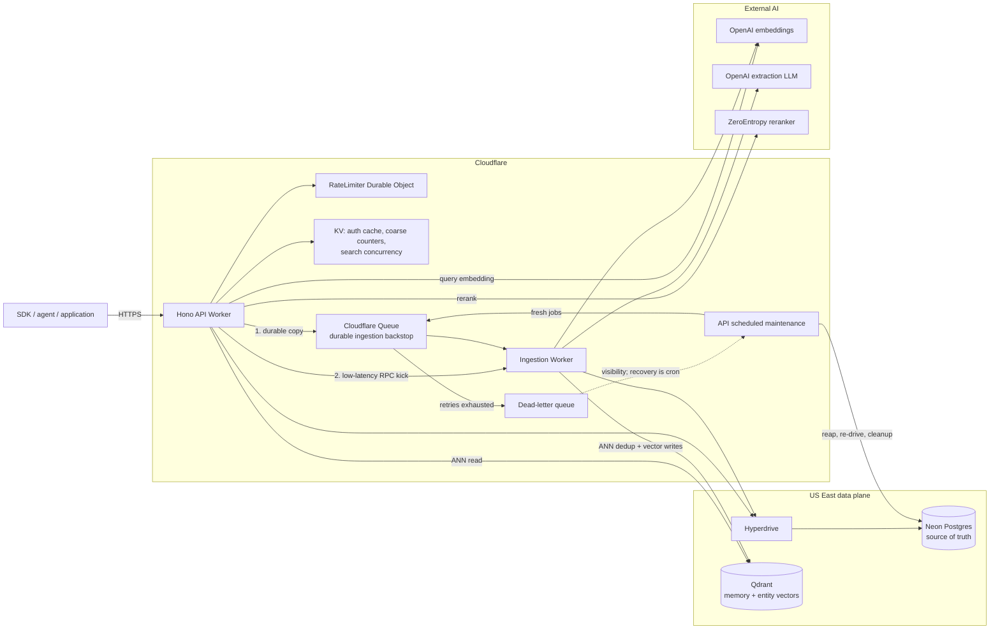
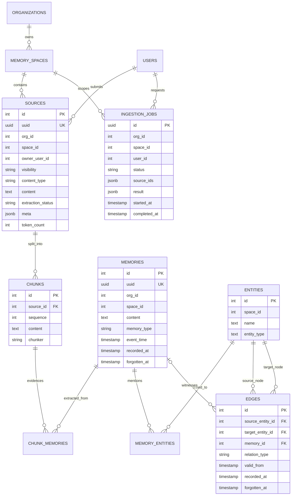
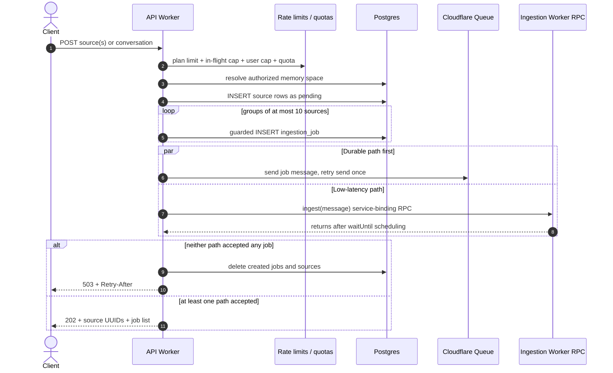
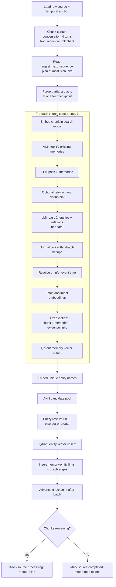
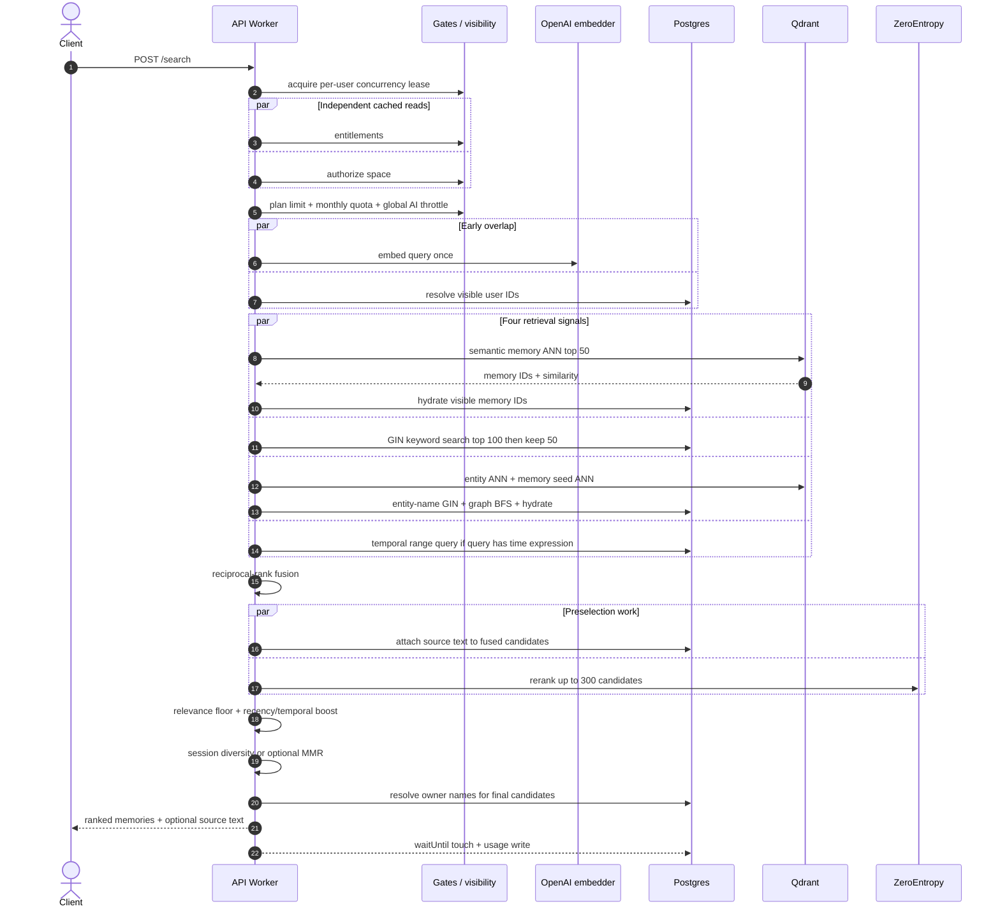
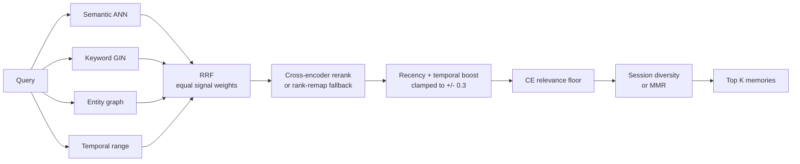
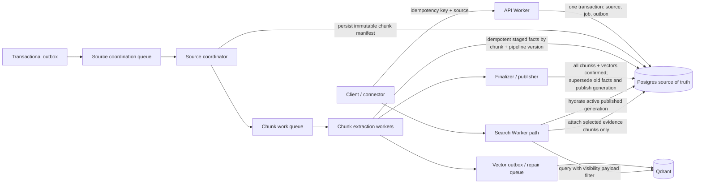
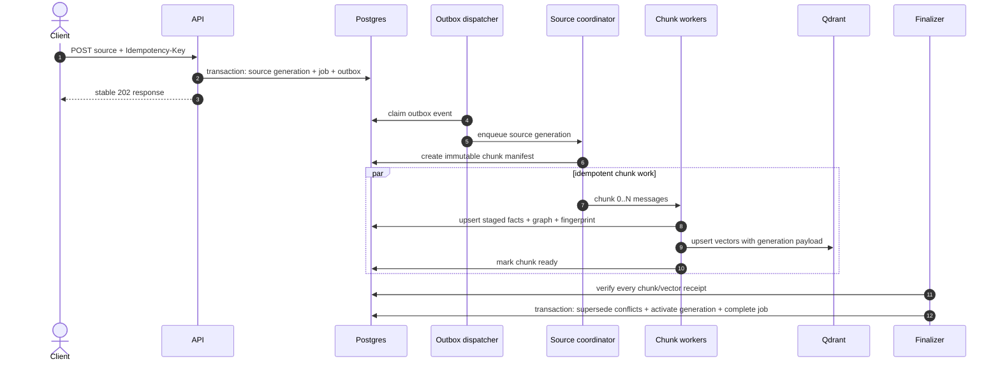

# Ingestion and Retrieval System Design

_Code-backed review of the TypeScript/Hono implementation, 2026-08-10._

## Scope and reading notes

This document describes the implementation in this repository, not the older
Python service. It was traced from the API and ingestion entrypoints through the
queue/RPC coordination, Postgres schema, extraction pipeline, vector adapters,
and search ranking code.

The Wrangler `production` environment in this repository is the current
customer-facing Hono API at `api.crosmos.dev`. It is configured for OpenAI
embeddings, OpenAI extraction, Qdrant vectors, ZeroEntropy reranking, Neon
Postgres through Hyperdrive, and Cloudflare Workers/Queues. The old Python
service is historical/reference code, not the current production API.

## Executive summary

The main architectural shape is sound:

- The API is a stateless control/read plane and ingestion is asynchronous.
- Postgres is the system of record for tenants, raw sources, extracted memories,
  graph structure, job state, visibility, and usage.
- Qdrant is a derived ANN index, not the authorization authority; results are
  hydrated and visibility-filtered in Postgres.
- Ingestion has a fast service-binding trigger plus a durable queue copy, joined
  by a Postgres compare-and-swap lease.
- Retrieval runs four signals in parallel, fuses them with RRF,
  reranks, applies temporal/recency adjustments, and then diversifies.

The most important remaining risks are not a need for more infrastructure. They
are boundary and lifecycle problems:

1. Partial-batch cleanup can delete every chunk row for a resumable source,
   breaking citations and leaving older memory rows detached.
2. A legal large source can require more continuation deliveries than the
   queue's retry horizon, while healthy-backstop polling consumes the same retry
   budget.
3. Citation attachment runs before final selection and loads the entire raw
   source for every fused candidate, not the small evidence chunk.
4. Graph “caps” are applied in JavaScript after unbounded DB reads for high-degree
   entities.
5. External ANN filtering does not include per-user visibility, so top-50 hits
   invisible to a caller are discarded without backfilling the candidate pool.
6. Search timeout stops waiting but does not cancel its OpenAI, Qdrant,
   ZeroEntropy, or Postgres work.
7. Knowledge is append-only without fact supersession/valid-to semantics, so old
   and current facts compete at retrieval.

The recommended sequence is: fix correctness and bound existing reads first;
then add idempotency/outbox and fact lifecycle semantics; only then split
ingestion into independently queued chunk work if volume justifies it.

## 1. Current deployed component architecture



Production placement pins both Workers near the Neon and Qdrant US East data
plane. That avoids paying an inter-region hop for every DB/vector round trip,
but a global user still pays one long client-to-Worker hop. OpenAI and
ZeroEntropy remain synchronous dependencies on the read path.

### Runtime responsibility map

| Component | Owns | Must not own |
|---|---|---|
| API Worker | Auth, tenant/space access, admission, source/job creation, retrieval, response mapping | Long-running extraction |
| Ingestion Worker | Job lease, chunking, extraction, persistence, retries/checkpoints | Public HTTP/auth decisions |
| Postgres | Authoritative state, visibility, job state, evidence links, graph, quotas | Remote ANN serving in the configured production path |
| Qdrant | Derived memory/entity vectors and ANN candidate IDs | Authorization, raw source truth, terminal job state |
| Queue | Durable delivery and bounded retry | Business idempotency by itself |
| KV / DO | Caches and overload controls | Durable job or memory state |

## 2. Core data model



Important implications:

- Raw source, evidence chunk, extracted memory, and graph assertion are distinct
  layers. This is the right basis for provenance.
- The vector store only knows numeric row IDs and tenant payload; Postgres must
  hydrate each result before it is trusted.
- `forgotten_at` is a soft-delete mechanism, not automatic supersession.
- Edges have `valid_from` but no `valid_to` or `superseded_by`.
- `speaker_role` is produced and normalized during extraction but has no memory
  column and is not copied into `memories.meta`, so it is lost at persistence.

## 3. Current ingestion design

### 3.1 API admission and dual dispatch

Both `POST /api/v1/sources` and `POST /api/v1/conversations` converge on the
same job path. Conversations are stored as one raw source; segmentation happens
inside the ingestion worker.



The queue message contains trusted integer `org_id`, `space_id`, `user_id`, and
`source_ids` established after API authorization. The worker still scopes writes
by org and space as defense in depth.

### 3.2 Fast path and durable backstop coordination

```mermaid
sequenceDiagram
  autonumber
  participant R as RPC trigger
  participant Q as Queue delivery
  participant P as Postgres job row
  participant W as Ingestion pipeline
  participant D as DLQ / cron re-drive

  par Competing triggers
    R->>P: CAS claim pending -> processing
  and
    Q->>P: CAS claim pending -> processing
  end

  alt RPC wins
    P-->>R: claimed
    P-->>Q: in_flight
    Q->>Q: retry after 60s; do not ack
    R->>W: process source(s)
  else Queue wins
    P-->>Q: claimed
    P-->>R: in_flight or terminal
    Q->>W: process source(s)
  end

  loop between sources and during long source
    W->>P: heartbeat started_at + stage
  end

  alt terminal success / partial / permanent failure
    W->>P: terminal job result
    Q->>Q: ack when it observes terminal
  else transient dependency failure
    W->>P: reset job to pending
    Q->>Q: delayed retry
  else chunk budget exhausted
    W->>P: checkpoint source and reset job pending
    Q->>Q: delayed retry to continue
  else retries exhausted
    Q->>D: dead-letter; cron later creates a fresh job
  end
```

The lease is a “no progress for five minutes” lease. `started_at` doubles as the
heartbeat timestamp. That is compact and effective, although a dedicated
`lease_expires_at`/`heartbeat_at` would make job semantics clearer and remove
overloading of a lifecycle timestamp.

### 3.3 Per-source extraction pipeline



### 3.4 Ingestion consistency model

The pipeline is not one distributed transaction. Its intended recovery model is
compensation:

- Postgres writes establish discoverable evidence links.
- Qdrant writes are idempotent upserts by memory/entity integer ID.
- A retry purges partial Postgres artifacts and corresponding vectors, then
  reconstructs them.
- The source checkpoint advances only after memory, entity, and edge work for
  the batch has committed.

This can work reliably, but only if the purge boundary exactly matches the
checkpoint boundary. Finding I-1 below is therefore a correctness issue, not a
minor cleanup bug.

## 4. Current retrieval design

### 4.1 Request and ranking sequence



Auxiliary keyword, graph, and temporal failures degrade to empty signal lists.
Semantic failure is fatal. Reranker failure falls back to a rank remap of the
RRF order.

### 4.2 Scoring pipeline



`computePersistence()` is calculated and returned internally but is not part of
`finalScore`; current scoring is reranker/rank-remap base multiplied only by the
clamped recency/temporal boost.

### 4.3 Trust and visibility boundary

For Qdrant, the current query filter is only `spaceId`. The returned IDs are not
trusted. Postgres hydration applies:

```text
org_id = scope.orgId
AND space_id = scope.spaceId
AND forgotten_at IS NULL
AND (visibility = 'org' OR owner_user_id IN visibleUserIds)
```

This prevents data exposure. It does not preserve recall: if many of the nearest
50 vectors are private to other users, they are dropped and the system does not
ask Qdrant for replacements.

## 5. What is already well designed

1. **Clear provider ports.** Embedders, rerankers, vector stores, queues, caches,
   and job stores sit behind interfaces, so production providers are replaceable.
2. **Postgres-authoritative authorization.** External ANN IDs are visibility-
   hydrated rather than returned directly.
3. **Fast plus durable ingestion trigger.** Service-binding RPC removes cold
   queue latency while the queue copy retains recovery semantics.
4. **Atomic job claim.** The RPC and queue triggers cannot normally process the
   same healthy job concurrently.
5. **Resumable source work.** A source checkpoint and per-invocation chunk budget
   acknowledge Workers runtime/subrequest ceilings.
6. **Bounded chunk concurrency.** Independent extraction windows overlap without
   unbounded provider fan-out.
7. **Failure isolation.** Graph extraction and auxiliary retrieval signals can
   degrade without discarding otherwise useful memories/search results.
8. **Evidence model.** `source -> chunk -> memory` is strong provenance structure,
   even though the current response mapper does not use it optimally.
9. **Read path no longer loads an entire memory space.** Semantic and temporal
   hydration are candidate-bounded. The remaining graph/citation exceptions are
   called out below.
10. **Structured timing logs.** Both pipelines emit stage and dependency events
    with request/job correlation fields.

## 6. Findings and recommendations

### P0: correctness and durability

#### I-1. Partial-batch purge crosses the checkpoint boundary

`purgeSourceArtifacts()` correctly selects only chunks whose sequence is at or
after `minSequence`, then derives their memory IDs. But its final chunk delete is
`DELETE chunks WHERE source_id = sourceId`, which deletes earlier committed
chunks as well.

Impact:

- A resumed source that has a partially written later batch can lose all earlier
  chunk rows.
- Earlier memories are not in the selected `memoryIds`, so they remain in
  `memories` while their `chunk_memories` links cascade away.
- Retrieval can still return those memories, but source citation attachment can
  no longer connect them to evidence.

Recommendation: delete only `chunkIds` selected for the purge. Add an integration
test with two committed batches plus one partial batch, asserting that sequences
before the checkpoint and all their evidence links remain intact. Longer term,
give each pipeline run/generation an explicit ID and publish only a completed
generation.

#### I-2. Continuation work and failure retries share one delivery budget

The pipeline processes at most 8 chunks per invocation but permits up to 500
chunks per source. That can require 63 invocations. The queue is configured for
15 retries, and “RPC still owns the live lease” polling also retries the same
message every 60 seconds.

Even an ordinary 500-message conversation produces roughly 125 four-turn chunks,
requiring 16 ingestion invocations before accounting for queue polls or transient
failures. A large legal source can therefore reach the DLQ without being poison
input.

Recommendation: distinguish continuation from retry. When a checkpoint advances,
ack the current delivery and enqueue a fresh continuation message carrying the
same logical job/source and next sequence. Track `failure_attempts` separately
from `continuation_count`. The CAS/checkpoint still prevents duplication.

#### I-3. API retries can create duplicate sources

The ingestion endpoints mint fresh source rows and job IDs on every accepted
request. There is no `Idempotency-Key`, caller source ID, or unique source-content
identity at the producer boundary.

Impact: a client that loses the 202 response and retries can pay twice, extract
duplicates, and create competing graph assertions.

Recommendation: support an idempotency key scoped to org + endpoint + user, store
the response/job mapping transactionally, and return the prior 202 response on a
replay. Also support an optional caller `external_source_id` unique within a
space for connector syncs.

### P1: latency and scale

#### R-1. Citation hydration is on the wrong side of final selection

`attachSourceText()` is launched for the full fused `candidateLookup` before
reranking. It selects `sources.content`, not `chunks.content`. A 100 KB source
can therefore be loaded repeatedly for candidates that will never reach top K,
and the response's `source` can be the entire raw document/conversation rather
than the exact evidence window.

Recommendation:

- Move citation attachment after relevance filtering and final top-K selection.
- Return `chunks.content` as the evidence excerpt.
- Return structured citation fields: source UUID, chunk UUID/sequence, session
  ID, recorded time, and optionally a source preview/URL.
- Fetch raw full-source content only through the source endpoint when explicitly
  requested.

#### R-2. Graph caps are applied after unbounded reads

`getEdgesForEntities()` fetches all matching edges and only then slices to 200 in
JavaScript. `getMemoriesForEntities()` can return every memory linked to a seed
entity before `GRAPH_MEMORY_BUDGET` is checked. A central entity such as “User”
can have degree proportional to the entire space.

Impact: graph latency and Worker memory can still be O(space) despite the
candidate-loader claim that the path is bounded.

Recommendation:

- Push edge limit/order/confidence into SQL per hop.
- Put a ranked per-entity memory cap into SQL.
- Enforce the 100-memory global graph budget during seed assembly, not only at
  the BFS loop boundary.
- For large graphs, use one bounded recursive CTE or a precomputed adjacency/
  neighborhood table instead of multiple unconstrained joins.

#### R-3. ANN visibility post-filter can starve recall

Qdrant stores only `orgId` and `spaceId` payload. Search requests top 50 by space,
then Postgres removes private hits the caller cannot see. The result list is not
backfilled.

Recommendation: add `ownerUserId` and `visibility` to memory point payloads and
push the visibility predicate into the Qdrant filter. Reindex existing points.
As an interim measure, over-fetch adaptively until 50 visible candidates are
hydrated or a hard scan cap is reached.

#### R-4. The route timeout does not cancel work

`withTimeout()` rejects after the deadline, but all underlying work continues.
The route then frees the user's concurrency lease, allowing a retry while the
timed-out OpenAI/Qdrant/ZeroEntropy/Postgres work is still consuming shared
capacity.

Recommendation: create one request `AbortController`, propagate its signal into
all fetch adapters, and check a deadline between DB stages. Budget the 6 seconds
across embedding, signals, reranking, and response hydration rather than giving
each dependency an independent long timeout. If a DB driver operation cannot be
cancelled, at least stop launching downstream stages after the deadline.

#### R-5. Single-region synchronous retrieval sets a global latency floor

Targeted placement near US East is correct for the current single Neon/Qdrant
data plane. It intentionally sacrifices edge-local execution so the request pays
the global network distance once rather than on every database hop.

Recommendation: do not add multi-region writes yet. First remove R-1/R-4 and
measure stage p50/p95/p99 by user region. Then consider, in order:

1. cache repeated query embeddings and versioned search responses;
2. add a read replica only if Postgres read time is material after the fixes;
3. move Qdrant/AI or introduce regional providers only with measured demand;
4. keep ingestion and authoritative writes single-region until conflict semantics
   are explicitly designed.

### P1: memory quality and temporal correctness

#### Q-1. No first-class fact supersession

New and old memories are both active until a user explicitly forgets one.
Edges are append-only and have `valid_from` but no `valid_to`. A temporal `asOf`
filter only excludes assertions learned after the cutoff; it does not exclude an
older assertion that had already ceased to be true.

Recommendation: introduce a stable fact identity and lifecycle, for example:

```text
fact_key = tenant + subject + predicate + qualifier-scope
valid_from
valid_to
superseded_by_memory_id
recorded_at
```

During ingestion, compare a candidate to active facts with the same key. Mark
contradicted values closed/superseded in the same Postgres transaction that
publishes the new fact. Retrieval defaults to active facts and uses the interval
for as-of queries. Do not overload `forgotten_at`: user deletion and knowledge
supersession are different events.

#### Q-2. Speaker provenance is discarded

The extraction schema emits `speaker_role`; normalization uses it for dedup; the
memory INSERT does not persist it. The system cannot later distinguish something
the user asserted from an assistant-provided answer.

Recommendation: add a `speaker_role` column (preferred for filtering/analytics)
or persist it in memory metadata, expose it in retrieval, and include it in
evaluation slices.

#### Q-3. Deduplication is probabilistic and local

Cross-batch novelty depends on a top-10 ANN hint plus an LLM judgment. Within a
batch, exact normalized content is deduped in memory. There is no database unique
fingerprint for an extracted fact or source.

Recommendation: add a normalized fact fingerprint and a pipeline version. Use a
unique key such as `(space_id, fact_fingerprint, lifecycle_generation)` for
strict duplicate prevention while retaining legitimate repeated episodes through
event/session qualifiers.

#### Q-4. Internal provenance is richer than the API response

Retrieval internally carries `recordedAt`, source UUID, source ID, and session ID,
but the response only exposes memory UUID, content/type/score, created/event time,
owner, and optional raw source text.

Recommendation: expose structured provenance instead of forcing consumers to
parse a raw `source` string. This also gives downstream answer generation enough
information to sort conflicts chronologically and cite evidence correctly.

#### Q-5. Reranker floor assumes a score contract the adapter does not enforce

The ranking constant describes the reranker score as calibrated `[0,1]`, while
the ZeroEntropy adapter comment describes it as unbounded but typically in that
range. No normalization or contract assertion exists before applying the fixed
`0.02` floor.

Recommendation: establish the provider score contract with recorded score
distributions. If it is not guaranteed across model versions, use a relative gap
or per-provider threshold and version it with the reranker model.

### P2: lifecycle, API, and operability

#### O-1. Orphan entities and entity vectors accumulate

Source deletion removes owned memories and memory vectors, but shared entities
are intentionally retained. Over time, entities with no memory links and no
edges remain in Postgres/Qdrant and can pollute entity ANN seeds.

Recommendation: add a periodic mark-and-sweep for entities with no active memory
links and no active edges, with an age grace period and vector deletion before
row deletion.

#### O-2. Unsupported content types are accepted asynchronously

The API schema admits HTML, JSON, PDF, image, audio, and video; the ingestion
pipeline supports only text, markdown, and conversation. Clients receive 202 and
later observe a failed source.

Recommendation: reject unsupported types synchronously until a parser exists.
For binary formats, put blobs in object storage and enqueue a parser/extractor
reference rather than placing encoded content in Postgres/queue messages.

#### O-3. Metrics are coded but Analytics Engine bindings are disabled

Structured logs provide stage visibility, but queryable metrics and alerts remain
off until account configuration enables the dataset bindings.

Minimum SLO set:

- Search success rate and p50/p95/p99 end-to-end and per stage, by region.
- Search timeout count and work still active after timeout.
- Visible candidates after ANN hydration divided by ANN hits.
- Graph rows fetched versus graph candidates returned.
- Ingestion queue age, claim conflicts, retries by reason, continuation count,
  source completion age, DLQ count, and re-drive exhaustion.
- PG-memory rows missing Qdrant points and Qdrant points missing active PG rows.
- Extraction yield per chunk and memory/speaker/type distribution.

#### O-4. Documentation has drifted from code

Examples include older docs saying conversations become multiple API-created
sources, retrieval loads a whole-space working set, the timeout is 30 seconds,
and graph retrieval selects only the latest edge triple. The current code stores
one conversation source, chunks inside ingestion, uses candidate hydration, has
a 6-second default, and fetches all matching edges before a JS cap.

Recommendation: make this document the current architecture source and update
the compact `.codex/pipelines.md` summary after the P0 behavior is fixed.

## 7. Recommended target architecture

The target keeps the current serverless/provider-port approach. It adds explicit
publication and repair boundaries instead of introducing Kafka or a separate
graph database prematurely.



### Why publication generations help

A source re-ingest or pipeline upgrade produces generation N+1 while generation
N remains queryable. Only after every chunk and vector write is confirmed does a
single Postgres transaction activate N+1 and retire/supersede N. Search hydration
drops Qdrant candidates whose generation is not active. Old vector points can be
garbage-collected later without exposing half-written state.

This is more robust than destructive purge-and-rebuild and makes pipeline-version
backfills observable and reversible.

### Target ingestion sequence



Do not make per-chunk queue fan-out the first change. It adds orchestration and
LLM concurrency complexity. Adopt it when source throughput, maximum source size,
or Worker duration makes the current 8-chunk continuation path operationally
expensive after I-1/I-2 are fixed.

## 8. Delivery roadmap

### Phase 0: correctness, 1-3 days

1. Fix checkpoint-scoped purge and add multi-batch failure tests.
2. Separate successful continuation from failure retry accounting.
3. Add ingestion request idempotency.
4. Reject unsupported content types synchronously.

### Phase 1: bound and shorten retrieval, 2-5 days

1. Attach `chunks.content` only after top-K selection.
2. Push graph limits into SQL and record fetched/returned counts.
3. Adaptively over-fetch ANN hits; then reindex with visibility payload filters.
4. Propagate one search deadline/abort signal through external adapters.
5. Expose structured citations and `recorded_at`/`session_id`.

### Phase 2: knowledge lifecycle, 1-2 weeks

1. Persist speaker role and fact fingerprints.
2. Model supersession and valid intervals.
3. Make active/published generation part of hydration.
4. Add PG-Qdrant reconciliation and orphan-entity GC.

### Phase 3: scale only on measured triggers

1. Enable Analytics Engine and SLO alerts.
2. Split source coordination from chunk execution if queue age or source duration
   breaches the agreed SLO.
3. Add versioned embedding/search caches for repeated queries.
4. Revisit regional reads/providers only after stage latency by geography shows
   the remaining dominant hop.

## 9. Architecture invariants to preserve

- Postgres, never Qdrant/KV, decides tenant visibility and active lifecycle.
- Every message carries immutable tenant/source identity and every write scopes
  by org + space.
- A client retry must resolve to the same logical ingestion request.
- A work retry must be idempotent by source generation + chunk + fact identity.
- Checkpoint advancement happens only after every artifact it covers is durable.
- Retrieval work is bounded before a DB/provider call, not sliced after an
  unbounded result is loaded.
- A timeout must stop launching/cancel downstream work, not only stop awaiting it.
- Raw source, evidence chunk, extracted fact, and current truth remain distinct.
- Provider/model/pipeline versions are stored with derived artifacts so rebuilds
  and score changes are explainable.

## 10. Code map used for this review

| Concern | Primary implementation |
|---|---|
| API ingestion | `apps/api/src/features/sources/routes.ts`, `conversations/routes.ts` |
| Admission and dispatch | `sources/gates.ts`, `sources/dispatch.ts`, `integrations/queue/*` |
| Job state and recovery | API/ingestion job stores, `maintenance/redrive.ts`, `queue-consumer.ts` |
| Source pipeline | `apps/ingestion/src/ingestion/pipeline.ts` |
| Chunking | `apps/ingestion/src/ingestion/chunking/*` |
| Extraction and graph | `extractors/*`, `prompts/*`, `ingestion/edges.ts` |
| Retrieval orchestration | `apps/api/src/features/search/service.ts` |
| Retrieval signals | `search/signals/*`, `search/temporal.ts` |
| Hydration/citations | `search/candidates.ts` |
| Vector behavior | `packages/vector/src/*` |
| Relational model | `packages/db/src/schema/*` |
| Deployed provider selection | both `wrangler.toml` files |

### Finding evidence index

| Finding | Code evidence |
|---|---|
| I-1 checkpoint-crossing purge | `apps/ingestion/src/ingestion/pipeline.ts:217-263` |
| I-2 continuation versus retry horizon | `apps/ingestion/src/constants.ts:132-146`, `apps/ingestion/wrangler.toml:51-65`, `apps/ingestion/src/queue-consumer.ts:64-82` |
| I-3 missing request idempotency | source/job creation in `apps/api/src/features/sources/routes.ts:139-265` and `features/conversations/routes.ts:118-220` |
| R-1 preselection full-source attach | `apps/api/src/features/search/service.ts:312-384`, `search/candidates.ts:205-252` |
| R-2 post-read graph caps | `apps/api/src/features/search/signals/graph.ts:63-100`, `:236-275` |
| R-3 ANN visibility starvation | `packages/vector/src/qdrant.ts:75-103`, `apps/api/src/features/search/signals/semantic.ts:29-46` |
| R-4 non-cancelling timeout | `apps/api/src/features/search/routes.ts:77-91`, `:431-449` |
| Q-1 missing supersession intervals | `packages/db/src/schema/memories.ts:63-72`, `schema/edges.ts:55-70` |
| Q-2 discarded speaker provenance | `apps/ingestion/src/extractors/normalize.ts:207-249`, `ingestion/pipeline.ts:652-670` |
| Q-4 response provenance gap | `apps/api/src/features/search/types.ts:102-111`, `search/routes.ts:94-136` |
| Q-5 score-contract mismatch | `apps/api/src/features/search/constants.ts:30-49`, `packages/ai/src/reranker/zeroentropy.ts:3-15` |
| O-2 accepted unsupported types | `apps/api/src/features/sources/schemas.ts:11-17`, `apps/ingestion/src/ingestion/pipeline.ts:274-278` |
