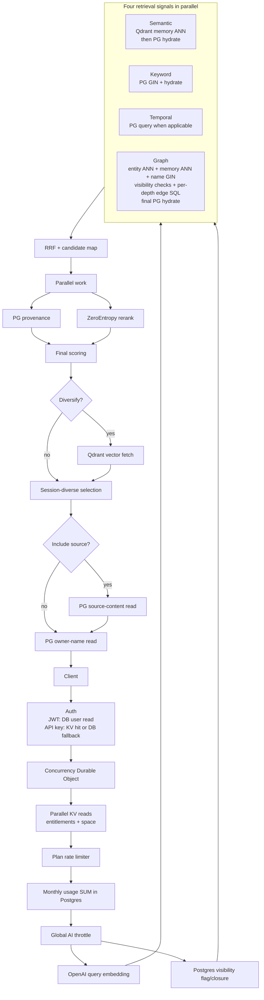
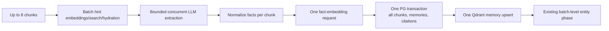

# Latency optimization opportunity audit

**Date:** 2026-08-11  
**Status:** Research record, superseded as an execution backlog by
[`observability-admin-analytics-checklist-2026-08-12.md`](./observability-admin-analytics-checklist-2026-08-12.md),
Track `P`; no proposal in this document has been implemented.

**Production reality:** `api.crosmos.dev` is the customer-facing Hono API. The Hono API Worker, ingestion Worker, Neon database, Qdrant collections, OpenAI embedding/extraction calls, and ZeroEntropy reranking are serving existing production users and existing data.  

**Relationship to the remediation checklist:** This remains the detailed R&D
record. All viable action items, deferrals, dependencies, and acceptance gates
are consolidated into the canonical observability/admin/analytics checklist so
there is only one execution checklist. It does not change or mark anything in
`ingestion-retrieval-priority-checklist-2026-08-10.md`.

## Executive conclusion

There is meaningful latency left to remove from the codebase without deleting any retrieval signal or changing ranking math. The best opportunities are mostly fewer remote round trips, not faster JavaScript:

1. **Batch ingestion by pipeline stage.** Up to eight chunks currently make independent dedup embedding calls, Qdrant searches, memory embedding calls, Postgres transactions, and Qdrant upserts. Batched requests can return the same embeddings and ANN results while turning many network round trips into one.
2. **Batch the two memory ANN searches in retrieval.** Semantic retrieval and graph memory seeding query the same Qdrant collection with the same query vector but different limits/thresholds. Qdrant's batch-search endpoint can preserve both searches while paying one HTTP round trip.
3. **Parallelize the plan limiter and monthly quota read.** They are serial today, although the quota read is side-effect-free and the limiter is already charged even when the later quota gate rejects. Running them together preserves the existing decisions and side effects.
4. **Collapse graph and final-enrichment database round trips.** Graph BFS performs one edge query per depth. A server-side traversal can preserve the algorithm while avoiding depth-by-depth Worker/DB waits. Source content and owner-name enrichment can also run concurrently.
5. **Bulk-resolve new entities.** Entity ANN is already batched, but unresolved entity inserts/fallback selects still run sequentially in a loop. One bulk insert plus one lookup can replace O(entity count) database waits.

The potentially largest model-level improvement is combining memory and graph extraction into one structured LLM response, removing one sequential LLM request per chunk. That is not automatically safe: it needs a corpus-level extraction and graph-quality evaluation before rollout.

Rust/WASM is technically supported, including SIMD, but it is not a first-line answer here. The current endpoint spends seconds waiting for network services; moving small RRF, scoring, tokenization, or fuzzy-matching loops from V8 to Rust cannot remove those waits. A WASM kernel becomes worth testing only if profiling shows MMR/cosine or another CPU loop is a material portion of p95 after the I/O work is fixed.

## What this audit examined

The review followed the current production paths rather than relying on older architecture notes:

- Search admission and response: `apps/api/src/features/search/routes.ts`
- Retrieval orchestration and selection: `apps/api/src/features/search/service.ts`
- Semantic, keyword, temporal, and graph signals: `apps/api/src/features/search/signals/`
- Candidate hydration and provenance: `apps/api/src/features/search/candidates.ts`
- Visibility closure: `apps/api/src/features/visibility/service.ts`
- API-key/JWT authentication and gate caches: `apps/api/src/features/auth/` and `apps/api/src/lib/gate-cache.ts`
- Ingestion orchestration: `apps/ingestion/src/ingestion/pipeline.ts`
- Entity resolution: `apps/ingestion/src/extractors/resolve-entity.ts`
- OpenAI, ZeroEntropy, Workers AI, and Qdrant adapters under `packages/ai`, `packages/vector`, and the two Workers
- Drizzle schemas and all declared Postgres indexes under `packages/db/src/schema/`
- Current production/staging Wrangler configuration
- The incident/remediation documents and the current checklist, without modifying them

This was a static audit plus literature/documentation research. It did **not** run a production benchmark, query production data, change a provider, create an index, or deploy anything.

## Measurement warning

The code now emits many useful `duration_ms` stage logs, but the `ANALYTICS` bindings are still commented out in both production Workers. The latest recorded before/after smoke test also explicitly says that network noise prevented a defensible latency claim. Therefore:

- impact sizes below are hypotheses, not promises;
- call-count reductions are much more reliable than millisecond estimates;
- production p50/p95/p99 must be measured by stage, result shape, geography, and cache status;
- no index should be added or removed from production based only on this static review.

The older benchmark artifact shows retrieval in the multi-second range, and code comments record an OpenAI query-embedding call around 370 ms and extraction calls commonly around 1–2 seconds. Those are useful scale indicators, not current baselines.

## Current retrieval critical path

Important existing good work that should not be undone:

- the query embedding already overlaps visibility resolution;
- semantic, keyword, graph, and temporal signals run concurrently;
- provenance runs concurrently with reranking;
- full raw source text is loaded only for selected results and only when requested;
- touch/usage writes run off the response path;
- timeouts propagate cancellation to OpenAI, Qdrant, and ZeroEntropy;
- Postgres remains the authoritative visibility and lifecycle filter;
- the Worker is deliberately placed near Neon and Qdrant in US East.

## Current ingestion critical path

For each concurrency window of up to three chunks, each chunk independently performs the following sequence:

```mermaid
flowchart LR
  Chunk[Chunk] --> DEmbed[OpenAI search embedding]
  DEmbed --> DAnn[Qdrant memory ANN]
  DAnn --> DHydrate[PG hydrate dedup hints]
  DHydrate --> MemoryLLM[OpenAI memory extraction]
  MemoryLLM --> GraphLLM[OpenAI graph extraction]
  GraphLLM --> Normalize[Normalize + temporal fallback]
  Normalize --> MEmbed[OpenAI document embeddings]
  MEmbed --> Tx[PG transaction<br/>chunk + memories + citations]
  Tx --> MUpsert[Qdrant memory upsert]
```

After all chunks in the current batch finish:

```mermaid
flowchart LR
  Facts[All facts in batch] --> EEmbed[One entity embedding request]
  EEmbed --> EAnn[One batched Qdrant entity search]
  EAnn --> EHydrate[One PG candidate hydrate]
  EHydrate --> ELoop[Sequential insert/select per unresolved entity]
  ELoop --> EUpsert[One Qdrant entity upsert]
  EUpsert --> Links[PG memory-entity links]
  Links --> Edges[PG edge insert]
  Edges --> Checkpoint[PG checkpoint update]
```

The pipeline already has bounded chunk concurrency, batched entity embeddings/searches/upserts, durable continuations, and retry-safe checkpoints. The main remaining inefficiency is that the earlier stages are organized as complete per-chunk pipelines instead of a bounded batch dataflow.

## Opportunity map

The classification is important:

- **Equivalent:** same providers, inputs, outputs, candidates, scores, and database authority; only scheduling or batching changes.
- **Guarded:** all signals remain, but ANN behavior, prompts, models, representations, or cache freshness can change output. Requires shadowing and quality gates.
- **Architectural bet:** potentially large upside with migrations, backfills, or a materially different operating model.

| ID | Opportunity | Pipeline | Class | Expected latency effect | Migration/backfill |
|---|---|---|---|---|---|
| R1 | Batch semantic ANN and graph memory-seed ANN into one Qdrant HTTP request | Retrieval | Equivalent | Remove one Qdrant network round trip | None |
| R2 | Run plan limiter and monthly quota read concurrently | Retrieval admission | Equivalent | Remove one serial gate wait | None |
| R3 | Run final source-content and owner-name reads concurrently | Retrieval | Equivalent | Hide one small PG round trip when source is included | None |
| R4 | Prefetch MMR vectors during rerank/provenance | Retrieval | Equivalent result; more transfer | Hide most/all post-score vector-fetch wait | None |
| R5 | Execute graph BFS in one server-side DB operation | Retrieval graph | Equivalent if differential-tested | Remove up to `MAX_DEPTH` sequential DB round trips | New SQL/function; indexes may help |
| R6 | Cache exact query embeddings by model/dimension/version | Retrieval | Guarded for privacy/versioning | Avoid the embedding call on repeated queries | None; cache policy required |
| I1 | Batch dedup embeddings and Qdrant searches across chunks | Ingestion | Equivalent | Up to 8 embedding requests -> 1 and 8 Qdrant calls -> 1 per invocation batch | None |
| I2 | Batch fact embeddings, PG persistence, and Qdrant memory upserts | Ingestion | Equivalent | Many remote writes -> one per bounded batch | None; transaction behavior changes |
| I3 | Bulk unresolved entity insert and lookup | Ingestion | Equivalent | O(entities) DB round trips -> about 2 | None |
| I4 | Overlap memory embedding with graph extraction | Ingestion | Equivalent after refactor/tests | Hide embedding latency under second LLM call | None |
| I5 | One-pass memory + graph extraction | Ingestion | Guarded | Remove one sequential LLM request per chunk | None; prompt/schema and eval work |
| D1 | Evidence-based relational index cleanup | Both | Equivalent | Faster writes, smaller cache/maintenance footprint | Online index drops; rollback plan |
| D2 | Graph traversal indexes plus `UNION ALL` query shape | Retrieval | Equivalent if ordered/deduped correctly | Reduce graph DB time, especially hubs | Online index creation |
| D3 | `(org_id, date)` covering usage index or monthly rollup | Admission/ingestion | Equivalent with transactional rollup | Bound monthly quota read as org grows | Index or new rollup/backfill |
| V1 | Qdrant tenant indexing and tuned HNSW/filter settings | Both | Guarded | Better scale/filtered ANN consistency | Background Qdrant rebuild |
| V2 | Add visibility/owner payload for ANN pre-filtering | Retrieval | Guarded; can improve recall | Reduce discarded hits/overfetch | Dual-write + point backfill + index rebuild |
| V3 | Quantization with oversampling and full-vector rescoring | Retrieval | Guarded | Lower ANN CPU/RAM at larger scale | New collection or background config/rebuild |
| A1 | Colocated embedding/reranking provider | Retrieval | Architectural bet | Remove external-provider distance | Full vector backfill if embedder changes |
| A2 | Matryoshka dimension reduction | Both | Architectural bet | Smaller network payloads, index, and MMR work | Full dual-write/re-embed/reindex |
| A3 | Precomputed late-interaction retrieval/reranking | Retrieval | Architectural bet | Could replace synchronous external rerank | New representations/index and backfill |
| A4 | Regional read architecture | Retrieval | Architectural bet | Largest global-network upside | Regional data/vector/inference replication |

## Priority 1: result-equivalent retrieval changes

### R1. Use Qdrant batch search for semantic and graph memory seeds

Today, one search makes two independent HTTP requests to the same Qdrant memory collection with the same query vector:

- semantic: top 50, minimum score 0.1;
- graph memory seed: top 5, minimum score 0.2.

Qdrant already exposes `/points/search/batch`, and the repository already uses it for ingestion entity resolution. Add a vector-port operation that accepts searches with different options and submit both searches in one batch. The semantic and graph paths still receive their own result arrays and keep their current thresholds and ordering.

Why not simply reuse semantic top-50 as graph top-5? Because HNSW is approximate and Qdrant documents that changing the requested limit can change the overlapping results. Reusing the larger result set is an attractive experiment, but the strictly result-preserving change is two searches in one HTTP batch.

**Quality contract:** per-signal IDs, order, scores, and graph seeds must match the two-call implementation over a frozen Qdrant snapshot.

### R2. Parallelize plan-rate and monthly-quota gates

After entitlement/space resolution, `enforcePlanRateLimit` runs before `checkQuota`. The quota operation is a read. The plan limiter's counter is already consumed before a later quota rejection, so starting them together does not newly charge quota-rejected requests.

This removes one serial network/database wait for accepted requests while retaining:

- concurrency shedding first;
- authorization before both gates;
- the same plan-limit decision;
- the same monthly-quota decision;
- no OpenAI work before all admission checks pass.

Error mapping must preserve the current 429 body and retry headers. A small orchestration change is safer than combining every limit into one global Durable Object, which would create a new central bottleneck and failure domain.

### R3. Parallelize final enrichment

With `include_source=true`, retrieval waits for final source content and then the route performs a separate owner-name query. Once top-K is known, these reads are independent. Start both together, or issue one tagged SQL statement that returns both result sets.

This does not affect ranking because both reads occur after selection. It also preserves the public response exactly. When `include_source=false`, only the owner read occurs.

### R4. Hide optional MMR vector loading

When `diversify=true`, raw vectors are fetched only after reranking and final scoring, creating a new serial Qdrant step. Options:

1. Start `fetchVectors` for the fused/reranker pool while reranking and provenance run; filter the returned map to the eventual selectable candidates.
2. Ask the semantic ANN search to return vectors, then fetch only keyword/graph-only candidates that are still missing.
3. Combine both: semantic vectors are free of an extra read, and the remainder is prefetched.

The selected results remain identical if the exact same full-precision vectors feed the existing `mmrRerank`. The tradeoff is extra bytes for candidates later removed by the relevance floor. Enable it only for `diversify=true`, record bytes and candidate counts, and cap the speculative pool.

### R5. Make graph traversal one database conversation

The current graph path performs:

- seed-name SQL, entity ANN, and memory ANN/link work;
- optional visibility validation;
- seed-entity-to-memory SQL;
- one edge SQL query per depth (maximum two today);
- final memory hydration.

The per-depth queries are logically sequential but do not have to cross the Worker/Postgres boundary each time. A recursive CTE or a versioned SQL function can perform the bounded traversal server-side and return scored memory IDs.

The hard part is semantic equivalence, not writing the CTE. It must reproduce:

- newest-first effective-time ordering and unique-ID tie-break;
- 200 edges per hop, not 200 for the entire traversal;
- null confidence as 1.0;
- temporal `as_of` filtering;
- visited/frontier behavior;
- max relevance propagation;
- depth decay and recency factor;
- the memory budget;
- visibility rules.

Build a differential test that executes both implementations inside one transaction over generated graphs and requires identical memory IDs and scores within floating-point tolerance. Do not deploy an approximately similar recursive query.

### R6. Exact query-embedding cache

The query embedding is independent of tenant data. An exact cache keyed by:

`HMAC(normalized query) + provider + model snapshot/alias + dimensions + embedding-mode/version`

can remove the OpenAI embedding call for repeated queries without caching retrieval results or weakening freshness. Safer rollout choices are:

- a small per-isolate memory LRU first;
- short TTL;
- store only the vector, never raw query text;
- rotate or version the HMAC/cache namespace when the model changes;
- measure hit rate before adding a distributed cache.

This is **guarded**, not automatically equivalent. Provider aliases can change, cached embeddings are derived from potentially sensitive queries, and a plain hash is dictionary-attackable. A model snapshot or explicit cache epoch is required. Do not use a result cache as the first step: result caching also needs visibility, lifecycle, access-frequency, and freshness invalidation.

## Priority 1: result-equivalent ingestion changes

### I1. Batch dedup-hint work across the invocation batch

For up to eight chunks, Stage 1 independently does:

1. one OpenAI search embedding;
2. one Qdrant memory ANN query;
3. one Postgres hydrate of returned IDs.

Instead:

1. embed every chunk text in one embeddings request;
2. call Qdrant batch search once, preserving one result list per chunk;
3. hydrate the union of memory IDs in one Postgres query;
4. reconstruct each chunk's ordered `existingMemories` list from its ANN order.

OpenAI explicitly supports multiple inputs in one embeddings request (up to the endpoint's documented input/token limits), and Qdrant recommends batching queries and inserts to reduce round trips. The vectors and per-chunk hints are unchanged.

Failure behavior must stay deliberate. The current Stage-1 hint is fail-soft per chunk. A failed batch request must either retry/split once or degrade all affected chunks to empty hints; it must not fail the source merely because batching combined their calls.

### I2. Convert per-chunk persistence into a bounded batch write phase

Each chunk currently performs its own fact embedding request, Postgres transaction, and Qdrant memory upsert. Reorganize one bounded invocation batch into phases:

This preserves chunk sequence, citation links, memory content, vectors, and the durable checkpoint. It also matches the current recovery unit: the checkpoint advances only after the whole invocation batch completes.

Implementation gotchas:

- retain the mapping from chunk -> fact -> inserted memory ID -> vector;
- retain per-chunk logging fields even though the provider call is shared;
- preserve the current purge/retry guarantee if PG commits and Qdrant fails;
- keep provider token and item limits below their documented maximums;
- split a provider batch deterministically if a source approaches those limits;
- decide whether a single PG transaction is acceptably short; do not hold it open across LLM or Qdrant calls.

### I3. Bulk unresolved entity creation

Entity embeddings, ANN prefiltering, candidate hydration, and final Qdrant upsert are already batched. However, `resolveEntities` calls `getOrCreateEntity` sequentially for every unresolved entity. Each call may do an insert and a fallback select.

After deterministic fuzzy decisions are known:

1. collect unresolved normalized names;
2. bulk `INSERT ... ON CONFLICT DO NOTHING RETURNING`;
3. query all unresolved names once to resolve conflicts/existing rows;
4. rebuild the original output order;
5. perform the already-batched vector upsert.

The unique `(space_id, lower(name))` index remains the concurrency authority. Test simultaneous ingesters resolving the same names.

### I4. Overlap memory embedding with graph extraction

Graph extraction is sequential after memory extraction. The memory embedding text depends on normalized memory content and event time, while graph extraction supplies entities and relations. Split normalization into:

- base memory validation/dedup/temporal data;
- later graph attachment and relation normalization.

Then begin fact embeddings and graph extraction together, join them before persistence, and keep the current final `NormalizedFact` shape. This hides the shorter of the embedding and graph-LLM calls without changing either provider request.

This needs differential tests because the current normalizer joins graph results by memory index and the within-batch dedup set is shared across concurrent chunks. Preserve deterministic ownership of that set; the existing interleaving is already best-effort, but a refactor should not make it less predictable.

## Priority 2: database and index work

### Start with evidence, following the Mem0 lesson

The supplied Mem0 article describes a 1.153 TB Postgres table where both HNSW indexes had zero scans; selective tenant filters made the planner choose sequential scans. Dropping unused vector indexes fixed their write/storage problem, and moving vectors to a dedicated store produced their large vector-search improvement.

Crosmos should **not** copy the migration literally:

- production already uses the article's resulting two-phase architecture: Qdrant returns IDs, then Postgres hydrates rows;
- production Qdrant rows leave `memories.embedding` and `entities.embedding` null;
- the Postgres HNSW indexes exist for the optional `pg` vector backend, not production retrieval;
- the current data scale and query plan are not Mem0's scale or plan.

The correct transfer is the method:

1. capture `pg_stat_statements` and `pg_stat_user_indexes` over a representative window;
2. run `EXPLAIN (ANALYZE, BUFFERS, WAL)` for representative staging queries;
3. measure write amplification and index sizes;
4. only then create/drop indexes online;
5. keep a rollback definition and observe p95/p99 plus retrieval equivalence.

### D1. Concrete cleanup candidates to investigate

These are candidates, not approved drops:

| Candidate | Why it may be redundant or unused | Required proof |
|---|---|---|
| `api_keys_key_hash_idx` versus the `key_hash UNIQUE` constraint | Both appear to create a unique B-tree on the exact same column | Confirm two physical indexes and identical opclass/validity; keep the constraint-owned one |
| `chunk_memories_chunk_id_idx` | Unique `(chunk_id, memory_id)` already has `chunk_id` as its leading key | Show no plan requires a smaller dedicated index enough to justify its write cost |
| `memory_entities_memory_id_idx` | Unique `(memory_id, entity_id)` already leads with `memory_id` | Same evidence |
| `visibility_group_members_group_id_idx` | Unique `(group_id, user_id)` already leads with `group_id` | Same evidence |
| `visibility_groups_org_id_idx` | Unique `(org_id, slug)` already leads with `org_id` | Same evidence |
| `daily_usage_org_id_idx` | Unique `(org_id, user_id, space_id, date)` already leads with `org_id` | Compare monthly query plans before replacing it with `(org_id,date)` |
| `memories_embedding_hnsw_idx`, `entities_embedding_hnsw_idx` | Production Qdrant writes null to these columns, so production search cannot use them | Decide whether the `pg` backend remains a supported live fallback; inspect size/scans |
| `entities_name_gin_idx` | Retrieval graph-name seeding explicitly uses the separate `simple` GIN index | Find any other production query using the English GIN index |
| Low-cardinality single-column indexes such as content/memory type | May cost more on ingestion than they save | At least a 30-day scan/plan inventory including maintenance/admin paths |

Do not drop constraint-owned indexes directly. Use a reviewed migration, `DROP INDEX CONCURRENTLY` where supported, and account for Drizzle schema reconciliation so a later migration does not recreate the index.

### D2. Graph-edge query shape and indexes

`getEdgesForEntities` uses an `OR` over `source_entity_id IN (...)` and `target_entity_id IN (...)`, plus org, space, forgotten, confidence, visibility, time, ordering, and limit predicates. Existing indexes are split between tenant and endpoint columns, so the planner may bitmap-combine or may read/sort more rows than necessary.

Experiment with:

- two query branches, one for source and one for target, combined with `UNION ALL`;
- dedupe by edge ID because a frontier may contain both endpoints;
- one final exact effective-time/ID ordering and per-hop limit;
- partial composite indexes shaped like `(org_id, space_id, source_entity_id, effective_time DESC, id DESC)` and the target equivalent, limited to non-forgotten edges.

An expression index on `coalesce(valid_from, recorded_at)` may avoid the final sort. Confidence/visibility predicates may prevent a perfect index-only plan, and two wide indexes make every edge insert more expensive. Use generated high-degree graphs and real selectivity distributions before adopting them.

### D3. Monthly quota lookup

The quota gate sums daily rows by `org_id` and month, but there is no `(org_id, date)` index. The current org-only index must inspect all history for the organization before applying the date predicate.

Two choices:

1. **Simple:** `(org_id, date) INCLUDE (tokens_ingested, search_queries)` for an index-friendly/index-only monthly sum.
2. **At larger org scale:** a transactional `org_monthly_usage` rollup with one row per org/month, while daily rows remain the billing/audit breakdown.

The rollup must be updated atomically with the existing idempotent usage accounting or reconciled from daily truth. Backfill it from `daily_usage`, compare both values continuously, and do not switch the enforcement gate until they agree.

The current SQL uses `current_date`/`date_trunc`, which Hyperdrive treats as uncacheable. Passing a month-start parameter would make the statement structurally cacheable, but authorization/billing quota reads require freshness and should use a cache-disabled Hyperdrive path. Query caching is not a substitute for the right index or rollup.

### D4. Visibility closure

Visibility-enabled search first reads the organization flag and then executes a recursive group/grant traversal. If visibility graphs become large or search-heavy, maintain a versioned/materialized closure keyed by `(org_id, viewer_user_id, visible_user_id)`.

The safe version is transactionally updated or rebuilt when membership/grants change and is protected by a visibility epoch. A short unversioned cache can leak newly revoked visibility, so it is not acceptable as a pure latency shortcut. Until measurements show this stage matters, the existing indexed recursive query is simpler.

### D5. Hyperdrive configuration audit

Cloudflare states that Hyperdrive query caching is enabled by default and can serve stale results after writes. Verify the deployed Hyperdrive configuration rather than assuming its state.

- Auth, permissions, billing/quota, cancellation fences, and read-after-write retrieval should use a cache-disabled binding if freshness is required.
- Explicitly stale-tolerant metadata can use a separately configured cached binding.
- `postgres.js` named prepared statements are supported; the repository does not set `prepare:false`, which is good for Hyperdrive caching/efficiency.
- Do not wrap unrelated reads in long transactions just to reuse a connection; Cloudflare warns that this reduces Hyperdrive pooling/scaling.

This audit is partly correctness work: an accidental 60–75 second stale authorization result is not a valid latency optimization.

## Priority 2: vector-store tuning

### V1. Tenant-index the actual filter

Qdrant points contain `orgId` and `spaceId`, while searches filter only by `spaceId`; `spaceId` has an integer payload index. Inspect collection configuration and segment telemetry before tuning.

Qdrant supports tenant payload indexes (`is_tenant=true`) to colocate a tenant's vectors within shared shards. Space is the natural query partition, but high-cardinality space IDs and each space's size distribution must be measured. Compare:

- current integer payload index;
- tenant indexing on one stable field;
- existing default HNSW;
- exact scan for very small filtered spaces;
- tuned `hnsw_ef` for a fixed Recall@K target.

Do not create a collection per space; Qdrant explicitly recommends payload-based multitenancy rather than hundreds/thousands of collections.

### V2. Visibility-aware ANN filtering

Today Qdrant filters by space only; Postgres then drops private/invisible/forgotten hits. This is secure because Postgres is authoritative, but a top-50 ANN window can contain unusable points and omit valid lower-ranked points.

A future Qdrant payload can include `visibility` and `ownerUserId`, allowing:

`spaceId AND (visibility = org OR ownerUserId IN visibleUserIds)`

Postgres must still hydrate and authorize every result. The benefit is primarily recall under selective visibility, with possible latency/load improvement from less adaptive overfetch. It requires:

- dual-writing payloads on new memory points;
- backfilling existing points without regenerating embeddings;
- payload indexes created before/rebuilt into filterable HNSW;
- updating Qdrant payload on visibility/ownership changes;
- shadow comparisons for private, org-visible, group-visible, forgotten, and mixed cases;
- a reconciliation job because Postgres and Qdrant can drift.

The active checklist deliberately defers this until overfetch/drop measurements justify it. This audit agrees: measure the invisible-hit ratio first.

### V3. Quantization only when vector compute/RAM is the bottleneck

Qdrant supports quantized candidate search followed by full-vector rescoring and oversampling. That can substantially reduce memory and ANN compute at scale while retaining high recall, but it is not mathematically identical to the current full-precision HNSW traversal.

Create a shadow collection and sweep:

- quantization method/bit depth;
- oversampling;
- full-vector `rescore=true`;
- `hnsw_ef`;
- Recall@50/Recall@100 against exact full-precision search;
- end-to-end retrieval NDCG/MRR/answer accuracy, not just ANN recall.

At today's small data sizes or when provider/reranker calls dominate, quantization may add operational work without visible endpoint benefit.

## Priority 2: LLM and model-path experiments

### I5. Combine memory and graph extraction

Current ingestion uses two sequential `gpt-4.1-mini` structured-output calls:

1. extract memories;
2. pass the extracted memory list to a graph prompt to extract entities/relations.

A single schema can return each memory with its entities and relations, eliminating one LLM round trip and the tokens used to resend memories. OpenAI's own latency guidance recommends combining sequential LLM steps when one structured response can represent both.

Why this is not an automatic win:

- the second pass focuses the model on graph quality;
- a larger schema can increase output tokens and structured-generation time;
- memory novelty and graph extraction currently fail/degrade differently;
- the empty-with-dedup-hint retry must remain able to recover new facts;
- a single malformed/low-quality result could now affect both memory and graph signals.

Evaluation gates should include memory fact precision/recall, temporal extraction, speaker role, entity resolution, relation precision/recall, ingestion wall time, output tokens, empty-source rate, and downstream retrieval/answer metrics. A useful compromise is one-pass by default with a second-pass graph fallback only when graph coverage/validation fails.

### Prompt caching and prompt shape

The memory and graph system prompts are long and stable. OpenAI prompt caching is automatic for eligible modern models and reports cached-token usage. The current adapter records total prompt/completion tokens but not `cached_tokens`/prompt-token details.

First add observation in a future implementation:

- log cached input tokens by extraction stage/model;
- keep static instructions and schema prefixes byte-stable;
- place changing chunk content later;
- use a stable prompt cache key if supported by the selected API/model;
- verify data-retention requirements before extended caching.

Prompt caching mainly reduces repeated prefix processing, not output-token generation. It will not equal the gain from removing an entire LLM call, but it is low-risk once privacy requirements are checked.

### Colocated provider bake-off

The repository already has a Workers AI reranker adapter, and Cloudflare currently offers BGE embedding and reranker models. A shadow bake-off can compare:

- OpenAI `text-embedding-3-small` + ZeroEntropy `zerank-2` (current production);
- current OpenAI embeddings + Workers AI reranker;
- a fully Workers AI embedding/rerank pair;
- a dedicated inference endpoint in/near US East with dynamic batching.

Measure p50/p95/p99, timeout/error rate, multilingual retrieval, all existing recall categories, relevance-floor calibration, and cost. An embedding-model change requires a new vector space and full dual-write/re-embed/backfill; never point the current 1536-dimensional collections at a different model in place.

### Matryoshka dimension experiment

`text-embedding-3-small` supports a `dimensions` parameter and the repository already documents this. Reducing 1536 dimensions can shrink:

- OpenAI response payloads;
- Qdrant storage/index memory and comparison work;
- Qdrant vector-transfer cost for MMR;
- Worker-side cosine CPU.

The Matryoshka Representation Learning paper demonstrates that nested representations can trade dimension for retrieval cost, but its headline results are not Crosmos guarantees. Run a dual-collection experiment at several dimensions, tune ANN parameters separately, and require retrieval/answer non-regression. A winning dimension still needs a full backfill and coordinated dual-read cutover.

## Larger architectural bets

### A1. Regional read path

Targeted placement near US East is correct for the current single-region dependencies: it turns repeated Worker-to-DB/vector trips into local hops at the cost of one long user-to-US trip. The remaining global floor cannot be coded away.

Neon's standard read replicas are same-region and share the same storage source; they can offload CPU but do not create a global read architecture. A genuinely regional path needs a coherent set in each chosen region:

- relational read replica/materialized search projection;
- vector index;
- embedding and reranking inference;
- session-consistency/freshness policy;
- authoritative visibility and deletion propagation.

Recent writes could route to the primary until a replication watermark is observed. This is a major system, justified only after latency by client geography and business volume shows the single-region floor is material.

### A2. Late-interaction retrieval instead of synchronous cross-encoder reranking

ColBERTv2-style late interaction precomputes compressed token-level document representations, then performs query-token/document-token scoring at retrieval time. It can improve retrieval quality and potentially avoid sending hundreds of full memory strings to a remote reranker.

This is not a drop-in speed fix. It adds multi-vector storage, new indexing/query behavior, and a backfill. Test it as a new signal/rerank implementation behind shadow reads. It is attractive if ZeroEntropy remains the dominant retrieval stage and the quality curve beats a colocated small cross-encoder.

### A3. Reconsider Postgres-only vectors only at small scale

Because production already has Qdrant, moving vectors back into Postgres would reverse the architecture Mem0 adopted and reintroduce filtered-HNSW planner risk. It can still be a simplification experiment for very small per-space datasets:

- exact pgvector scan within a highly selective space can provide perfect ANN recall;
- one SQL query can filter visibility, score vectors, and hydrate rows;
- pgvector 0.8+ iterative scans improve filtered approximate search.

However, production Postgres columns are 1024-dimensional while the live vector space is 1536-dimensional, so this requires a new column/backfill or dimension change. Benchmark a shadow table before considering it. Do not treat “one fewer service” as proof of lower latency or greater reliability.

### A4. Keep Qdrant as the candidate engine, not the authorization database

Another extreme is to duplicate full retrieval metadata/source text into Qdrant and avoid Postgres hydration. That would be faster on some calls but makes authorization, deletion, and transactional truth eventually consistent. It is not recommended.

A safer middle ground is richer payload for pre-filtering/candidate metadata while retaining the final Postgres authorization/hydration check. The extra Postgres hop is an intentional security boundary.

## Rust/WASM assessment

Cloudflare Workers supports precompiled WebAssembly and SIMD but not threading. WASM binaries are often larger and can increase startup time.

Current CPU candidates are:

- RRF and final score assembly over at most a few hundred candidates;
- session diversity over at most 300 candidates;
- MMR cosine work over at most 300 vectors × 1536 dimensions × top-K selections;
- entity fuzzy matching against a pool capped at 50 per extracted entity;
- tokenization and temporal regex parsing.

None is likely to explain multi-second wall time. The raw-vector HTTP transfer needed by MMR is likely more expensive than its JS arithmetic. V8 is also already highly optimized for tight numeric loops when data layout is friendly.

Use Rust/WASM only under this decision rule:

1. collect Worker CPU profiles and stage wall time;
2. show a pure CPU kernel is at least roughly 10–20% of p95 endpoint CPU/wall time after I/O batching;
3. create a typed-array benchmark using production candidate sizes;
4. compare optimized TypeScript, WASM SIMD, binary size, startup time, and memory copies across the JS/WASM boundary;
5. adopt only if end-to-end p95 improves, not merely the microbenchmark.

The most plausible WASM experiment is a packed `Float32Array` MMR/cosine kernel. A whole Rust Worker or Rust rewrite of the pipelines is not justified: it would leave OpenAI, Qdrant, Neon, Durable Object, and ZeroEntropy waits unchanged while increasing implementation and debugging complexity.

## Experiments that are tempting but should not be first

| Idea | Why it is not first |
|---|---|
| Remove reranking | Directly risks retrieval precision/answer quality; violates the “no signal loss” constraint |
| Skip graph based on an intent classifier | Can silently lose graph-only recall; classifier adds its own latency/failure mode |
| Reduce candidate pool/top-K | Easy speedup that can lose recall before reranking |
| Cache whole search responses | Hard visibility, deletion, freshness, time-decay, and access-frequency invalidation problem |
| One Qdrant collection per space | Qdrant warns against hundreds/thousands of collections; payload multitenancy is the intended model |
| Add Kafka or another broker | Does not shorten the synchronous retrieval path; current Queue + RPC design already supplies durability and a fast kick |
| Replace all TypeScript with Rust | Remote I/O dominates; rewrite risk is high and Cloudflare WASM is single-threaded |
| Move all vectors back to Postgres because Mem0 discussed pgvector | Mem0 did the opposite at scale; current production already has the split architecture |
| Aggressively quantize without exact/shadow evaluation | Can alter ANN candidates and downstream fusion even with rescoring |
| Blindly raise ingestion concurrency | Can turn provider/subrequest/DB limits into worse p99 and retry storms |

## Recommended experiment order

This is not a replacement checklist; it is the order in which latency hypotheses should be tested if the team chooses to pursue them.

### Phase 0: obtain a trustworthy latency budget

1. Enable the already-planned metrics sink, emit stage histograms to it, and verify those measurements arrive. The current structured stage logs alone are not a durable metrics series.
2. Record p50/p95/p99 for authentication, every admission gate, embedding, each signal, reranking, provenance, MMR vector fetch, source/owner enrichment, and total response.
3. For ingestion, record per batch and per chunk: hint embed/search/hydrate, both LLM calls, fact embed, PG persistence, Qdrant upsert, entity resolution, edges, and checkpoint.
4. Include candidate/chunk/vector/token counts, cache status, placement colo, provider, and error/timeout class.
5. Build a read-only benchmark mode that suppresses touch/usage mutations and uses a frozen staging snapshot.

### Phase 1: remove waits without changing results

1. R1 Qdrant batch search.
2. R2 parallel admission gates.
3. R3 parallel final enrichment.
4. I3 bulk entity creation.
5. I1 batch dedup hints.
6. I4 overlap graph extraction and fact embedding.
7. I2 bounded batch persistence/upsert.
8. R4 MMR prefetch if its stage is visible in metrics.

Each change should ship separately behind a flag or small canary so its latency delta is attributable.

### Phase 2: query/index shape

1. Collect index scans/sizes and slow-query plans over a representative period.
2. Remove only proven duplicate/unused indexes online.
3. Test the monthly quota index/rollup.
4. Test edge `UNION ALL` and composite/expression indexes.
5. Test server-side graph traversal against the differential suite.
6. Inspect Qdrant tenant/filter configuration and exact-vs-HNSW thresholds by space size.

### Phase 3: quality-gated model/vector work

1. Measure current OpenAI prompt-cache hits.
2. One-pass extraction shadow run.
3. Workers AI/colocated reranker bake-off.
4. Matryoshka dimensionality dual-collection experiment.
5. Visibility-aware Qdrant payload only if discarded-hit metrics justify it.
6. Quantization only after Qdrant compute/RAM becomes material.
7. Late interaction only if reranking remains the dominant critical-path stage.

### Phase 4: architecture only with a demonstrated ceiling

1. Decide whether the user-to-US network floor or backend work dominates by geography.
2. Add same-region Neon read compute only for database CPU/connection isolation, not as a false “global replica.”
3. Design regional search projections only if geographic latency and demand justify their consistency/operations cost.

## Accuracy and efficacy gate

Every optimization must be evaluated at several layers. A faster ANN call is not a success if downstream answers degrade.

### Retrieval invariants for equivalent changes

- identical semantic/keyword/graph/temporal candidate IDs, ordering, and scores;
- identical RRF order and score;
- identical reranker input order/content and output mapping;
- identical recency/temporal/persistence adjustments;
- identical relevance-floor behavior;
- identical session diversity and MMR top-K;
- identical source IDs/text and owner display names;
- identical private/org/group visibility behavior;
- identical behavior for forgotten and stale Qdrant points;
- identical timeout/fail-soft policy.

### Quality metrics for guarded changes

- Recall@K, Precision@K, MRR, NDCG, and per-signal recall;
- existing single-session, multi-session, temporal, graph, speaker-role, and adversarial visibility categories;
- answer exactness/faithfulness and abstention behavior;
- extraction fact precision/recall, entity/relation precision/recall, temporal correctness, duplicate rate, and empty-source rate;
- drift by language, source size, plan, space size, and visibility selectivity;
- p50/p95/p99 latency and timeout/error rate;
- token/provider cost and Qdrant/Postgres resource load.

Use a non-inferiority threshold decided before looking at the result. Do not accept “average quality unchanged” if one important category regresses.

## Production rollout and data safety

The equivalent scheduling/batching proposals R1–R4 and I1–I4 need no historical-data migration or re-embedding. They still affect production request execution and should use canary/shadow/differential verification.

Changes that do require data work:

| Change | Required production treatment |
|---|---|
| Index cleanup/addition | Concurrent online DDL where possible, lock/IO monitoring, rollback DDL, schema definition update |
| Monthly usage rollup | Additive table, historical backfill, dual comparison, then gated cutover |
| Visibility-aware Qdrant payload | Dual-write, payload backfill, payload index/HNSW rebuild, reconciliation, shadow reads |
| Qdrant tenant/quantization changes | Shadow collection or background rebuild, recall validation, reversible alias/config cutover |
| Embedding model/dimension change | New collections/columns, complete re-embed, dual-write, coverage audit, coordinated API+ingestion cutover |
| Late-interaction representations | New index/collection and full representation backfill |
| Regional architecture | Replication/bootstrap, consistency watermark, deletion/visibility propagation, rollback routing |

Never mutate the existing vector collection in place for an embedding-model or dimension change. Existing users' 1536-dimensional production vectors must remain readable until a verified replacement has full coverage.

## Source notes

- The supplied [Mem0 latency article](https://mem0.ai/blog/how-we-cut-vector-search-latency-by-70x) is a useful case study in checking actual index scans and separating relational/vector workloads. Its reported scale and numbers are not assumed to apply to Crosmos.
- [Qdrant indexing documentation](https://qdrant.tech/documentation/manage-data/indexing/) explains filterable HNSW, payload-index timing, HNSW parameters, and ACORN behavior.
- [Qdrant production guidance](https://qdrant.tech/documentation/production-checklist/) recommends payload indexes, batching queries/inserts, reranking tradeoffs, and delayed fan-out for tail latency.
- [Qdrant multitenancy documentation](https://qdrant.tech/documentation/tutorials/multiple-partitions/) describes tenant payload indexes and why per-user/per-tenant collections do not scale well.
- [Qdrant quantization documentation](https://qdrant.tech/documentation/quantization/) documents full-vector rescoring and oversampling, along with their recall/speed tradeoffs.
- [pgvector documentation](https://github.com/pgvector/pgvector) documents exact search, HNSW/IVFFlat, filtered-search limitations, and iterative scans in 0.8+.
- [OpenAI embeddings API](https://developers.openai.com/api/reference/resources/embeddings/methods/create) documents multiple inputs per request and current request limits.
- [OpenAI latency guidance](https://developers.openai.com/api/docs/guides/latency-optimization) recommends fewer requests, parallel work, shorter outputs, and not defaulting to an LLM.
- [OpenAI prompt caching](https://developers.openai.com/api/docs/guides/prompt-caching) documents automatic caching, stable prefixes, cache metrics, and explicit cache controls for supported models.
- [Cloudflare Hyperdrive query caching](https://developers.cloudflare.com/hyperdrive/concepts/query-caching/) documents default caching, read-after-write staleness, and separate cache-disabled bindings for security/freshness-sensitive reads.
- [Cloudflare Worker placement](https://developers.cloudflare.com/workers/configuration/placement/) explains targeted/Smart Placement and the edge/front-worker plus placed-backend pattern.
- [Cloudflare Workers AI model catalog](https://developers.cloudflare.com/workers-ai/models/) is the authoritative current list for embedding/reranker candidates.
- [Cloudflare Workers WebAssembly](https://developers.cloudflare.com/workers/runtime-apis/webassembly/) documents SIMD support, lack of threading, and binary/startup tradeoffs.
- [Neon read replica documentation](https://neon.com/docs/ai/ai-scale-with-neon) describes read-only compute scaling; Neon also identifies them as [same-region read replicas](https://neon.com/blog/introducing-same-region-read-replicas-to-serverless-postgres), not global replicas.
- [Matryoshka Representation Learning](https://arxiv.org/abs/2205.13147) motivates flexible lower-dimensional representations, but Crosmos needs its own text-retrieval evaluation.
- [ColBERTv2](https://arxiv.org/abs/2112.01488) is the primary reference for compressed late-interaction retrieval.
- [ACORN](https://arxiv.org/abs/2403.04871) and the [filtered ANN survey](https://arxiv.org/abs/2505.06501) explain why filter selectivity and data/query distribution must be part of ANN tuning and evaluation.

## Bottom line

The best near-term path to lower latency while preserving all signal value is:

**measure by stage -> batch identical remote work -> overlap independent work -> reduce DB conversations -> only then tune indexes/models/vector representations.**

The codebase does have optimizable CPU loops, but they are not currently the dominant architectural cost. Rust/WASM, quantization, new embedding dimensions, provider switches, and regional storage are valuable experiments only after the simpler round-trip reductions establish the remaining latency budget.
