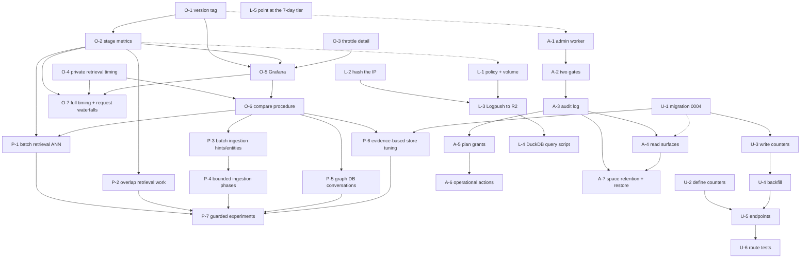

# Observability, Admin Plane, Analytics, and Latency Optimization Priority Checklist

_Repository-scoped consolidation, 2026-08-12._

## Purpose

This is the canonical execution checklist for five related gaps, all of them
versions of the same problem — **we cannot see our own system**:

1. **Engineering changes are unmeasurable.** Every latency or architecture
   change (a cache, an index, fewer provider calls) is currently justified by
   reasoning rather than by a before/after number. The only measurement tool is
   the `../benchmark` repository, which measures *retrieval quality on a fixed
   corpus* — not production latency, and not the effect of a deploy.
2. **There is no admin plane.** No way to see who is using Crosmos, and no way
   to grant an account Pro for thirty days without hand-editing production
   Postgres. A platform admin role was deliberately never added, to remove
   privilege-escalation paths.
3. **There are no user-facing analytics.** The console wants a 30/60/90-day view
   of sources ingested, memories created, and a content-type breakdown, per org
   and per space.
4. **Logs vanish after seven days, and nobody reaches for them before then.**
   Debugging habit is `wrangler tail`, which is live-only — so anything already
   in the past has to be reproduced. Past seven days it is genuinely
   unrecoverable: an incident cannot be analysed after it closes, and "was this
   happening last month" has no answer.
5. **The viable latency backlog was separate from the execution checklist.**
   The result-preserving batching, scheduling, and database changes from the
   latency audit now live in Track `P` below, with measurement and quality gates.
   The audit remains the research record, not a second backlog.

Related documents:

- [Metrics runbook](./metrics-runbook.md) — what each existing metric means.
- [Ingestion and retrieval priority checklist](./ingestion-retrieval-priority-checklist-2026-08-10.md)
  — item `P1-B` enabled Analytics Engine; this checklist builds on it.
- [Latency optimization opportunity audit](./latency-optimization-opportunity-audit-2026-08-11.md)
  — source analysis retained for context; its viable work is consolidated into
  Track `P` here and it is no longer an independent execution checklist.

Track `O` is a precondition for Track `P`. Almost every optimization is a
latency claim, and none of them can be accepted without a measured before/after
result and the relevant equivalence or quality gate.

> **Production warning:** `api.crosmos.dev` serves production users and the Neon
> database holds live production data. All three migrations below are additive,
> but each still requires the staging-first, backup, verification, and rollback
> procedure described in the ingestion/retrieval checklist.

## What already exists — do not rebuild it

The observability floor is considerably better than "nothing", and a plan that
ignores this would waste weeks. Verified 2026-08-12:

| Capability | Where | State |
|---|---|---|
| Structured logging with a PII allowlist | `packages/observability/src/index.ts` | 105-entry `FIELD_ALLOWLIST`; unlisted fields are stripped in production |
| `logger.time()` / `durationMs()` | same file | Used throughout both pipelines |
| Analytics Engine sink | `createMetrics`, same file | **Live**, not stubbed |
| Six AE datasets | both `wrangler.toml` files | `crosmos_api{,_staging,_dev}`, `crosmos_ingestion{,_staging,_dev}` |
| 17 emitted metrics | across both workers | Enabled 2026-08-11 (`f676711`) |
| Per-endpoint latency | `http_request`, `apps/api/src/index.ts:133` | `tags=[method, path, status]`, `values=[duration_ms]` |
| Request id propagation | `apps/api/src/index.ts:75` | `X-Request-Id`, plus `correlation_id` across the worker boundary |
| Queryable log history | Workers Logs (`[observability]`, both workers, all envs) | **7 days**, via dashboard, observability API, and the Cloudflare MCP server — already on, and unused |
| Per-stage timings | retrieval `service.ts`, ingestion `pipeline.ts`, and `createStageRecorder` | Structured logs **and** deployed `api_stage` / `ingestion_stage` Analytics Engine metrics; aggregate panels are live in Grafana |
| Daily usage rollups | `packages/db/src/schema/daily-usage.ts` | `(org_id, user_id, space_id, date)`, atomic `ON CONFLICT` upserts |
| Usage endpoints | `GET /api/v1/usage`, `GET /api/v1/spaces/{uuid}/usage` | Establish the response shape and the scoped-key access rule |
| Entitlement overrides | `resolveEntitlements`, `apps/api/src/features/orgs/entitlements.ts:81` | Pure function; `organizations.entitlements` jsonb merges over `PLAN_DEFAULTS` |
| Deadline-bounded temporary state | `plan_pending` / `plan_pending_expires_at` | Shipped pattern: read-time expiry + daily sweep |

**Per-endpoint p50, p95, and p99 for production can therefore be calculated since
2026-08-11 and have never been queried, and seven days of structured logs are
sitting behind an API nobody calls.** The gap is not collection.

Plan limits worth knowing before changing anything: Workers Logs on the Workers
Paid plan retains **7 days** and includes **20 million events per month, then
$0.60 per additional million**. Both workers run at `head_sampling_rate = 1`
across production and staging, and the current volume has never been measured
(L-1).

So the real gaps are narrower than they feel:

- **Per-request diagnosis.** Deploy versions and bounded stage names are now in
  Analytics Engine, but request ids correctly remain logs-only. Aggregate stage
  regressions are visible in Grafana; a single-request waterfall is not yet
  available there.
- **Complete timing coverage.** `http_request` is a broad application metric and
  the private `search` metric measures retrieval after several admission gates.
  Neither is explicitly defined as earliest Worker entry through response
  readiness, and authentication, request validation, response construction,
  API-side ingestion enqueue, and ingestion orchestration still have gaps. The
  public `X-Crosmos-Took-Ms` header is now marked for removal in O-4/O-7.
- **An admin plane.** A separate Access-gated worker now exists locally; the
  former public-worker `POST /api/v1/_admin/reembed` surface has been removed.
- **Two rollup counters** that user-facing analytics needs and nothing tracks.
- **Durable log storage.** Collection is on and correct; nothing survives seven
  days, and the interactive 7-day tier that *does* exist is not being used
  because the documented debugging tool is a live stream.

## Decisions

| Question | Decision | Reason |
|---|---|---|
| Where does the admin panel live? | New **`apps/admin` worker in this repository** | Own wrangler config, own hostname, own deploy. The public API worker gains no admin code, so an admin bug cannot reach the data plane. |
| How is platform admin authorized? | **Environment allowlist plus Cloudflare Access. No database role.** | Nothing in Postgres can be flipped to grant admin. A SQL-injection or a compromised org-owner account cannot escalate. Changing the admin set requires a deploy, which is the point. |
| What renders developer metrics? | **Grafana Cloud over the Analytics Engine SQL API** | No new data store, no new worker, no data leaves Cloudflare's store. Grafana is purely a query and visualisation layer. |
| How are metrics attributed to a change? | **Cloudflare `version_metadata` binding** | Bounded cardinality (one value per deploy), zero manual bookkeeping, and it cannot be forgotten the way a hand-set env var can. |
| How are user-facing numbers computed? | **Extend `daily_usage` rollups** | A 90-day read touches at most ~90 tiny indexed rows per space regardless of corpus size. Live `COUNT(*)` over `sources`/`memories` has the same O(N) shape that `P1-E` just removed from retrieval. |
| Client/tool distribution (Claude Code, Codex, MCP, SDK)? | **Deferred.** Seam recorded only. | Genuinely absent from the data model; it is net-new instrumentation, not a query. Adding it now would also clutter the analytics response. |
| Accuracy and recall regression tracking? | **Deferred to `../benchmark`.** | Ingestion depends on non-deterministic LLM extraction, so it cannot be a CI gate. Retrieval-side determinism is already covered by `apps/api/tests/pipeline-baseline.pg.test.ts`. |
| The `../dashboard` sibling app? | **Treat as stale.** Optional port. | It reads Neon directly with a read-only role and Basic auth. Its `lib/queries.ts` (funnel, leaderboard, content types) is worth porting; nothing here depends on it. |
| Where do logs go after 7 days? | **Logpush → R2**, gzipped NDJSON, 90-day lifecycle | Server-side delivery: no worker CPU, no added latency, and log delivery stays outside our failure domain. A Tail Worker would spend an invocation per request to move data Cloudflare already holds. |
| How is the archive queried? | **DuckDB over R2** via a repo script | Reads gzipped NDJSON directly over the S3 API with no service to operate — a better fit for agent-driven debugging than any hosted UI. Pipelines/Iceberg/R2 SQL is the eventual answer but is in open beta. |
| How long are logs kept? | **90 days** in R2; 7 days interactive in Workers Logs | Long enough for "did this regress this quarter", short enough to state plainly in a security questionnaire. Analytics Engine covers longer horizons in aggregate. |
| How long is a **deleted space** kept? | **30 days — confirmed 2026-08-14.** | Thirty days provides an audited recovery window while bounding retained customer data. The destructive finalizer stays off until its staging gate passes. See A-7. |
| What about the IP address? | **Rotating salted hash**, raw value never persisted | It is the only personal data in the logs. Removing it makes a 90-day archive pseudonymous operational data rather than something needing a much stronger justification. |
| Which latency ideas become implementation work? | **Result-preserving round-trip reductions first; evidence-gated store tuning second; guarded model/vector changes only as experiments.** | This captures the viable audit work without turning every speculative architecture idea into an active commitment. |

### Non-regression rules

| Invariant | Required behavior |
|---|---|
| Request path cost | New instrumentation must not add a blocking call to any request. Metric emission is already fire-and-forget and must stay that way. |
| Metric cardinality | Request, user, org, space, source, job and recall ids remain forbidden as metric tags. Deploy version is admitted because it is bounded by deploy count. |
| Log allowlist | Every new log field is added to `FIELD_ALLOWLIST` in the same commit, or it vanishes silently in production. |
| Public API compatibility | Analytics endpoints are additive. No existing response field changes. |
| Scoped-key isolation | A space-scoped key must never read org-wide figures. |
| Billing separation | Admin plan grants must not read or write `plan`, `subscription_status`, `polar_*`, or `current_period_end`. |
| Usage accuracy | Rollup counters must not double-count across ingestion continuations. |
| Admin blast radius | The admin worker gets no queue producer and no service binding to ingestion. |
| Persisted personal data | No raw IP address may be written to any durable log. The `FIELD_ALLOWLIST` is the enforcement point, not a convention. |
| Log delivery cost | Archiving must not add worker CPU, request latency, or an invocation per request. |
| Retrieval equivalence | Track P's equivalent changes must preserve per-signal IDs/order/scores, fusion, reranker input/output mapping, final top-K, enrichment, visibility, forgotten-point handling, and fail-soft behavior. |
| Ingestion equivalence | Batching must preserve chunk/fact/citation identity, checkpoints, retry/purge behavior, per-chunk observability, and provider-size limits. No transaction may remain open across an LLM or Qdrant call. |
| Guarded optimization quality | A cache, prompt/model change, vector setting, or representation change needs a predeclared non-inferiority threshold and shadow/canary result before cutover. |
| Authorization freshness | Hyperdrive or application caching must not make auth, visibility, billing/quota, cancellation, deletion, or read-after-write checks stale. |
| Optimization attribution | Ship one optimization per version/canary where practical; do not claim a delta from a deploy containing multiple unseparated changes. |

## Status legend

- `[x]` — present in this repository and documented as deployed.
- `[~]` — partially implemented or implemented but not adequately verified.
- `[ ]` — not implemented.
- `[-]` — deliberately dropped or deferred; do not implement without new
  evidence.
- `[external]` — required outside this repository.

### Current completion snapshot — 2026-08-14

This checklist is **not complete**. After the live deployment audit and the
addition of O-7 below, the top-level items are:

- **6 complete** (`[x]`);
- **24 partial or awaiting a verification gate** (`[~]`);
- **2 not started** (`[ ]`), including the new request-waterfall work and the
  guarded experiment queue;
- **11 deliberately deferred** (`[-]`).

The immediate next engineering item is **O-7**. P-1 through P-6, the remaining
admin/user-analytics fault gates, destructive deleted-space finalization, and
archive-operability checks remain real work; their individual sections state
the exact gate still missing. Deferred entries do not prevent completion unless
new evidence explicitly reactivates them.

## Deployment log

| Date | Change | Ingestion Worker | API Worker | Admin Worker |
|---|---|---|---|---|
| 2026-08-14 | Applied `0004_tense_speed` to the backup and production in single transactions; deployed observability, analytics, and result-preserving latency changes; completed public, authenticated retrieval, ingestion, analytics, and soft-delete smoke tests. | `3bfcc097-addf-4933-9115-b36374edf485` | `a81117b3-8901-46af-9483-03559cbbe69a` | Pending Cloudflare Access application |
| 2026-08-14 | Backfilled analytics for 2026-04-25 through 2026-08-13 (`2,542` completed sources, `28` failures, `4,806` memories), reconciled against authoritative rows, and deployed the legacy-metadata preservation fix found by the backup rehearsal. | `511f7532-8722-4f7a-82de-881135c29402` | `561a810c-4054-41ab-9fbf-e3a5d8787590` | Pending Cloudflare Access application |
| 2026-08-14 | Created the private R2 archive bucket with a verified 90-day lifecycle; deployed the admin Worker behind the Access application; configured its issuer/AUD/four-email allowlist; verified the unauthenticated redirect, issuer JWKS, a successful allowlisted `/admin/whoami` browser session, and production totals from `/admin/overview`. | — | — | `78889c96-00b8-4cef-81ca-d7853366fb38` |
| 2026-08-14 | Enabled account Logpush job `1838803` for Workers Trace Events using Cloudflare's automatic R2 destination `cloudflare-managed-9459b43b`; retained the generated writer's original permission after its Health view stalled while edited; added the verified 90-day expiry rule; and inspected a landed API record with the required fields, no raw-IP-named field, and no truncation marker. Object timestamps show delivery began before the permission restoration, so no causal delivery failure is attributed to the narrower scope. Redeployed the unchanged Workers after job creation to make Logpush eligibility explicit. | `4e3aaa96-0ebf-4e6a-8a55-ae1677ed70b2` | `4d746005-f092-4d15-9dae-ddf28c91898a` | — |
| 2026-08-14 | Provisioned Grafana Cloud with a read-only Cloudflare Analytics datasource and imported the seven-panel dashboard. Corrected Analytics Engine timestamp/function/subquery incompatibilities, excluded legacy blob layouts, and verified live weighted endpoint, error, stage, and zero-throttle rendering. Direct Cloudflare SQL for the same 24-hour window matched the visible 16 attempts, zero rejections, 301 requests, two errors, and endpoint/stage percentiles. Retention and staging-burst gates remain. | — | — | — |
| 2026-08-14 | Checked only the currently deployed cohorts, per the operator's requested scope. API `4d746005` had 66 sampled requests with zero errors, zero 429/503 responses, and six unthrottled searches (observed p50 `1,923 ms`, p95 `3,813 ms`; provisional due to sample size). Ingestion `4e3aaa96` had 10 completed jobs, no recorded failure outcome, p50 `3,297 ms`, and p95 `7,113 ms`. | `4e3aaa96-0ebf-4e6a-8a55-ae1677ed70b2` | `4d746005-f092-4d15-9dae-ddf28c91898a` | — |
| 2026-08-14 | Ran a bounded production benchmark in an isolated, subsequently soft-deleted space: 10/12 submitted conversations completed (23 memories); the API-key RPM gate rejected the other submissions and later searches without a 503 or ingestion failure. Ten successful search metrics landed with p50 `628 ms`, mean `814.5 ms`, and p95 `1,670 ms`; three `search_throttled` metrics landed with mean rejection latency `35 ms`, giving a `23.08%` controlled-burst shed share. The harness summary (`678/1,030 ms`) and HTTP-request window (`662/1,053 ms`) agreed to `16/23 ms` at p50/p95. | `4e3aaa96-0ebf-4e6a-8a55-ae1677ed70b2` | `4d746005-f092-4d15-9dae-ddf28c91898a` | — |

---

## O — Developer observability: make a change provable

### [~] O-1. Tag every metric with the deploy version

_Deployed to production 2026-08-14; current API version `4d746005` and ingestion
version `4e3aaa96`. Cross-version SQL verification remains._

**Why**

`http_request` already records a duration for every request, so the data needed
to answer "did this change help?" is largely present. What is missing is the
dimension that separates *before* from *after*. Comparing raw time windows
breaks whenever traffic mix shifts or two changes ship close together — and
during the 2026-07-25 incident, exactly that kind of window comparison is what
made a provider-budget rejection look like a generic 500.

**Repository change**

- Add to every environment block of `apps/api/wrangler.toml` and
  `apps/ingestion/wrangler.toml`:

  ```toml
  [version_metadata]
  binding = "CF_VERSION_METADATA"
  ```

- Declare the binding's shape in both `bindings.ts` files
  (`{ id: string; tag: string; timestamp: string }`).
- Thread an 8-character version id into the base passed to `createMetrics`
  (`packages/observability/src/index.ts:229`) so it is written at a **fixed
  `blob4`**, shifting every call site's tags to `blob5` and beyond.
- Update the column-convention table and **every SQL example** in
  `docs/metrics-runbook.md` in the same commit.

The blob shift is deliberate and is done now rather than later: no Grafana
panels exist yet, so the runbook is the only consumer and this is the cheapest
this change will ever be. The alternative — reserving a high slot such as
`blob20` to preserve existing positions — avoids the edit but leaves a
convention nobody would choose from scratch.

**Acceptance gate**

- `SELECT DISTINCT blob4 FROM crosmos_api` returns one value per deployed
  version, and exactly one value between deploys.
- A single query returns p95 grouped by version across a deploy boundary.
- No metric loses a tag: `blob5+` for each metric matches its documented tag
  order.
- `createMetrics(undefined)` still returns the no-op sink, so tests and local
  dev are unaffected.

**Rollback**

Remove the binding and revert the base. Emission is best-effort and wrapped in
try/catch, so a missing binding degrades to the pre-change layout rather than
failing a request. Runbook queries must be reverted with it.

### [x] O-2. Emit stage-level latency to Analytics Engine

_Implemented, deployed, and queried in production 2026-08-14 across retrieval,
admission gates, ingestion, and entity resolution. Weighted raw SQL matched the
Grafana panels, and the bounded production benchmark produced retrieval and
ingestion stage cohorts. Parallel stages are compared as critical-path groups,
not summed. Per-request waterfalls and the remaining timing gaps are O-7._

**Why**

Stage timings already exist for both pipelines, but only as structured logs.
That answers "which request was slow" after you already know which request to
look for. It does not answer "which *stage* got slower this week", which is the
question every latency change in the optimization audit needs answered.
Retrieval has roughly ten timed stages and ingestion has ten more; none of them
are aggregatable today.

**Repository change**

- Add a `stageRecorder` helper to `@crosmos/observability` that logs *and*
  emits, so a stage is never instrumented twice or instrumented inconsistently.
- Emit `api_stage` and `ingestion_stage` with `tags=[stage, ok|failed]` and
  `values=[duration_ms, input_count, output_count, transfer_bytes]`; use zero
  only when zero is a real observation and otherwise document the unavailable
  sentinel. These numeric slots capture candidate, chunk, vector, token, and
  transfer shape without turning them into high-cardinality tags.
- Route the existing timing sites through it:
  - `apps/api/src/features/search/service.ts` — the `temporalParse`, `embed`,
    `fusion`, `lookup`, `attachSource`, `rerank`, `rankRemap`, `scoring`, and
    `sourceContent` starts.
  - `apps/api/src/features/search/routes.ts` — the four gate stages already
    wrapped in `logger.time('retrieval.stage_completed')`.
  - `apps/ingestion/src/ingestion/pipeline.ts` — `load_source`,
    `purge_partial_batch`, `existing_memory_lookup`, `memory_extraction`,
    `graph_extraction`, `normalize_facts`, `memory_embedding`.
  - `apps/ingestion/src/extractors/resolve-entity.ts` — `entity_embedding`,
    `entity_candidate_pool`, `entity_upsert`.

Stage names are a bounded enum, so this stays inside the cardinality rule the
runbook already states.

**Acceptance gate**

- For one traffic window, the longest branches in each parallel group can be
  compared with `http_request`; stage durations are never naively summed. Any
  systematic remainder is named as orchestration, authentication, validation,
  response construction, or other uninstrumented work and is routed to O-7.
- A failing stage emits with `failed` rather than disappearing.
- Provider/cache status and the relevant candidate/chunk/vector/token counts are
  available in the correlated structured log where applicable; bounded counts
  are also emitted as metric doubles. Sensitive text and IDs are never metric
  dimensions.
- Production `api_stage` and `ingestion_stage` points are queryable with
  `_sample_interval` weighting and match the Grafana result for the same
  window.

**Rollback**

Revert the call sites; the helper is inert without them.

### [x] O-3. Give the shedding metrics enough detail to size an incident

_Implemented and exercised in a bounded production burst on 2026-08-14. Ten
successful searches and three throttled attempts landed; throttled mean
rejection latency was `35 ms` and the controlled-window shed share was
`23.08%`._

**Why**

`search_throttled` (`apps/api/src/features/search/routes.ts:274,358,383,420`) is
the metric that would have characterised the 2026-07-25 incident, where
concurrency rejections were 52.98% of all search invocations. It carries **no
values at all** — so it can say that shedding happened, but not how long a shed
request took to be rejected, nor how deep the queue was when it was. It also
omits `index`, so it indexes on its own name while the rest of the `search`
family indexes on `'search'`.

**Repository change**

- Add `values=[duration_ms]` to all four `search_throttled` call sites, plus the
  observed depth or wait where the gate already computes one.
- Set `index: 'search'` for consistency with `search` and `retrieval_signal`.
- Document the new value order at each call site, per the convention in
  `createMetrics`.

**Acceptance gate**

- A synthetic burst produces `search_throttled` rows whose
  `sum(_sample_interval)` and `avg(double1)` both read sensibly.
- The shed rate as a share of total search invocations is computable in one
  query.

**Rollback**

Additive; revert the call sites.

### [~] O-4. Keep retrieval latency private and benchmarkable

_The public `X-Crosmos-Took-Ms` header restored the broken benchmark and enabled
the bounded 2026-08-14 verification, but the operator subsequently decided that
server timing is developer telemetry, not part of the public `/search`
contract. The private `search` Analytics Engine metric and
`retrieval.request_completed` structured log already retain the same duration.
Header removal and a private request-id-based benchmark reader are implemented
locally; deployment and live private-telemetry reconciliation remain._

**Why**

The first response trim removed `body.took_ms` and silently broke the production
benchmark. Restoring it as a header proved the measurement path and produced a
valid bounded baseline, but it solved an internal tooling problem by exposing a
server implementation detail to every API caller. Public clients do not need
retrieval-core duration, admission timing, stage names, or infrastructure
topology. They need response data, documented errors, and the opaque
`X-Request-Id` they can quote to support.

The duration itself must not be discarded. `metrics.count('search')` already
writes it privately to Analytics Engine, and the structured completion log
contains the exact request id and duration. Aggregate benchmarks can query the
weighted metric for their bounded window; exact per-request benchmarks can
resolve the returned `X-Request-Id` through the private Workers Logs/trace API.
Client elapsed time remains useful as a separate RTT-inclusive measurement but
is never relabelled as server time.

**Repository change**

- Remove `X-Crosmos-Took-Ms` from the response, OpenAPI declaration, CORS exposed
  headers, benchmark reader, and response tests. Do not replace it with another
  public timing header or body field.
- Preserve retrieval-core duration in the private `search` metric and
  `retrieval.request_completed` log.
- Change `scripts/prod-latency-bench.ts` to retain every public
  `X-Request-Id`, then query the private observability API for those completion
  records. It must distinguish "telemetry not available yet" from a zero or
  successful timing and allow for normal telemetry delivery delay.
- Keep the Analytics Engine window query as the aggregate parity check and the
  client timer as the RTT-inclusive comparison. Never require public users to
  send a debug header or secret query parameter.

**Acceptance gate**

- `/search` responses and OpenAPI expose no server/stage timing other than the
  opaque `X-Request-Id`.
- The benchmark resolves each request id privately and prints real
  retrieval-core percentiles; missing/delayed telemetry fails explicitly rather
  than producing `NaN`.
- Private per-request values reconcile with the weighted `search` metric for the
  same bounded window and remain separate from client RTT.

**Rollback**

Removing the public header is the intended change. If the private reader is
unreliable, fall back to aggregate Analytics Engine windows; do not restore
public timing output.

### [x] O-5. Stand up Grafana Cloud over the Analytics Engine SQL API

_Grafana Cloud, its Account Analytics Read datasource, and the seven-panel
dashboard were provisioned and rendered successfully on 2026-08-14. Live data
shows weighted endpoint/error/stage results and a healthy zero-throttle cohort.
Raw SQL for the same moving 24-hour window reproduced its 16 attempts, zero
rejections, 301 requests, two errors, and endpoint/stage values. A later bounded
production burst was visible as ten completed searches and three rejections;
the operator accepted production as the burst environment. Analytics Engine's
documented retention is three months. The later operator-created one-hour search
chart should be exported with the next dashboard JSON revision under O-7 so a
hosted-only edit does not become configuration drift._

**Why**

Everything above produces data nobody looks at until something renders it. The
runbook's `curl` is a forensic tool, not a habit. A dashboard is what turns
"we should measure this" into "we noticed this".

Grafana is chosen over an in-house page because the time-range picker, window
comparison, percentile panels, and alert routing are exactly the parts that are
tedious to build and easy to build wrong. The data itself never leaves
Cloudflare's store; Grafana only issues queries.

**Repository change**

- `[external]` A Cloudflare API token scoped to **Account Analytics Read** only.
- `[external]` Grafana Cloud with the Infinity datasource pointed at
  `POST /client/v4/accounts/{account_id}/analytics_engine/sql`, body as plain
  SQL text.
- Commit the dashboard JSON to `docs/grafana/` so it is reviewable, diffable,
  and restorable.
- Panels: p50/p95/p99 by path; error rate; the 429 versus 503 split; throttle share
  of search invocations; retrieval stage breakdown (O-2); ingestion outcome mix;
  and a version-comparison row driven by O-1.
- Extend `docs/metrics-runbook.md` with a "Dashboards" section replacing its
  current "does NOT cover" note.

**Every panel must aggregate with `sum(_sample_interval)`, and percentiles must
be sampling-weighted.** An unweighted panel under-reports worst under load,
which is precisely when it is being read. Verify the exact weighted-quantile
function against the SQL API before committing panels rather than assuming a
ClickHouse signature.

**Acceptance gate**

- A panel and the runbook's `curl` return the same figure for the same window.
- A deliberately induced burst on staging is visible in the throttle panel.
- Dashboard JSON in `docs/grafana/` imports cleanly into an empty Grafana
  instance.
- Retention of the underlying datasets is measured and written down here, so
  nobody plans a 6-month comparison against a shorter window.

**Rollback**

External configuration only. Deleting the dashboard changes no repository
behavior.

### [x] O-6. Write down the before/after procedure

_The comparison script, minimum-sample refusal, tests, and procedure were added
2026-08-14. A live run against versions `561a810c` and `4d746005` correctly
refused every endpoint because both cohorts did not yet have 100 comparable
requests. On 2026-08-14 the operator explicitly scoped the immediate latency
check to the current version rather than a historical comparison; current-only
measurements are recorded above. The procedure remains available for a future
change that needs attribution._

**Why**

A dashboard answers "is it slow now". The original question is narrower: "I
added an index — did it help?" That needs a repeatable procedure, not a
freehand exploration each time, otherwise the comparison is done differently
every time and the results are not comparable to each other.

**Repository change**

- `scripts/compare-versions.ts` — takes two version ids (or two time windows)
  and prints the delta in p50, p95, p99, error rate, and throttle share per endpoint,
  plus per-stage deltas from O-2.
- `docs/measuring-a-change.md` — the short procedure: deploy, wait for a
  representative traffic sample, run the script, record the result in the
  corresponding Track `P` item. Includes the honest caveats: traffic mix shifts,
  the sample size needed for a p95 claim, and the fact that a single deploy
  containing two changes cannot attribute either.

**Acceptance gate**

- Run against two known-different versions from Analytics Engine history and
  reproduce a delta that matches an independently measured one.
- The script refuses to report a percentile below a stated minimum sample count
  rather than printing a confident number from six requests.

**Operating decision (2026-08-14):** the historical live-delta exercise was
waived for this rollout in favor of checking the current deployed version. The
minimum-sample refusal was exercised successfully; no low-sample delta was
reported.

**Rollback**

Documentation and a script; no runtime effect.

### [ ] O-7. Close the full request timing budget and add per-request waterfalls

_In progress 2026-08-14. The outermost private `request_total` metric/log/custom
span and its boundary documentation are implemented locally. The shared stage
recorder now creates correctly nested custom spans for timed API stages; manual
`record(...)` sites remain metric/log-only by design. Ingestion now threads the
same tracer through `job_total`, per-attempt `source_total`, and its timed
pipeline stages; observed queue wait is emitted as a metric/log rather than a
fake retroactive span. The restorable Grafana model now includes a separately
labeled three-clock panel. Complete timing coverage, hosted panel verification,
Grafana trace/log export, deployment, and an operator-tested single-request
workflow remain._

**Why**

The developer needs three private latency clocks. They answer different
questions and must not be conflated:

| Clock | Current meaning | Gap |
|---|---|---|
| Retrieval core (`search` `double1`) | Search retrieval from after entitlements/space/plan/quota gates through result construction | Already private in Analytics Engine/logs. Remove its public `X-Crosmos-Took-Ms` copy under O-4. |
| `http_request` | Access-middleware entry through the downstream Hono response being constructed | Includes route auth and handler work, but starts after CORS/request-id/security/body-limit middleware. Keep it as a private comparison clock. |
| Full application request (`request_total`, new) | Earliest application entry until the Worker has produced the response | Not implemented; this is the private request-to-response-ready clock the bird's-eye view needs. |

The full application clock is server-side and excludes Internet RTT. Worker
code cannot observe when the last
response byte physically reaches the client, so neither the metric nor its docs
may claim that. Cloudflare's root-span / `WallTimeMs` is also not a substitute:
`waitUntil()` work can continue after the response and inflate it, while the
runtime can close the JavaScript context before every response byte is sent.
Client elapsed time remains useful only in developer benchmarks as a separate,
RTT-inclusive measurement.

Analytics Engine must remain aggregate-only. Adding `request_id` as a metric
dimension would create unbounded cardinality and would still not guarantee an
exact row because Analytics Engine adaptively samples. Exact request inspection
belongs in traces and structured logs.

Cloudflare Workers now supports
[custom spans](https://developers.cloudflare.com/workers/observability/traces/custom-spans/)
and direct
[OpenTelemetry export to Grafana Cloud](https://developers.cloudflare.com/workers/observability/exporting-opentelemetry-data/grafana-cloud/).
Use those capabilities rather than inventing a second proprietary trace format.
Cloudflare cannot export custom Analytics Engine metrics through OTLP yet, so
Grafana remains one UI over three appropriate sources: Analytics Engine via
Infinity for aggregates, Tempo for request waterfalls, and Loki for detailed
logs. R2 remains the 90-day archive and is not replaced.

**Repository change — complete server clock**

- Start an outermost API timer before CORS and the other application
  middleware, and stop it after the downstream `Response` object is ready.
- Emit it privately as `request_total` in Analytics Engine, the structured log,
  and the request's root/custom span. Do **not** return `Server-Timing`,
  `X-Crosmos-Server-Ms`, `X-Crosmos-Took-Ms`, or any other timing/debug field to
  public callers.
- Keep the private retrieval-core `search` metric and the existing
  `http_request` clock so Grafana can show all three on one chart. Name their
  boundaries in the panel description rather than making the developer remember
  them.
- Record response construction/serialization separately where it is material.
  The timer ends when Hono/Workers has a `Response`, not when the client receives
  its final byte.

**Repository change — meaningful timing coverage**

Instrument meaningful awaited boundaries and parent phases, not every
JavaScript expression. Parent/child and parallel relationships must be retained
so nobody adds overlapping durations:

- API admission: `auth_total`, API-key cache lookup, API-key DB resolution on a
  miss, JWT verification, revocation lookup, principal load, principal/org
  resolution, and management rate limit.
- Search: retain the existing concurrency, entitlements, space access, plan
  limiter, monthly quota, global throttle, visibility, retrieval-signal,
  fusion/rerank, owner/source, and selection stages; add request validation,
  response build, response serialization, and a `search_total` parent span.
- Database calls on retrieval and ingestion paths: wrap each stable query family
  in a custom span such as `db.space_access`, `db.candidate_lookup`,
  `db.graph_hop`, `db.source_persist`, or `db.checkpoint_write`. Record duration,
  operation, outcome, and bounded row counts, but never raw SQL, bind values, or
  customer data. These spans answer "which query boundary is slow?"; use P-6's
  `pg_stat_statements`/production-shaped `EXPLAIN` gate to determine *why* the
  database executed that query slowly.
- API-side ingestion: move the existing logs for preflight, source insert, job
  creation, queue dispatch, and enqueue total through the shared stage recorder
  so they become metrics, logs, and spans consistently.
- Ingestion Worker: add queue wait (`worker_start - enqueued_at_ms`), job claim,
  cancellation/deletion checks, source-status transitions, checkpoint write,
  usage rollup, terminal-status write, `source_total`, and `job_total` around the
  already measured extraction, embedding, ANN, persistence, entity, and edge
  phases.
- Add bounded attributes only: outcome, auth method, cache hit/miss, dependency,
  and counts/sizes. Never attach tokens, query/source content, API keys, raw IP,
  or user/org/space/request IDs as Analytics Engine dimensions.

Use `tracing.enterSpan()` around the actual async work so Cloudflare's automatic
fetch/KV/Durable-Object spans nest underneath the application phase. A timer
recorded after a promise settles cannot retroactively create a correct span, so
manual `stages.record(...)` call sites on async work must be wrapped or changed
to `stages.time(...)`. The custom-spans API currently cannot expose trace/span
ids or manually wire parents across the API-to-queue boundary; preserve
`request_id -> correlation_id -> job_id` in structured logs for that hop rather
than pretending it is one distributed trace.

**External change — one Grafana investigation surface**

- Create least-privilege Grafana Cloud OTLP credentials for `traces:write` and
  `logs:write`; store them only in Cloudflare's Observability Destination, not
  in Wrangler or this repository.
- Add separate Cloudflare trace and log destinations for Grafana Tempo/Loki,
  then name those destinations in the API and ingestion production
  `wrangler.toml` observability blocks.
- In Grafana, verify `Explore -> Traces` shows a single search waterfall and
  `Explore -> Logs` can filter the same invocation's structured logs. Add a
  dashboard data link from aggregate latency panels into trace search for the
  selected service/version/time window.
- Make the default developer dashboard a two-level investigation surface:
  - **Bird's-eye row:** one-hour p50/p95/p99 for private retrieval-core,
    `http_request`, and full `request_total`; request/error/throttle volume;
    ingestion queue wait/job total; and deploy-version annotations.
  - **Bottleneck row:** slowest API/ingestion stages, slowest stable DB query
    families, dependency errors, timeout rate, and latency/error anomalies.
  - **Drill-down:** click a slow interval/endpoint to open Tempo traces; open one
    request waterfall, then jump to its correlated Loki logs. A slow API should
    identify its slow phase; a slow DB phase should identify the stable query
    family to investigate with P-6.
- Export the working hosted dashboard and commit it to `docs/grafana/`;
  operators should not repeatedly overwrite JSON just to receive new data, only
  when dashboard layout/query configuration changes.
- Measure projected Cloudflare and Grafana event volume before leaving 100%
  trace/log export enabled. Sampling policy and retention for Tempo/Loki must be
  written next to the existing Workers Logs, Analytics Engine, and R2 policy.

**Acceptance gate**

- A controlled search exposes no timing/debug data publicly. Its private
  retrieval-core, `http_request`, and `request_total` values appear in the
  correct Grafana aggregate panels and reconcile with its structured
  logs/trace. Developer-only client elapsed remains a separate RTT comparison.
- Injected delay in auth, one search dependency, response serialization, queue
  wait, and one ingestion persistence stage appears in the correct parent span
  and aggregate metric without being double-counted.
- One request id finds its ordered structured logs in the recent tier; its trace
  renders as a waterfall in Cloudflare and Grafana. One ingestion submission can
  be followed across the queue using request/correlation/job ids even though
  automatic cross-queue parent wiring is not yet available.
- Error and timeout paths close their spans and emit `failed`; sensitive payloads
  and credentials are absent from attributes/logs.
- The Grafana aggregate query still matches weighted Analytics Engine SQL for
  the same window. Tempo/Loki delivery delay, retention, sampling, and first-day
  volume/cost are recorded here.
- A deliberately slowed stable DB query family becomes the longest child span
  in that request and the slow-query aggregate panel identifies the same family,
  without raw SQL or bind values leaving the service.
- A bounded benchmark shows no material latency regression from the added
  instrumentation. Trace/log export remains non-blocking.

**Rollback**

Remove the OTLP destination names to stop export without changing request
behavior. Custom spans are diagnostic-only and can be reverted independently.
Keep the full server clock and aggregate metrics unless measurement itself is
shown to regress the request path.

**Document ownership**

There is no separate "request waterfall checklist" to maintain. **This file is
the canonical execution/status checklist**, and O-7 is the waterfall item. The
supporting documents are implementation artifacts, not competing checklists:

- `docs/metrics-runbook.md` — metric/field meanings, private queries, incident
  workflow, and how to interpret sampling;
- `docs/grafana/crosmos-observability.json` plus `docs/grafana/README.md` — the
  restorable dashboard model and import/configuration instructions;
- `docs/measuring-a-change.md` — the repeatable benchmark and before/after
  procedure;
- `docs/latency-optimization-opportunity-audit-2026-08-11.md` — detailed source
  analysis and hypotheses only; Track P in this checklist owns their status.

When O-7 is implemented, update this checklist **and** whichever supporting
artifact actually changed. Do not copy O-7 into a second checklist.

---

## P — Latency optimization: remove measured waits without losing results

This is the canonical home for the viable work from the latency optimization
audit. The audit preserves the detailed static analysis and source research;
it is not a second checklist. An optimization is complete only when both its
behavioral gate and its measured production or production-shaped staging delta
pass. Fewer calls alone are useful evidence, but not proof of lower end-to-end
latency.

### Consolidation map

| Audit opportunity | Canonical disposition |
|---|---|
| Measurement phase | O-1 through O-6 |
| R1 batch semantic and graph-seed ANN | P-1 |
| R2 parallel admission gates; R3 parallel enrichment; R4 MMR prefetch | P-2 |
| I1 batch dedup hints; I3 bulk unresolved entities | P-3 |
| I2 bounded batch persistence; I4 overlap embedding and graph extraction | P-4 |
| R5 server-side graph traversal; D2 graph query/index shape | P-5 |
| D1 index cleanup; D3 monthly quota; D5 Hyperdrive audit; V1 Qdrant tenant/filter tuning | P-6 (D3's additive index is also U-1) |
| R6 exact query-embedding cache; I5 one-pass extraction; prompt caching; provider and dimension experiments | P-7 |
| D4 visibility closure; V2 visibility payload; V3 quantization | P-8, deferred until their stated bottleneck is observed |
| Regional reads, late interaction, Postgres-only vectors, model-space replacement, and other architectural bets | P-9, deferred |
| Rust/WASM and the audit's tempting shortcuts | P-10, rejected as first-line work |

### [~] P-1. Batch the two retrieval memory ANN searches

_Implemented locally 2026-08-14 with per-search Qdrant batch options and
adapter tests proving one request and positional result parity. Frozen-snapshot
and deployed latency gates remain._

**Why**

Semantic retrieval and graph memory seeding send two HTTP requests to the same
Qdrant memory collection with the same query vector. The requested limits and
thresholds differ, so reusing one result set could change approximate-HNSW
results; Qdrant's batch endpoint removes one round trip while preserving two
independent searches.

**Repository change**

- Add a vector-port batch-search operation that accepts per-search limit,
  threshold, filter, and payload/vector options.
- Submit semantic top-50/minimum-score-0.1 and graph-seed
  top-5/minimum-score-0.2 together, then return the two result arrays to their
  existing consumers unchanged.
- Keep the current timeout, cancellation, telemetry, and fail-soft behavior for
  each signal. A batch transport failure must map to the same outward behavior
  as the equivalent individual-call failures.
- Record request count and Qdrant-stage duration before and after under O-2/O-6.

**Acceptance gate**

- Against a frozen Qdrant snapshot, the old and new paths return identical IDs,
  order, scores, and graph seeds for a representative query corpus.
- The Qdrant HTTP call count falls from two to one for searches that execute
  both signals.
- Retrieval p50/p95/p99 does not regress, and the Qdrant stage shows a defensible
  improvement at the minimum sample size defined by O-6.

**Rollback**

Keep the individual vector-port operation until the canary passes. Revert the
orchestration to the two calls; no data migration is involved.

### [~] P-2. Overlap independent retrieval work

_Plan/quota checks and final source/owner enrichment are overlapped locally.
MMR prefetch remains evidence-gated; route differential and deployed latency
gates remain._

**Why**

Three result-equivalent scheduling opportunities remove serial waits without
removing a signal or changing ranking math: the plan limiter and monthly quota
read, final source and owner enrichment, and (only when `diversify=true`)
optional MMR vector loading.

**Repository change**

1. After authorization and concurrency shedding, start
   `enforcePlanRateLimit` and the read-only `checkQuota` together. Await both
   before any OpenAI work. Preserve the current 429 body, retry headers, and
   the fact that the plan-limit counter is consumed before a quota rejection.
2. Once top-K is fixed, fetch requested source content and owner display names
   concurrently, or return both from one tagged SQL statement. When
   `include_source=false`, do not add a source read.
3. If O-2 proves post-score MMR vector loading material, prefetch exact
   full-precision vectors while reranking and provenance execute. Restrict this
   to `diversify=true`, cap the speculative candidate pool, and measure bytes
   and unused vectors. Do not accept a faster request that creates excessive
   Qdrant transfer or load.

**Acceptance gate**

- The retrieval fixture/differential suite produces an identical response,
  error mapping, reranker input, final top-K, source text, and owner names.
- A synthetic gate test proves no embedding or retrieval provider call starts
  before both admission checks pass.
- MMR uses exactly the same vectors and produces the same selection as before;
  its prefetch is implemented only if the measured stage saving outweighs the
  extra transfer.
- Each sub-change ships as a separately attributable version and passes O-6.

**Rollback**

Revert each scheduling change independently. None changes persisted data.

### [~] P-3. Batch ingestion hints and unresolved entity creation

_Implemented locally 2026-08-14: bounded-window embedding/ANN/hydration with a
single split fail-soft fallback, plus bulk conflict-safe entity resolution.
Real-Postgres concurrency/fault equivalence and deployed latency gates remain._

**Why**

For a bounded chunk window, dedup hints currently repeat embedding, ANN, and
hydration calls per chunk. Later, unresolved entity insert/select pairs run
sequentially even though entity embedding, ANN, hydration, and Qdrant upsert are
already batched.

**Repository change**

- For each invocation batch, embed all eligible chunk texts in one provider
  request, use one Qdrant batch search, hydrate the union of candidate memory
  IDs once, and rebuild each chunk's `existingMemories` in its own ANN order.
- Enforce provider token/item limits. Split oversized batches
  deterministically rather than allowing one large source to fail the window.
- Preserve Stage-1's per-chunk fail-soft contract: a batch failure retries or
  splits once, then gives only affected chunks empty hints rather than failing
  the source.
- After deterministic fuzzy entity decisions, bulk
  `INSERT ... ON CONFLICT DO NOTHING RETURNING`, resolve all conflicts/existing
  normalized names in one query, restore original result order, and retain the
  existing batched vector upsert.
- Keep `(space_id, lower(name))` as the entity concurrency authority.

**Acceptance gate**

- Per chunk, old and new hint IDs/order/content and resulting extracted facts
  match on a frozen provider/Qdrant fixture.
- A forced partial/batch provider failure exercises retry, split, and fail-soft
  behavior without losing unaffected chunks.
- Two simultaneous ingesters resolving the same names create no duplicate
  entities and receive the same authoritative IDs.
- Provider/Qdrant/Postgres call counts fall as predicted and ingestion
  batch p50/p95/p99 improves without a worse error/retry rate.

**Rollback**

Retain the per-chunk hint and per-entity helpers behind the canary until the
new batch path passes. No historical-data migration is required.

### [~] P-4. Turn per-chunk persistence into a bounded batch phase

_Implemented locally 2026-08-14: graph/embedding overlap, one bounded-window
transaction, explicit chunk/fact/memory mapping, and one post-commit vector
upsert. Real-Postgres continuation/fault injection and deployed latency gates
remain._

**Why**

Each chunk independently embeds facts, commits a Postgres transaction, and
upserts Qdrant memories. Graph extraction is also serial after memory
extraction even though normalized memory text can be embedded while the graph
call runs. These are the largest viable ingestion round-trip reductions, but
they touch retry and checkpoint semantics and therefore ship after P-3.

**Repository change**

For one bounded invocation window:

1. perform P-3's batched hint phase;
2. run the existing bounded concurrent memory/graph extraction;
3. split normalization into base memory validation/dedup/temporal data and
   later graph attachment;
4. begin fact embeddings and graph extraction together, then join them into the
   unchanged `NormalizedFact` shape;
5. embed all facts in provider-sized deterministic batches;
6. use one short Postgres transaction for the window's chunks, memories, and
   citations; and
7. upsert all memory vectors once before the existing entity/link/edge and
   checkpoint phases.

Retain the mapping `chunk -> fact -> memory id -> vector`, per-chunk log fields,
chunk sequence, citation identity, within-batch dedup ownership, and the purge
path for a Postgres commit followed by Qdrant failure. Do not hold a database
transaction open during an LLM, embedding, or Qdrant request.

**Acceptance gate**

- A continuation-split source yields the same chunks, facts, temporal data,
  citations, entity links, edges, vectors, checkpoint, and retry outcome as the
  current path.
- Fault injection at each phase proves the next attempt purges/rebuilds the
  same recovery unit without duplicates or orphaned authoritative rows.
- A maximum-sized source stays under provider/subrequest limits and does not
  create a materially longer Postgres transaction or lock wait.
- Ingestion-stage p50/p95/p99 and call counts improve, with no worse timeout,
  failure, token, or downstream retrieval-quality result.

**Rollback**

Canary the phased orchestration while retaining the per-chunk path. Reverting
requires no backfill because both write the same authoritative schema/vector
space.

### [~] P-5. Reduce graph retrieval to fewer database conversations

_The result-preserving source/target `UNION ALL`, row deduplication, global
ordering, and per-hop cap are implemented locally. Production-shaped `EXPLAIN`,
graph differential tests, and the evidence-gated index/recursive-CTE decision
remain._

**Why**

Graph BFS performs one edge query per depth. The edge query also uses an `OR`
across source/target entity IDs plus tenant, time, visibility, forgotten,
confidence, ordering, and limit predicates. The target is fewer conversations,
not an approximately similar traversal.

**Repository change**

- First test two endpoint branches combined with `UNION ALL`, deduped by edge
  ID, followed by the exact effective-time/ID ordering and **per-hop** 200-edge
  limit.
- Use `EXPLAIN (ANALYZE, BUFFERS, WAL)` on generated high-degree graphs and
  production-shaped selectivity before considering partial composite indexes
  on `(org_id, space_id, source_entity_id, effective_time DESC, id DESC)` and
  the target equivalent. Include the write cost in the decision.
- Implement a bounded recursive CTE or versioned SQL function only after a
  differential harness exists. It must preserve null-confidence handling,
  `as_of`, visited/frontier semantics, max-relevance propagation, depth decay,
  recency, memory budget, visibility, ordering, tie-breaks, and fail-soft
  behavior.
- Prefer the smallest winning change: keep the query-shape/index improvement if
  it removes the measured bottleneck; add server-side traversal only if
  Worker/database round trips remain material.

**Acceptance gate**

- Old and new traversal execute in one transaction over generated graphs and
  return identical memory IDs and scores within a declared floating-point
  tolerance, including hubs, cycles, temporal edges, null confidence, and all
  visibility modes.
- Staging plans prove the chosen index/query is used and total buffers, sort
  work, round trips, and graph-stage p95 improve.
- Index creation is online where supported, lock/IO impact is monitored, and
  rollback DDL is tested before production.

**Rollback**

Switch back to the iterative traversal. Drop only newly added non-constraint
indexes with reviewed concurrent DDL; retain the old query until rollback is
complete.

### [~] P-6. Audit and tune Postgres, Hyperdrive, and Qdrant from evidence

_U-1's covering `(org_id, date)` index is implemented. The production-shaped
statistics/plan capture and evidence-gated Postgres/Hyperdrive/Qdrant decisions
remain; no speculative index removal or vector tuning was performed._

**Why**

Index and store tuning can reduce writes and tail latency, but static review
cannot prove the production planner or vector bottleneck. This item authorizes
measurement and individually reviewed changes, not a bulk schema cleanup.

**Repository change**

- Capture a representative window of `pg_stat_statements`,
  `pg_stat_user_indexes`, index sizes, write amplification, and staging
  `EXPLAIN (ANALYZE, BUFFERS, WAL)` plans. Investigate, but do not presume the
  removal of:
  - `api_keys_key_hash_idx` beside the `key_hash` unique constraint;
  - leading-prefix duplicates on `chunk_memories`, `memory_entities`,
    `visibility_group_members`, and `visibility_groups`;
  - unused production Postgres HNSW indexes while Qdrant is the live backend;
  - the English entity-name GIN index beside the live `simple` GIN index; and
  - low-cardinality indexes with no representative scans.
- Deliver U-1's `(org_id, date)` covering usage index and compare it with the
  existing org-only index. Promote a transactional `org_monthly_usage` rollup
  only if org scale still makes the indexed daily sum material; backfill and
  dual-compare before switching quota enforcement.
- Audit deployed Hyperdrive caching. Security/freshness-sensitive auth,
  permission, visibility, quota, cancellation, deletion, and read-after-write
  paths use a cache-disabled binding. Only explicitly stale-tolerant metadata
  may use a separately configured cached binding.
- Inspect Qdrant collection/segment telemetry and space-size distribution.
  Compare the current `spaceId` payload index, tenant indexing on the actual
  stable filter, tuned `hnsw_ef`, and exact scans for very small spaces at a
  fixed Recall@K. Do not create a collection per space.
- Change one index/configuration at a time, keep its definition and rollback,
  and record p50/p95/p99 plus database/vector load and retrieval equivalence.

**Acceptance gate**

- Every dropped index has zero/negligible representative use, is not
  constraint-owned, and has a tested recreation statement; the schema source
  is updated so it is not recreated later.
- Every added index/configuration wins on a production-shaped plan/load test
  after its write, storage, rebuild, and recall costs are included.
- Quota values agree before/after any read-path change, and a read-after-write
  suite proves no freshness-sensitive path receives a stale authorization or
  lifecycle result.
- Qdrant tuning meets a predeclared Recall@K non-inferiority bound and improves
  a stage that is material to end-to-end latency.

**Rollback**

Use reviewed online DDL or reversible Qdrant configuration/alias changes.
Never mutate the active embedding model or dimension in place under this item.

### [ ] P-7. Run guarded cache, prompt, model, and representation experiments

**Why**

These ideas can be viable after P-1 through P-6, but they can change derived
data, candidate sets, extraction quality, privacy posture, calibration, or
cost. This item is an experiment queue, not approval to cut any result into
production.

**Promotion order and gates**

1. **Observe prompt caching.** Emit cached-input-token counts by extraction
   stage/model, keep stable prefixes byte-stable, put changing content later,
   and verify retention/privacy terms. Adopt prompt-shape changes only if cache
   hits and wall time improve without output drift.
2. **Exact query-embedding cache.** Measure repeat rate with no raw query
   persistence. Start with a small, short-TTL per-isolate cache keyed by an HMAC
   of normalized query plus provider, immutable model/version epoch,
   dimensions, and embedding mode. Add no distributed cache unless measured
   hit rate justifies its privacy and invalidation surface.
3. **One-pass memory and graph extraction.** Shadow a combined structured
   response, optionally falling back to the graph pass when coverage or schema
   validation fails. Compare fact, temporal, entity, relation, empty-source,
   token, cost, and downstream retrieval/answer metrics.
4. **Colocated embedding/reranking bake-off.** Shadow current providers against
   candidates close to the placed Worker. An embedding change uses a new vector
   space and full dual-write/re-embed/backfill; never write a different model
   into the current collection.
5. **Reduced embedding dimensions.** Use dual collections, tune ANN parameters
   separately, and compare retrieval/answer quality, transfer, storage, MMR,
   cost, and p50/p95/p99. A winning dimension still requires a complete
   backfill and coordinated dual-read cutover.

Before running a guarded experiment, declare non-inferiority thresholds for
Recall@K, Precision@K, MRR/NDCG, per-signal and temporal/graph/speaker/visibility
categories, answer faithfulness/abstention, extraction fact/entity/relation
quality where applicable, timeout/error rate, and cost/load. Do not accept an
unchanged average that hides a material category regression.

**Acceptance gate**

- Shadow data is isolated from authoritative production writes and contains
  enough examples per declared category to evaluate the threshold.
- A written result includes quality, latency, error, resource, cost, privacy,
  migration, and rollback findings. Only a winning experiment becomes its own
  separately reviewed rollout item here.
- Model/dimension changes have complete coverage, reconciliation, reversible
  alias/routing cutover, and no in-place corruption of existing 1536-dimensional
  production vectors.

**Rollback**

Experiments default off. Remove the flag/shadow resources; retain the current
provider, prompts, vector space, and authoritative data until a promoted cutover
has independently passed.

### [-] P-8. Conditional store changes without current bottleneck evidence

Do not build a materialized visibility closure until O-2 shows recursive
visibility resolution is material at realistic graph sizes. If revisited, it
must be transactionally updated or epoch-versioned; a stale unversioned cache
can leak revoked access.

Do not add visibility/owner payload prefiltering to Qdrant until the
invisible/forgotten discarded-hit ratio shows a candidate-recall problem. If
revisited, Postgres remains the authorization authority and the change needs
dual-write, payload backfill/indexing, reconciliation, and visibility-specific
shadow cases.

Do not quantize until Qdrant compute or RAM is a measured material bottleneck.
If revisited, use a shadow collection, oversampling and full-vector rescoring,
and evaluate exact Recall@K plus end-to-end retrieval quality.

### [-] P-9. Architectural bets

Regional search projections, late-interaction representations, moving live
vectors back to Postgres, or replacing the embedding vector space are not
current optimization items. They require new representations or regional
replication, backfills, consistency/deletion/visibility propagation, and a
demonstrated ceiling in the existing architecture. Same-region Neon read
compute is capacity isolation, not a global read architecture. Qdrant remains a
candidate engine; final Postgres authorization/hydration remains an intentional
security boundary.

### [-] P-10. CPU rewrites and shortcuts that remove retrieval value

Do not start with Rust/WASM, removing reranking/graph signals, reducing
candidate pools, whole-response caching, per-space Qdrant collections, a new
broker, blindly higher ingestion concurrency, or a language rewrite. A WASM
MMR/cosine kernel becomes eligible only after profiling shows the CPU kernel is
roughly 10–20% of endpoint p95 after I/O work, and only an end-to-end win—not a
microbenchmark—counts.

---

## A — Admin plane

### [x] A-1. Create the `apps/admin` worker

_Deployed to production 2026-08-14 as version `78889c96` with independent
Hyperdrive, Analytics Engine, KV, and rate-limiter bindings; there is no queue
producer or ingestion service binding. The production route and Access boundary
were verified live._

**Why**

Admin functionality needs database write access to organizations. Putting that
in the worker that serves `api.crosmos.dev` means an admin-route bug shares an
isolate, a deploy, and a blast radius with the production data plane. A separate
worker costs one more deploy target and buys complete separation.

**Repository change**

- New `apps/admin` with its own `wrangler.toml`: `workers_dev = false`, route on
  a dedicated hostname (`admin.crosmos.dev`), Hyperdrive and Analytics Engine
  bindings, `production` and `staging` env blocks matching the existing pattern.
- **No queue producer and no `INGESTION_SERVICE` binding.** Admin operations that
  need ingestion behavior call the same repository-level functions directly.
- Reuses `@crosmos/db`, `@crosmos/observability`, and the `createApiApp` error
  envelope pattern from `apps/api/src/lib/openapi.ts`.
- Add to `turbo.json` and the root workspace; `deploy:production` /
  `deploy:staging` scripts mirroring the other two apps.
- Remember the deploy note in `.codex/deployed-architecture.md`: root
  `bun run deploy` targets the default environment, so production deploys must
  be explicit.

**Acceptance gate**

- `apps/api` contains no new admin code and no new admin route.
- The admin worker cannot enqueue an ingestion job — verified by the absence of
  the binding, not by convention.
- `bun run typecheck` passes across the workspace.

**Rollback**

Delete the worker and its route. Nothing else depends on it.

### [x] A-2. Two independent gates, neither of them a database value

_The production Access application protects `admin.crosmos.dev`; issuer, AUD,
and all four exact admin emails are configured as Worker secrets. The
unauthenticated redirect, issuer JWKS, and an allowlisted `/admin/whoami`
browser session were verified on 2026-08-14. Four route tests cover JWT,
audience, expiry, allowlist, and per-IP enforcement._

**Why**

The reason no `ADMIN` role exists today is sound: a role stored in Postgres is a
value, and any write path that can reach that value becomes an escalation path.
The concern is not paranoid — it is the standard argument for keeping the
authorization root outside the system being authorized.

Two gates, both outside the database:

1. **Cloudflare Access** in front of the hostname, with Google SSO and an email
   allowlist. The worker **verifies the `Cf-Access-Jwt-Assertion` JWT against
   the team's JWKS** — it does not merely assume Access ran, because a worker
   reachable by any other route would otherwise be unprotected.
2. **`ADMIN_ALLOWED_EMAILS`**, an environment allowlist checked inside the
   worker after JWT verification.

Both must pass. Neither can be changed by a database write; changing the admin
set requires a deploy.

**Repository change**

- JWKS fetch with caching, issuer and audience validation, expiry check.
- Allowlist comparison after successful verification, normalised and
  case-insensitive.
- Per-IP rate limiting on the admin worker, reusing the `RateLimiterDO` pattern
  from `apps/api/src/integrations/rate-limit/`.
- Every rejection emits an `admin_auth_failure` metric tagged with the reason.
- The former `ADMIN_TOOLS` flag and `POST /api/v1/_admin/reembed` surface are
  removed in A-6, leaving one admin authorization model.

**Acceptance gate**

- No Access JWT → 403.
- Valid Access JWT, email absent from `ADMIN_ALLOWED_EMAILS` → 403.
- Expired or wrong-audience Access JWT → 403.
- A normal Crosmos API key or user JWT, including an org owner's → 403.
- Setting a database column to any value grants nothing, because no admin check
  reads the database.

**Rollback**

Remove the route binding. The worker becomes unreachable, which is the safe
state.

### [~] A-3. `admin_audit_log`, written in the same transaction as the change

_The append-only schema and paginated audited read are implemented. Grant and
restore mutations write their before/after evidence in the same transaction;
backup fault-injection verification remains._

**Why**

The genuine risk of an admin panel is not that the wrong person reaches it — the
two gates address that. It is that a legitimate admin action is later
indistinguishable from an illegitimate one, or from a bug. An admin plane
without an audit log cannot answer "who changed this org's plan, when, and from
what".

**Repository change**

- Generated migration `0004_tense_speed`: `admin_audit_log` with `id`, `uuid`, `actor_email`,
  `action`, `target_type`, `target_id`, `before` jsonb, `after` jsonb,
  `request_id`, `created_at`. Indexed on `actor_email`, `target_id`,
  `created_at`. Append-only by convention; no update or delete path is written.
- Every mutation writes its row **inside the same transaction** as the change,
  so a partial failure leaves neither the change nor an orphan audit row.
- A read endpoint to browse the log, which is itself audited as a read.

**Acceptance gate**

- Every mutation route has a corresponding audit row containing a usable
  before/after snapshot.
- Forcing a failure mid-transaction leaves the database unchanged and writes no
  audit row.
- No code path updates or deletes an audit row.

**Rollback**

The table is additive. Do not remove it after any admin mutation has run in
production.

### [~] A-4. Read surfaces

_Bounded platform overview, user lookup, ingestion health, failed/stuck jobs,
and tombstones with purge-eligibility times are implemented without returning
source or memory content. Full org-detail membership/key/job enrichment and
live reconciliation remain. The Access-authenticated production
`/admin/overview` totals were verified in-browser on 2026-08-14._

**Why**

"How many people are using Crosmos" currently has no answer that does not
involve opening `psql`. Several of the operational questions in
`docs/metrics-runbook.md` are literally instructions to run a query by hand —
for instance the tombstone count, which the runbook tells you to check directly
because `SPACE_FINALIZER_ENABLED` is unset and its metrics never fire.

**Repository change**

- **Platform overview** — users, orgs, spaces, sources, memories; new and active
  counts over a selectable window, with previous-window deltas.
- **Org detail** — plan, resolved entitlements, month-to-date usage against
  limits, spaces, API keys with `last_used_at`, recent ingestion jobs.
- **User lookup** by email, with org memberships.
- **Ingestion health** — failed and stuck jobs, dead-letter counts, tombstoned
  space count, sources repeatedly redriven.
- Reads are scoped and paginated; no endpoint loads an unbounded set.

Porting the funnel and leaderboard SQL from `../dashboard/lib/queries.ts` is
worthwhile and explicitly optional. That app also caches aggressively rather
than polling production, which is a pattern worth keeping.

**Acceptance gate**

- Every list endpoint is paginated with a hard maximum page size.
- The tombstone count matches
  `SELECT count(*) FROM memory_spaces WHERE deleted_at IS NOT NULL`.
- Totals reconcile against direct `COUNT(*)` on staging.
- No endpoint returns memory or source *content* — the admin plane reports
  counts and metadata, not user data.

**Rollback**

Read-only; remove the routes.

### [~] A-5. Time-boxed plan grants

_Grant columns, read-time entitlement resolution, customer-visible grant
metadata, audited create/revoke routes, and daily expiry cleanup are implemented
locally. Backup migration and webhook coexistence verification remain._

**Why**

"Give this person Pro for thirty days" must not be implemented by writing
`organizations.plan`. That column and its siblings are owned by the Polar
webhook path: a grant written there would be clobbered by the next subscription
event, or would itself clobber real billing state. The abandoned-checkout bug
fixed by `plan_pending_expires_at` is the same shape of problem — temporary
state with no deadline — and its fix is the pattern to copy.

**Repository change**

- Generated migration `0004_tense_speed`: `organizations.granted_plan` and
  `granted_plan_expires_at`, mirroring `plan_pending` / `plan_pending_expires_at`
  exactly.
- `resolveEntitlements(org)` (`apps/api/src/features/orgs/entitlements.ts:81`)
  returns `PLAN_DEFAULTS[granted_plan]` while the grant is unexpired, then falls
  back to `plan`. It stays a pure function; the clock is read at call time, the
  same read-time-expiry approach already used for `plan_pending`.
- `organizations.entitlements` jsonb overrides continue to merge **on top of**
  whichever base wins, so a grant and a bespoke override compose.
- Extend the existing daily `17 3 * * *` sweep in `apps/api/src/index.ts` to
  clear expired grants, alongside the existing subscription reconciliation.
- Admin routes to create, extend, and revoke a grant. All audited.
- Surface the active grant in `GET /api/v1/orgs/{uuid}/entitlements` so the
  customer can see why they have Pro.

**Acceptance gate**

- Grant Pro for one day → entitlements report Pro and quotas rise immediately.
- Advance past expiry → entitlements return to `plan` with no sweep run, proving
  read-time expiry works independently of the cron.
- A Polar webhook arriving during an active grant changes `plan` and leaves the
  grant intact; the grant changes no Polar field.
- Revoking a grant takes effect on the next request.
- No admin code path writes `plan`, `subscription_status`, `polar_customer_id`,
  `polar_subscription_id`, or `current_period_end`.

**Rollback**

Columns are additive and default null, so `resolveEntitlements` behaves exactly
as today until a grant is written. Clear all grants before dropping the columns.

### [~] A-6. Operational actions

_Audited grant revocation, shared API-key KV invalidation, and a bounded,
idempotent source-redrive request are implemented. The former public API
`ADMIN_TOOLS`/re-embed route has been deleted, leaving one admin surface.
Staging end-to-end action checks remain._

**Why**

The recurring operational work today is manual: a stuck source needs requeuing,
a revoked key needs its cache invalidated, a grant needs revoking. Each is
currently a script or a database edit performed without an audit trail.

**Repository change**

- Requeue a stuck source, reusing `runIngestionRedrive` from
  `apps/api/src/features/maintenance/redrive.ts` rather than reimplementing it.
- Invalidate an API-key cache entry, reusing `invalidateApiKeyCache`.
- Revoke a grant (A-5).
- Decide `ADMIN_TOOLS` / `/_admin/reembed`: migrate it into the admin worker or
  delete it. Leaving a second, differently-gated admin surface in the public API
  worker is the weaker outcome.

Every action is audited and idempotent.

**Acceptance gate**

- Each action is idempotent: running it twice produces the same end state and
  two audit rows.
- Requeue respects the existing continuation and attempt caps and cannot create
  a redrive loop.
- After this item, exactly one admin surface exists in the repository.

**Rollback**

Remove the routes. The underlying functions are unchanged and still reachable
from the cron path.

### [~] A-7. Decide the deleted-space retention period, and build the restore path

_Thirty days is now the documented and coded retention period. The admin view
shows purge eligibility and the audited restore refuses expired or name-conflict
cases. The destructive finalizer remains disabled pending staging verification._

**Decision confirmed 2026-08-14: retain deleted spaces for 30 days.** The
destructive finalizer remains disabled until its staging observation gate
passes; restore is already available through the audited admin implementation.

**Why**

`DELETE /spaces/{uuid}` sets `deleted_at` and returns 204; the row and every
memory, entity, edge, source, and vector it owns stay exactly where they were.
The sweep that makes deletion physical — `runSpaceFinalization`, P1-A in the
[ingestion and retrieval checklist](./ingestion-retrieval-priority-checklist-2026-08-10.md)
— is complete and correct as of `ff3e6d3`, but `SPACE_FINALIZER_ENABLED` is unset
in every environment. Production holds 173 spaces and zero tombstones.

Asked directly, the operational case for ever deleting is weak. Name reuse is
handled by the partial unique index, quota by `activeSpace()` in `countSpaces`,
retrieval isolation by the `spaceId` filter in Qdrant plus `activeSpace()` in
Postgres, and billing history by `daily_usage`'s deliberately dropped foreign
key. Storage is a rounding error at ~4,400 memories. Keeping tombstones costs
nothing today and buys a fully recoverable delete.

The case against *never* deleting is not operational, and it lands squarely in
this checklist's territory:

- **Erasure obligations.** A user pressed delete and the data is still there.
  GDPR/CCPA right to erasure, India's DPDP Act, and any customer DPA all apply.
  This document already commits to answering "what is retained, for how long,
  why, and what personal data it contains" for logs (L-1). A deleted space is a
  much more pointed version of the same question, and a B2B security review will
  ask it first.
- **Indefinite retention is not a policy.** The current behaviour is *kept until
  someone remembers to write SQL*. That is undecided, not generous.

**There is no restore path.** `includeDeleted` is confined to
`apps/api/src/features/spaces/service.ts` and used only by the deletion and
finalization paths. No route, script, or admin surface un-deletes a space, so
undoing a mistaken delete is hand-written SQL against production Neon. This is
tolerable only while the retention window is infinite — which is exactly the
thing under review.

**Repository change (implemented)**

- Set `SPACE_FINALIZE_GRACE_MS` (`apps/api/src/features/maintenance/finalize-spaces.ts`)
  to the confirmed 30-day retention period.
  The constant already gates eligibility, so this is one line. It converts the
  grace period from "long enough to outlive an ingestion lease" into a stated
  retention policy, and makes enabling the finalizer a slow, observable change
  rather than an irreversible one: nothing is deleted for the first 30 days after
  switch-on, and `space_finalized` fires before anything disappears.
- Add an audited admin restore action (Track A: A-2 gates, A-3 audit log): clear
  `deleted_at` for a space still inside its retention window, refusing once the
  name has been reused by an active space. This is what makes the window usable
  by someone who is not holding a `psql` session.
- Surface pending deletions in the admin read plane — A-4 already lists the
  tombstoned-space count under ingestion health; extend it to show each
  tombstone's age and its scheduled purge date.
- Record the period, its purpose, and its legal basis in `docs/log-retention.md`
  alongside the log policy, or rename that document to cover both. One retention
  document, not two.
- Then decide `SPACE_FINALIZER_ENABLED` per environment.

**Acceptance gate**

- The retention period is written down with a stated rationale, and the deployed
  `SPACE_FINALIZE_GRACE_MS` matches the documented number.
- Restore returns a space to fully active state, is audited, and is refused when
  the name is no longer free.
- A space past its retention window is finalized; a space inside it is not —
  observable from `space_finalized` and the admin tombstone view, not by reading
  the constant.
- The published retention answer is one someone would be willing to paste into a
  security questionnaire.

**Rollback**

Until `SPACE_FINALIZER_ENABLED` is set, every part of this is inert: the grace
period is only read by a sweep that returns immediately. Lengthening retention
later is trivial; data already purged is gone, which is the argument for
deciding the number before switching the flag on rather than after.

---

## U — User-facing analytics

### [~] U-1. Extend the daily rollups

_Applied and verified on the production backup and production on 2026-08-14,
including the org/date covering index and content-type table. Historical rows
were preserved and initialized with zero-valued new counters._

**Why**

`daily_usage` already has the right grain and the right write discipline, but
only two counters: `tokens_ingested` and `search_queries`. The console needs
sources ingested and memories created, which nothing tracks. Live `COUNT(*)`
over `sources` and `memories` would work today and degrade later — the same
O(N)-per-query shape that `P1-E` removed from retrieval, reintroduced on a page
that loads on every dashboard visit.

**Repository change**

Generated migration `0004_tense_speed`, additive:

- `daily_usage`: add `sources_ingested`, `sources_failed`, `memories_created`,
  all `integer not null default 0`.
- New `daily_source_content_types`: `org_id`, `user_id`, `space_id`, `date`,
  `content_type`, `count`, with a unique constraint on the first five columns.
  A narrow companion table rather than a jsonb column, because atomic
  increments into jsonb are awkward and the group-by is the whole point.
- Add index `daily_usage (org_id, date)`. `GET /api/v1/usage` already performs
  an org-window scan that no existing index covers — `daily_usage_user_date_idx`
  is keyed on `user_id`.
- `space_id` in the new table follows the same deliberate no-foreign-key rule as
  `daily_usage`, so deleting a space cannot erase history. Joins to
  `memory_spaces` must therefore be outer.

**Acceptance gate**

- Existing `daily_usage` reads and the quota path are unaffected by the new
  columns.
- The org-window query plan uses the new index.
- `packages/db/migrations` still reproduces the production schema exactly after
  the migration is applied to both.

**Rollback**

Additive columns and one new table. Drop in reverse order; nothing reads them
until U-3 ships.

### [~] U-2. Define what each counter means, in the response

_The canonical wording is embedded in the OpenAPI response schema. Generated
document verification remains._

**Why**

"Sources ingested" is ambiguous — submitted, or successfully extracted? Whichever
is chosen, a user comparing the number against their own records will find it
wrong unless it is stated. The counters are written at the ingestion terminal
transition, so they naturally mean *completed*, and `sources_failed` exists so
the difference is visible rather than silently missing.

**Repository change**

- Document each counter's meaning in the OpenAPI schema description and in the
  table below, and keep the wording identical in both.

| Field | Means |
|---|---|
| `sources_ingested` | Sources that reached `extraction_status = 'completed'` on that day |
| `sources_failed` | Sources whose extraction terminally failed on that day |
| `memories_created` | Memories persisted by completed extractions on that day |
| `tokens_ingested` | Submitted input tokens — the quota basis, not provider throughput |
| `search_queries` | Retrieval requests that passed the admission gates |

**Acceptance gate**

- Every analytics field has a description in the generated OpenAPI document.
- `tokens_ingested` still matches what `GET /api/v1/usage` reports for the same
  window; the two must never disagree.

**Rollback**

Documentation only.

### [~] U-3. Write the counters at the existing site

_Deployed 2026-08-14 at the existing completion/budget/cancellation sites with
a shared DB helper and newly-failed-only accounting. A production smoke ingest
recorded one completed source, one memory, and one content type; continuation
and rollup-failure fault tests against real Postgres remain._

**Why**

The ingestion terminal transition already computes everything needed —
`memoryCount`, the completed source set, and `inputTokens` are all in scope at
`apps/ingestion/src/process-ingestion.ts:606-612`, where `recordIngestionTokens`
already runs. Adding a second write site would risk the two disagreeing.

**Repository change**

- Widen the terminal write to one upsert carrying all counters.
- Content types come from a single indexed `GROUP BY content_type WHERE id IN
  (...)` over the completed source ids. Jobs cap at 25 sources, so this is one
  small query per job.
- De-duplicate `recordIngestionTokens`, currently copied verbatim in
  `apps/api/src/features/usage/service.ts:44` and
  `apps/ingestion/src/usage.ts:11`.
- Keep the write best-effort and inside the existing try/catch: a rollup failure
  must never fail a job.

**The hazard.** `recordIngestionTokens` has three call sites — the budget and
partial paths at `:274` and `:551`, and the terminal path at `:608`. Counters
must increment on *this invocation's* completed set only, so a large source
split across continuations sums to the correct total instead of counting the
same sources once per continuation. This is the single most likely bug in the
track and it is silent: the numbers would simply be too high.

**Acceptance gate**

- A source large enough to require continuations produces counters identical to
  a single-shot ingest of the same source. This test must fail against a naive
  implementation that recounts on every invocation, or it is not a real gate.
- A job that partially fails increments `sources_ingested` and `sources_failed`
  such that they sum to the source count.
- A rollup write failure is logged and the job still completes.
- `tokens_ingested` is unchanged from current behavior.

**Rollback**

Revert the widened write. The columns remain and simply stop advancing;
previously written values stay valid.

### [~] U-4. Backfill history

_Completed for 2026-04-25 through 2026-08-13 on 2026-08-14. The backup
dry-run/apply/double-apply reconciled exactly and exposed a legacy scalar-metadata
case before production. Production then reconciled `2,542` completed sources,
`28` failures, `4,806` memories, and `2,542` content-type rows against the
authoritative tables. Historical completion dates are approximated by creation
date because the legacy schema recorded no source completion timestamp._

**Why**

Rollups only begin at the migration date, so without a backfill the new endpoint
launches showing an empty 30-day chart to every existing user — which reads as a
broken feature rather than a new one.

**Repository change**

- One-shot script backfilling `daily_usage` and `daily_source_content_types`
  from `sources.created_at` and `memories.created_at`, both indexed, batched by
  date range so it does not hold a long transaction against production.
- Idempotent: re-running produces the same values rather than doubling them.
- Read-only dry-run mode that reports what it would write, following the pattern
  of `scripts/audit-ingestion-integrity.sql`.

**Acceptance gate**

- On staging, post-backfill rollups equal live `COUNT(*)` over the same window.
- Running the backfill twice changes nothing the second time.
- The overlap between backfilled history and live rollups is handled explicitly
  — a documented cutover date, not an assumption.

**Rollback**

Delete rows written by the backfill within its date range. Record the exact
range in the deployment log.

### [~] U-5. The analytics endpoints

_Org and active-space 30/60/90-day endpoints were deployed and smoke-tested in
production on 2026-08-14 with previous-window totals, zero-filled series,
content types, and active per-space breakdown. Full HTTP isolation and
historical direct-count reconciliation remain._

**Why**

This is the deliverable the console asked for: a 30/60/90-day window, defaulting
to 30, with sources ingested, memories created, a content-type breakdown, and a
per-space view.

**Repository change**

- **`GET /api/v1/analytics/summary?days=30|60|90`** — org-scoped. Returns the
  period, totals, previous-window totals (so the frontend can render deltas
  without a second call), a daily series, `sources_by_content_type`, and a
  per-space breakdown.
- **`GET /api/v1/spaces/{space_uuid}/analytics?days=30`** — the same shape for
  one space.
- `days` defaults to 30 and is constrained to `{30, 60, 90}`. The bound is what
  keeps the read at roughly 90 tiny indexed rows per space regardless of how
  large the corpus grows.
- Per-space queries reuse `assertKeyScopeAllowsSpace` from
  `apps/api/src/lib/key-scope.ts` and `activeSpace()` from
  `apps/api/src/features/spaces/service.ts`, so tombstoned spaces are excluded
  consistently with the rest of the API.

**Scoped-key isolation.** `/api/v1/analytics` must **not** be added to
`SCOPED_KEY_ALLOWED_PREFIXES` (`apps/api/src/features/auth/middleware.ts:295`).
A space-scoped key is handed to a single end-user of a B2B2C customer and must
never read org-wide figures. The per-space route needs no allowlist change: the
existing `GET /api/v1/spaces/*` clause at `middleware.ts:327` already admits it,
and `assertKeyScopeAllowsSpace` pins it to the key's own space. This is a case
where the safe behavior is the default and the unsafe behavior would require an
explicit edit — leave it that way.

**Acceptance gate**

- All three `days` values return; anything else is rejected with the standard
  error envelope.
- A space-scoped key reads its own space's analytics and receives 403 on both
  `/api/v1/analytics/summary` and another space's analytics.
- Totals reconcile against a direct `COUNT(*)` over the same window.
- A tombstoned space is excluded from the per-space breakdown but its historical
  usage still contributes to org totals — the retention rule `daily_usage`
  already enforces.
- Response time is flat as corpus size grows; verified with a seeded large
  space.

**Rollback**

Additive routes; remove them. No existing endpoint changes.

### [~] U-6. Establish an HTTP-level route test pattern

_A typed `app.request(...)` Postgres suite now covers window validation, org
totals, cross-org isolation, and own/other-space scoped-key behavior. It skips
visibly without the disposable local database; execution against migrated
Postgres remains._

**Why**

No test in this repository issues an HTTP request to the Hono app. Every
existing suite tests functions directly. These endpoints are mostly
authorization and query shape, which is exactly what a function-level test does
not cover — particularly the scoped-key isolation rule in U-5, whose failure
mode is a silent data leak between tenants rather than an error.

**Repository change**

- `apps/api/tests/analytics.pg.test.ts` using `app.request(...)` against the
  exported Hono app with a seeded database. `bun test`, not vitest; no
  miniflare needed.
- Reuse `getTestDb()` and `announceSkip()` from `packages/test-support/src/test-db.ts`
  so a checkout without Docker skips visibly instead of passing silently.
- Cover: each `days` value, the invalid-`days` rejection, org-wide key access,
  space-scoped key allowed and forbidden paths, and cross-org isolation.

**Acceptance gate**

- The scoped-key isolation test fails if `/api/v1/analytics` is added to the
  allowlist — it must be a real gate against the specific mistake, not a
  generic smoke test.
- The suite skips visibly without Docker.
- The pattern is documented well enough for the next route to copy.

**Rollback**

Tests only.

---

## L — Log retention and post-hoc debugging

### [~] L-1. Establish the retention policy, and measure what it costs

_The 7/90-day policy and security-questionnaire wording are documented. Live
event volume, lifecycle expiry observation, and first-month cost remain._

**Why**

Workers Logs retains **7 days on the Workers Paid plan** and includes **20
million log events per month, then $0.60 per additional million**. Both workers
run `head_sampling_rate = 1` with `invocation_logs = true` across production and
staging, so nobody has established whether we are near that line — a retention
decision made without the volume number is a guess.

Seven days is enough to debug what happened yesterday. It is not enough to
answer "was this happening last month", to analyse an incident three weeks after
it closed, or to investigate a customer who says it was slow last Tuesday once
Tuesday has scrolled off. The 2026-07-25 incident took two weeks to reconcile
across three documents; its logs were gone long before the reconciliation
finished.

**Repository change**

- Measure current monthly log-event volume per worker per environment and record
  it in this item.
- Adopt and document the policy: **90 days** in R2, enforced by a bucket
  lifecycle rule, with Workers Logs' 7 days remaining the interactive tier.
- Record the retention period, its purpose, and its legal basis in
  `docs/log-retention.md`, written so it can be pasted into a security
  questionnaire. GDPR and India's DPDP Act require a **defined, documented,
  enforced** period — not a specific number.
- Cover **deleted-space retention in the same document** (A-7). It is the same
  question about a more sensitive object, and answering the two separately is how
  they end up contradicting each other.
- Consider reducing `head_sampling_rate` on staging only if the measurement
  warrants it. Do not reduce production sampling; see the deferred item on log
  volume.

**Acceptance gate**

- Measured volume is written down, with the headroom to 20M stated explicitly.
- The lifecycle rule is verified by observing objects actually expire on
  staging, not by reading the configuration.
- `docs/log-retention.md` answers, in plain language: what is retained, for how
  long, why, and what personal data it contains.

**Rollback**

Policy and documentation. Lengthening retention later is trivial; data not
captured is gone permanently, which is why L-3 should not wait on this item.

### [~] L-2. Replace the one raw-IP log field with a rotating salted hash

_Implemented, unit-tested, secret-configured in staging/production, and deployed
to production on 2026-08-14. Captured-log verification remains._

**Why**

The `FIELD_ALLOWLIST` in `packages/observability/src/index.ts:47` is doing more
work than it gets credit for: logs contain **no user content** — only
identifiers, counts, durations, and bounded enums. That makes long retention
far easier to justify than for a typical application.

There is exactly one exception. `ip` is on the allowlist and is written at
`apps/api/src/integrations/rate-limit/ip.ts:85` (`ratelimit.ip_exceeded`). An IP
address is personal data under GDPR and the DPDP Act, and it is the single field
that turns a 90-day archive from "pseudonymous operational data" into something
requiring a materially stronger justification.

**Repository change**

- Log `HMAC(ip, salt)` truncated to a short hex prefix instead of the raw
  address, with the salt held as a secret and rotated on a documented schedule.
- **Keep the raw IP for the Durable Object key** at
  `integrations/rate-limit/ip.ts:75`. That value is ephemeral and never
  persisted, and hashing it would reset every rate-limit bucket at each salt
  rotation. The split matters: hash what is *stored*, not what is *computed
  with*.
- Rename the allowlist entry to `ip_hash` so a raw address cannot be logged by
  accident later — the allowlist becomes the enforcement point rather than a
  convention.

**Acceptance gate**

- No log record in any environment contains a raw IP address; verified by
  grepping a captured production log sample, not by reading the code.
- Per-IP rate limiting behaves identically before and after, including across a
  salt rotation.
- Two requests from the same IP within one salt window produce the same
  `ip_hash`; across a rotation, they do not.

**Rollback**

Revert the log field. Rate limiting is untouched by design, so this cannot
affect request admission.

### [~] L-3. Logpush to R2

_Both Workers are Logpush-eligible and account job `1838803` is enabled for
Workers Trace Events. Cloudflare's automatic setup created the private
`cloudflare-managed-9459b43b` destination and writer, and its 90-day lifecycle
was verified 2026-08-14. A landed `crosmos-api-production` record has the
required fields, no raw-IP-named field, and no truncation marker. Ingestion
coverage, representative large-ingestion truncation, query-credential, and
cost checks remain._

**Why**

This is the item with an actual deadline attached, because it is the only one
here that is irreversible: every day it is not running, a day of logs is lost
permanently. The query layer, the tooling, and the policy can all be built later
over data already captured. They cannot be built over data that was never
written.

Logpush is the right mechanism. Cloudflare batches and delivers server-side, so
it costs no worker CPU and adds no request latency. A Tail Worker — the
alternative — spends an invocation per request to move data Cloudflare is
already holding.

**Repository change**

- `[external]` An account-level Logpush job on the **Workers Trace Events**
  dataset, delivering gzipped NDJSON for the eligible workers to a dedicated
  R2 bucket, partitioned by date and distinguishable by `ScriptName`.
- `[external]` A 90-day lifecycle rule on that bucket (L-1).
- Document the job configuration in `docs/log-retention.md` so it is
  reconstructible; Logpush jobs are account configuration and are not captured
  by anything in this repository.

**The truncation limit is a real risk here, not a footnote.** Logpush truncates
when `logs` and `exceptions` exceed a **combined 16,384 characters** for a
single invocation, substituting `<<<Logpush: logs truncated>>>`. The ingestion
worker emits per-stage records across up to 8 chunks per invocation, so it is
both the most likely path to hit the cap and the path where losing the tail of
the logs hurts most. Measure a representative large-source invocation before
relying on this archive for ingestion debugging.

**Acceptance gate**

- Objects land in R2 for both workers, and a known log line written at a known
  time is found in the archive.
- A large-source ingestion invocation is checked specifically for the truncation
  marker, and the measured worst-case character count is recorded here.
- The archive contains no raw IP addresses (L-2 ships first, or the first days
  of archive are discarded).
- Cost is recorded after one full month: R2 storage plus Logpush, against the
  Workers Logs overage it does not replace.

**Rollback**

Disable the job. Existing objects remain and expire on the lifecycle schedule.

### [~] L-4. Make the archive queryable by an agent

_The bounded DuckDB/R2 query CLI, tests, credential handling, and three worked
examples were added 2026-08-14. Live archive and 90-day performance checks
remain._

**Why**

Raw NDJSON in R2 is write-only in practice. The predictable failure mode of this
whole track is dutifully archiving gigabytes that nobody ever opens, and then
still not being able to answer a question about last month.

The specific capability wanted is narrow and worth naming: **an agent debugging
an issue should be able to retrieve historical logs with one command**, rather
than attaching `wrangler tail` and waiting for the problem to happen again.

DuckDB reads R2 directly over the S3 API with no infrastructure and no service
to operate, and it reads gzipped NDJSON natively. That is a better fit for
agent-driven debugging than any hosted UI.

**Repository change**

- `scripts/query-logs.ts` — takes a date range and a filter (`request_id`,
  `correlation_id`, `org_id`, event name, level) and runs a DuckDB query against
  the R2 archive, printing records in timestamp order.
- Read-only R2 credentials scoped to the log bucket, documented alongside the
  other secrets.
- A short section in `docs/log-retention.md` with three worked examples: trace
  one request end to end, trace one ingestion job across continuations via
  `correlation_id`, and count an error by category over a month.

`request_id` and `correlation_id` already propagate correctly — `correlation_id`
is minted at `apps/api/src/features/conversations/routes.ts:176`, crosses the
worker boundary in the job message, and survives continuations. The archive
inherits that for free, which is what makes cross-worker tracing possible at
all.

**Acceptance gate**

- A single command returns every log line for one `request_id` across both
  workers.
- A single command reconstructs one ingestion job across its continuations.
- A query over a full 90-day range completes in a time someone would actually
  wait for; if not, revisit the deferred Iceberg item.
- The examples in the doc run as written.

**Rollback**

A script and documentation.

### [~] L-5. Stop reaching for `wrangler tail` first

_The three-tier debugging workflow and tested recent/archive query CLIs are
documented. Live API and archive examples still require external provisioning._

**Why**

The reason logs feel inaccessible is largely a tooling default. `wrangler tail`
is live-only — it shows what happens after you attach, so debugging anything
already in the past means reproducing it. Meanwhile Workers Logs has been
retaining everything for 7 days, queryable through the observability API and the
Cloudflare MCP server, and nothing points anyone at it.

Fixing the default is nearly free and removes most of the day-to-day pain
without waiting on L-3 or L-4.

**Repository change**

- A "Debugging" section in `docs/log-retention.md` (or `.codex/operations.md`,
  whichever an agent reads first) stating the three tiers plainly: **live** =
  `wrangler tail`; **last 7 days** = Workers Logs via the observability API or
  MCP; **8 to 90 days** = the R2 archive via `scripts/query-logs.ts`.
- Concrete query examples for the 7-day tier, not just a link.
- Note the correlation fields to filter on, so the first instinct is to filter
  by `request_id` rather than to read a stream.

**Acceptance gate**

- Someone unfamiliar with the setup can retrieve yesterday's logs for one
  request without asking anyone.
- The guidance names which tier answers which question, so the choice is not
  left to instinct.

**Rollback**

Documentation.

---

## Explicitly deferred: do not add now

### [-] Pipelines → Iceberg → R2 SQL as the primary log query path

The all-Cloudflare version of L-4 is Logpush → Cloudflare Pipelines → R2 as
Apache Iceberg tables in R2 Data Catalog → queried with R2 SQL. It fits the
stated preference to keep the stack on Cloudflare, and it is clearly where the
platform is heading.

**Both Pipelines and R2 SQL are in open beta.** That is acceptable for a warm
archive and unacceptable for the tool reached for during an incident. L-3 writes
plain gzipped NDJSON precisely so this migration stays open: the archive format
is not a commitment, and Iceberg can be built from the same objects later.

Revisit when both leave beta, or when a 90-day DuckDB query stops completing in
reasonable time — whichever comes first.

### [-] A Tail Worker

Rejected in favour of Logpush. A Tail Worker spends an invocation per request to
forward data Cloudflare already holds, and it puts log delivery inside our own
failure domain. The only reason to revisit is a transformation that must happen
before delivery — and the `FIELD_ALLOWLIST` already performs the one
transformation that matters.

### [-] A user-facing memory access log

Customers will eventually want "what did my agent read and write, and when".
That is a **product feature**, not a use of these archives — it needs to be
queryable per org, retained per plan tier, and permission-filtered, none of
which an operational log archive provides. It is a sibling of `admin_audit_log`
(A-3), not of Track L.

Recorded here so that Track L is never stretched to serve it. Serving customer
requests from debug-log archives is how debug logs acquire product-grade
retention obligations.

### [-] Client and tool distribution (Claude Code, Codex, OpenCode, SDK, MCP)

Nothing in the system records which client made a call. There is no user-agent
capture, no client column on `sources`, `api_keys`, or `daily_usage`, and no
client tag on any metric. The nearest proxies are `api_keys.name` (user-supplied
free text) and `oauth_clients.client_name` (only for DCR-registered MCP clients).

This is net-new instrumentation, not a query, and it would clutter the analytics
response for a number that would be wrong until every SDK ships the change.

**The seam, so it stays cheap later:** accept an optional `X-Crosmos-Client`
header, map it through a strict allowlist of known client identifiers defaulting
to `unknown`, and add it as one bounded-cardinality tag on `http_request` plus
one column on the rollup. The allowlist is what keeps it from becoming an
unbounded metric dimension. The SDKs would send it; anything unrecognised
collapses to `unknown`.

### [-] Persisting per-request latency to Postgres

Analytics Engine plus Cloudflare Logs already cover this. A latency column would
add a write to the hot path of every request to answer a question the existing
tooling answers.

### [-] Accuracy and recall regression tracking as a CI gate

Ingestion depends on non-deterministic LLM extraction, so an end-to-end quality
number is not reproducible run-to-run and cannot gate a merge. Retrieval-side
determinism is already covered by `apps/api/tests/pipeline-baseline.pg.test.ts`
and the fixture harness. Corpus-level quality stays in `../benchmark`, run
deliberately rather than continuously.

### [-] Reducing log volume

Checklist item `P1-B` left `head_sampling_rate = 1` in place deliberately.
Revisit only after L-1 has measured actual volume against the 20M monthly
inclusion, and after O-2's added emission is accounted for — reducing
observability to save cost, immediately before adding observability, is the
wrong order.

If the measurement does force a reduction, sample **staging** first. Production
sampling below 1 makes a rare failure unreproducible from logs, which is
precisely the failure class the 2026-07-25 incident was made of.

### [-] An in-house metrics UI inside `apps/admin`

Grafana covers it (O-5). Revisit only if a third-party dependency becomes a
problem, and note that the AE SQL API is the same interface either way, so the
switching cost stays low.

---

## Production migration and existing-data notes

One generated additive migration, applied **by hand via `psql`** per
`packages/db/migrations/README.md`. Never run `drizzle-kit migrate` against
production.

`0004_tense_speed` was applied to the production backup and production on
2026-08-14 with `ON_ERROR_STOP` and a single transaction. Post-checks confirmed
all expected columns, constraints, and indexes; the historical usage rows were
preserved. Schema-only pre-migration dumps are held in the operator's temporary
directory for the cutover session and contain no table data.

| # | Change | Track | Backfill required |
|---|---|---|---|
| `0004_tense_speed` | Analytics rollups, `admin_audit_log`, and plan-grant columns | U + A | Analytics history only — U-4 |

Rules for this migration:

- Staging first, verified, then production.
- Every column is nullable or has a default, so old and new worker versions can
  run concurrently during a deploy.
- Production's `chunk_memories` primary key is still named
  `source_memories_pkey` from an old table rename. No migration may reference it
  by name.
- After the migration, re-run the column and index diff that confirmed
  `packages/db/migrations` reproduces production exactly.

Ordering: deploy the ingestion worker before the API worker, as always. The
admin worker is independent of both. Migration `0004_tense_speed` must precede
the U-3 ingestion/API deploy and the A-3/A-5 admin deploy.

Track L needs no migration, but it does add **account-level configuration that
this repository cannot capture** — two Logpush jobs, an R2 bucket, a lifecycle
rule, a scoped read-only R2 credential, and a rotating HMAC salt secret. All of
it is recorded in `docs/log-retention.md` so it is reconstructible, in the same
spirit as the Cloudflare account state documented in `.codex/deployed-architecture.md`.

Track P has no unconditional migration. P-1 through P-4 are orchestration
changes over the existing schemas and vector spaces. Any P-5/P-6 index or SQL
function is proposed only after its evidence gate, gets its own reviewed
migration/rollback, and uses online DDL where supported. P-7 model/dimension or
representation experiments use new shadow collections/columns and never mutate
the active production vector space in place.

## Delivery order



Recommended sequence:

1. **L-5 immediately.** Pure documentation, and it recovers the 7-day tier that
   already exists, which is most of the day-to-day pain.
2. **L-2 then L-3, this week.** Track L is the only work here with a real
   deadline: every day Logpush is off is a day of logs lost permanently.
   Everything else in this document can be built later over data already
   captured. L-2 ships first so the archive never contains a raw IP.
3. **O-1 and O-4.** Version tagging and private retrieval timing are the
   measurement foundation. O-4 is reopened only to remove the public timing
   header and switch the already-working benchmark to private request-id
   telemetry; do that before adding another public or ad-hoc timing field.
4. **Track U.** Highest user-visible value, isolated blast radius, and it
   produces the counters A-4 will want to display.
5. **O-2, O-3, O-5, O-6, and L-1/L-4.** The aggregate measurement and dashboard
   foundation is now deployed; finish the remaining log-volume and archive
   operability gates rather than rebuilding it.
6. **O-7 next.** Close the total server timing boundary, add the missing
   auth/enqueue/orchestration phases, wrap them as custom spans, and export
   traces/logs to Grafana so one slow request has a real waterfall.
7. **P-1 through P-6, one attributable change at a time.** Start with the
   result-preserving round-trip reductions (P-1/P-2/P-3), then the higher-risk
   ingestion/graph refactors (P-4/P-5), and tune stores only from P-6's evidence.
   P-7 is an experiment queue after these establish the remaining latency
   budget; it is not permission to change the production model/vector space.
8. **Track A last.** Largest new surface, and it benefits from everything above.

**A-7 is the exception to that ordering.** Only its restore path needs the admin
worker; the retention *decision* — pick a period, set
`SPACE_FINALIZE_GRACE_MS`, write it down — depends on nothing in this checklist
and can be made at any point. It is deferred by choice, not by dependency, and
the cost of deferring is that deleted spaces accumulate under no stated policy.

## Verification matrix

| Item | Verification |
|---|---|
| O-1 | Deploy twice; one query returns two distinct `blob4` values with separate p95s. Every runbook query still parses. |
| O-2 | Weighted stage cohorts render in Grafana and match raw SQL; parallel branches are treated as critical-path groups rather than summed. |
| O-3 | A synthetic burst yields `search_throttled` rows with sensible weighted counts and durations. |
| O-4 | `/search` exposes no timing detail; the benchmark resolves `X-Request-Id` through private telemetry, prints real percentiles, and fails explicitly on missing/delayed records. |
| O-5 | A panel and the runbook `curl` agree for the same window; dashboard JSON imports into an empty Grafana. |
| O-6 | `scripts/compare-versions.ts` reproduces a known delta and refuses to report below its minimum sample count. |
| O-7 | The private retrieval-core, `http_request`, and full application clocks reconcile with logs/traces; injected delays land in the right custom/DB spans; one search and one ingestion can be inspected in Cloudflare and Grafana without public timing fields or high-cardinality metric dimensions. |
| P-1 | Frozen-snapshot batch and two-call ANN results match exactly; call count drops to one; measured retrieval latency does not regress. |
| P-2 | Gate/enrichment/MMR differential tests match; no provider work precedes admission; each scheduling delta is separately attributable. |
| P-3 | Per-chunk hints and entity IDs match; batch failure remains fail-soft; simultaneous entity creation does not duplicate rows. |
| P-4 | Fault-injected phased ingestion preserves facts, citations, vectors, checkpoints and recovery; batch latency improves without longer locks or worse errors. |
| P-5 | Iterative and server-side traversal match over generated graphs; plans show fewer waits/buffers/sorts; online DDL rollback is tested. |
| P-6 | Every store/index change has representative usage/plan/recall evidence, a measured end-to-end win, and a tested freshness/rollback gate. |
| P-7 | Every experiment has predeclared per-category non-inferiority thresholds, isolated shadow data, a written result, complete migration coverage, and reversible cutover before promotion. |
| A-1 | `apps/api` has no admin code; the admin worker has no ingestion binding. |
| A-2 | No JWT → 403. Non-allowlisted email → 403. Expired JWT → 403. Org owner's API token → 403. |
| A-3 | Every mutation has an audit row; a forced mid-transaction failure leaves neither change nor orphan row. |
| A-4 | Tombstone count matches the direct query; every list is paginated; no user content is returned. |
| A-5 | Grant Pro 1 day → Pro; past expiry without a sweep → back to `plan`; a Polar webhook in between disturbs neither side. |
| A-6 | Each action is idempotent; exactly one admin surface remains in the repository. |
| A-7 | Deployed `SPACE_FINALIZE_GRACE_MS` matches the documented retention period; restore reactivates a space and is refused once its name is reused; a space inside its window is not finalized. |
| U-1 | Existing usage reads unaffected; org-window query uses the new index; schema diff still clean. |
| U-3 | A continuation-split source produces counters identical to a single-shot ingest — the double-count gate. |
| U-4 | Post-backfill rollups equal live `COUNT(*)` on staging; second run is a no-op. |
| U-5 | 30/60/90 all return; scoped key gets its space and 403 on org analytics; totals reconcile; latency flat as corpus grows. |
| U-6 | The isolation test fails if `/api/v1/analytics` is added to the scoped-key allowlist. |
| L-1 | Measured volume and headroom to 20M are written down; a staging object is observed actually expiring. |
| L-2 | A grep of a captured production log sample finds no raw IP; rate limiting is unchanged across a salt rotation. |
| L-3 | A known log line is found in R2; a large-source ingestion invocation is checked for the truncation marker and its worst-case character count recorded. |
| L-4 | One command returns every line for one `request_id` across both workers; another reconstructs an ingestion job across continuations. |
| L-5 | Someone unfamiliar with the setup retrieves yesterday's logs for one request without asking anyone. |

```text
bun run typecheck
bun test
scripts/test-db-setup.sh          # required for the *.pg.test.ts suites
bun --filter @crosmos/ingestion deploy:staging
bun --filter @crosmos/api deploy:staging
# then the Analytics Engine queries in docs/metrics-runbook.md
```
